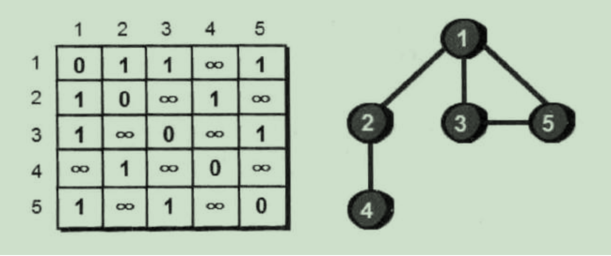
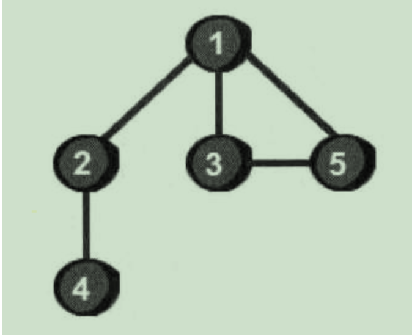

## 广度优先算法

### 广度优先算法原理

- 作用：用于图遍历
- 步骤：
  - 从某个顶点出发，遍历完和此节点相连接的所有节点
  - 再将遍历过的节点一次当作顶点，遍历和他们相连接的节点，访问顺序是：先被访问的节点的邻节点先于后被访问的邻节点
  - 直到所有节点都遍历完成
- 实现原理：
  - 创建一个队列，在图中选取一个节点放入队列中
  - 在队列中取出这个节点，然后访问所有和这个节点连接并且之前未被访问过的节点，放入队列中
  - 再从节点中取出一个节点，执行上一步，直到图中所有节点都被访问
  - 节点从队列中取出的顺序就是节点访问的顺序

### 广度优先算法python实现



```python
def fun(n):
    book = [0]*n
    book[0] = 1
    sum = [1]
    p = []
    while sum:
        i = sum.pop(0)
        p.append(i)
        for j in range(5):
            if e[i][j] == 1 and i != j and book[i] ==0:
                book[i]=1
                sum.append(j)
```


## 深度优先算法

### 深度优先算法原理

- 用于图遍历




- 如上图，进行深度优先算法遍历，步骤是：
  1. 先找一个没有走过的顶点，比如1顶点作为初始点。
  2. 从1号顶点出发，找和1号顶点相连接但是没有走过的点，比如2号节点。
  3. 再以2号节点作为出发点，重复2号步骤，直到访问的节点没有下一个没有访问的节点，如上图访问顺序为：1->2->4
  4. 4号节点没有可访问的下一个节点，所有返回上一级2号节点，找其他可访问点，如果有继续重复3步骤，如果没有继续返回上一节点继续重复3步骤，直到图遍历完成。
- 如上图访问顺序为：1->2->4->3->5
- 主要思想为：
  - 以图中某一节点为顶点，沿着此顶点的边一步一步向下，访问没有访问的节点
  - 当没有未访问的节点时候，返回上一级，继续访问其他节点，直到所有节点都被访问过

### 深度优先算法python实现


- 说明：
  - 二维数组存储图数据（**图的邻接矩阵存储法**）
  - 第i行第j列的数据表示，节点i到节点j的距离
  - 0表示自己到自己，1表示有边，∞ 表示没有边
  - **这个二维数组是沿着主对角线对称的，因此上面这个图是无向图**
    - 无向图指的是图的边没有方向，1号节点可以到5号节点，5号节点也可以到1号节点

- 代码实现：

```python
sum = 0
n = int(input('节点数'))
i=0
book = [0 for i in range(n)] # 记录已经访问过的节点，1表示已经访问过，0表示未访问
def fun(i):
  sum += 1
  if(sum==n)return
  for j in range(n):
    if e[i][j] == 1 and book[j] == 0 and i != j:
      book[j] = 1
      fun(j)

```


