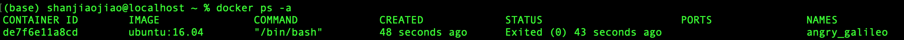

# Docker

[TOC]

## 安装

### mac安装

#### homebrew安装

- 命令：`brew cask install docker`

- 首次打开可能会需要输入电脑密码

#### 手动安装

- 官网下载Docker

- 和mac安装其他软件方式一样，打开软件包并拖动程序到Application

- 打开软件，顶部出现这个图标说明安装成功

  

- 打开命令行输入命令:`docker --version`

  

## Docker容器使用

### 帮助命令查询

- `docter` 命令，可以查看Docker的所有客户端命令

  

- `docker command --help` 可以查看更深入的命令详情

  - 例如：`docker run --help` 可以查看docker启动容器的详细命令

    

### 容器使用详解

#### 获取镜像

- 获取ubuntu镜像，用`docker pull` 命令载入容器
  - `docker pull ubuntu` 获取最新版本Ubuntu镜像
  - 安装其他版本
    - Ubuntu 镜像库地址： https://hub.docker.com/_/ubuntu?tab=tags&page=1
    - 查找需要的版本，并复制命令到本地执行
    - 
- 查看本地镜像命令
  - `docker images`
  - 

#### 启动容器

- 命令：`docker run -it ubuntu /bin/bash`
- 参数说明：
  - **-i**: 交互式操作
  - **-t**: 终端
  - **ubuntu**: ubuntu 镜像
  - **/bin/bash**：放在镜像名后的是命令，这里我们希望有个交互式 Shell，因此用的是 /bin/bash

#### 退出终端

- 命令：`exit`

#### 启动已停止运行的容器

- 查看所有容器：`docker ps -a`
  - 
- 启动一个已停止的容器：`docker start`
  - 

#### 后台运行

- 说明： docker 的服务是在后台运行的，我们可以过 **-d** 指定容器的运行模式
- 命令实例：
  - `docker run -itd --name ubuntu-test ubuntu /bin/bash`

#### 进入容器

- 命令：
  - `docker attach`
  - `docker exec` :推荐大家使用 docker exec 命令，因为此退出容器终端，不会导致容器的停止。

- `docker attach`命令
  - 
  - 特点：退出后，容器跟着停止
- `docker exec`命令
  - 
  - 特点：退出后，容器不回停止

#### 导出容器

- 命令：
  - 例子：`docker export 1e560fca3906 > ubuntu.tar`
  - 
- 说明：根据容器id导出容器到本地文件ubuntu.rar

#### 导入容器

- 命令：
  - 例子：`cat ubuntu.tar | docker import - test/ubuntu:v1`
  - 
- 说明:导入容器后，添加到镜像中
  - 删除镜像，必须先删除此镜像上的容器
  - 删除镜像命令：`docker rmi 5a828c65fdce`

### 例子：运行一个web应用

- 在docker容器中运行一个 Python Flask 应用来运行一个web应用
- 下载镜像：`docker pull training/webapp`
- 启动容器：`docker run -d -P training/webapp python app.py`
  - **-d:**让容器在后台运行
  - **-P:**将容器内部使用的网络端口映射到我们使用的主机上
- 查看web容器：`docker ps`
  - 
  - 多了端口信息：表示开放5000端口（后面），映射到主机的5000端口上（前面）
  - 访问结果：
- 修改端口映射：
  - 命令：`docker run -d -p 80:5000 training/webapp python app.py`
    - 表示将web用用的80端口，映射到主机5000端口上
- 快速查看网络端口：
  - 命令：`docker port bf08b7f2cd89`
- 查看web用用程序日志
  - 命令：`docker logs -f bf08b7f2cd89`
    - **-f:** 让 **docker logs** 像使用 **tail -f** 一样来输出容器内部的标准输出
- 查看web应用程序容器进程
  - 命令：`docker top 21b08e1b449f`或者`docker top focused_gagarin`
- 查看 Docker 的底层信息
  - 命令：`docker inspect`
  - 
- 停止web容器
  - 命令：` docker stop`
    - 

- 查询最后一次创建的容器:`docker ps -l `
- 移除web容器：`docker rm focused_gagarin`
  - 说明：移除容器的时候，容器必须是停止状态，否则会报错
- 删除镜像：`docker rmi 6fae60ef3446`
  - 

