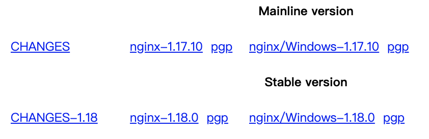
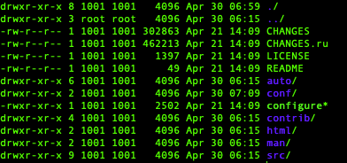
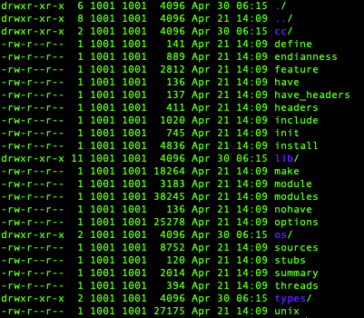
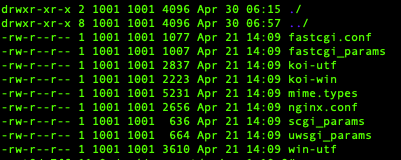
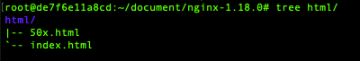
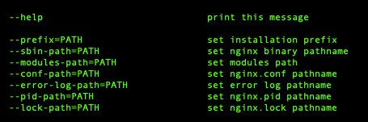
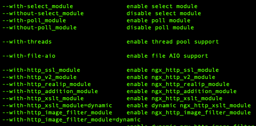
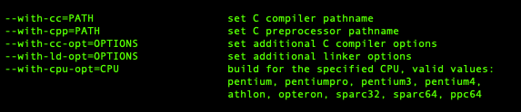
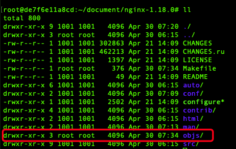
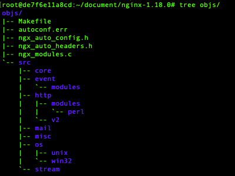

# nginx

## 安装nginx
### 编译nginx

- 下载地址：http://nginx.org/en/download.html
  - 

#### 介绍各目录

##### 源码目录

- 
	- auto
		- 
	-  CHANGE 文件 - 版本变化说明
	- conf - 配置示例文件夹
		- 
	- configure 脚本-编译必备文件
	- contrib 文件夹 
		- nginx vim语法文件
	- html 文件夹
		- 提供两个标准的html文件
		- 
		- 500错误的重定向文件，和默认index.html访问文件
	- man 文件夹
		- linux对nginx 的帮助文件
	- src 目录
		- nginx的源代码

##### Configure

- 
	- 定义一些路径，编译安装去这些文件找相应功能
	- `--prefix=PATH ` nginx 安装路径
- 
	- 默认使用和不使用某些模块
		- with 默认不使用，如果使用，需要编译的时候加上参数
		- without 默认使用，如果不使用，编译的时候加上参数
- 
	- 编译中使用特殊的参数 

####  编译

- 执行configure文件
	- ./configure --prefix=/root/arno/nginx` 命令
		- 安装nginx时依赖库：zlib，pcre，openssl
			- `sudo apt-get install openssl libssl-dev`
			- `sudo apt-get install libpcre3 libpcre3-dev`
			- `sudo apt-get install zlib1g-dev`
	- 
		- nginx 配置特性和安装目录
	- 执行完成后会生成一些中间文件
		- 
		- objs文件夹
			- 
			- ngx_modules.c 文件
				- 决定编译时候，有哪些模块会被编译进去

### 安装

- 命令：
	- `make`
	- `maike install`

## nginx执行

- 命令：

	- `nginx -s relaod` 重新加载nginx命令

- 参数：

	- -?,-h     :帮助
	- -v   -V  打印nginx版本信息
	- -t   -T  测试配置文件是否有语法错误
	- -s  发送信号
		- stop 立即停止服务
		- quit 优雅停止服务
		- reload 重新加载配置文件
		- reopen 重新开始记录日志文件
	- -p 制定运行目录
	- -c 使用制定配置文件

	

	

