## 学习路径

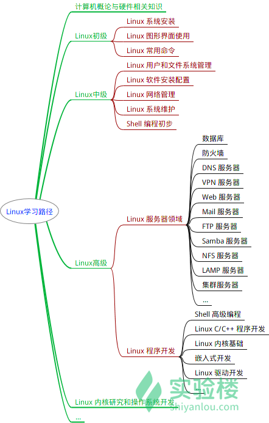		

## 常用命令
###  `$ touch file`

- 创建一个名为 file 的文件，touch是一个命令
- 一次创建多个文件
   - 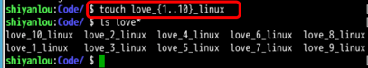			

### `$ cd /etc/`

- 进入一个目录，cd是一个命令

###  `$ pwd`

- 查看当前所在目录

### `$ mkdir`
- 创建文件夹

### 通配符:
- 有星号（*）和问号（?），用来对字符串进行模糊匹配（比如文件名、参数名）
	- 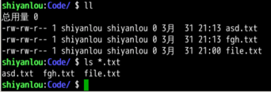		
- 常用通配符
	- 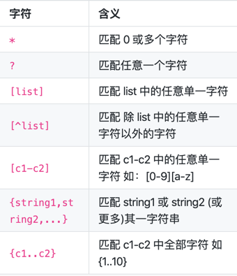

### 命令行中获取帮助
- 命令:`main`
- 格式:`$ man <command_name>`
- 结果说明
  - NAME（名称）:该命令或函数的名称，接着是一行简介
  - SYNOPSIS（概要）:对于命令，正式的描述它如何运行，以及需要什么样的命令行参数。对于函数，介绍函数所需的参数，以及哪个头文件包含该函数的定义
  - DESCRIPTION（说明）:命令或函数功能的文本描述。
  - EXAMPLES（示例）:常用的一些示例。
  - SEE ALSO（参见）:相关命令或函数的列表。
  - 其他:
  - OPTIONS（选项）
  - EXIT STATUS（退出状态）
  - ENVIRONMENT（环境）
  - BUGS（程序漏洞）
  - FILES（文件）
  - AUTHOR（作者）
  - REPORTING BUGS（已知漏洞）
  - HISTORY（历史）
  - COPYRIGHT（版权）

### 程序安装
- `$ sudo apt-get update`
	- 安装包更新
- `$ sudo apt-get install sysvbanner`
  - ​	安装sysvbanner

### 在命令行中输出图形		

- banner 命令

  - 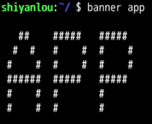

- figlet 命令

  - 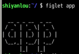

- toilet 命令

  - 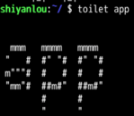

### 文件编辑
- vim :读写操作
- cat:读取文件内容

### `$ ls`
- 查看当前文件夹文件信息
- `$ ls -a`
	- 查看当前文件夹所有文件

## 用户管理及权限管理

### 查看用户

-  `$ who am i` 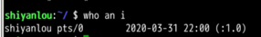
- `$ who mom likes`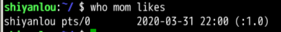
- `$ whoami`
- `$ who`
- 添加用户
  - `adduser`
    - adduser 在创建用户的同时，会创建工作目录和密码（提示你设置），做这一系列的操作
    - adduser 更像是一种程序，需要你输入、确定等一系列操作
  - `useradd`
    - 只创建用户，不会创建用户密码和工作目录，创建完了需要使用`passwd <username>`  去设置新用户的密码
    - useradd、userdel 这类操作更像是一种命令，执行完了就返回

### 权限

- root:拥有整个系统至高无上的权利
- su，su- 与 sudo
  - `su <user> `可以切换到用户 user，执行时需要输入目标用户的密码
  - `sudo <cmd>` 可以以特权级别运行 cmd 命令，需要当前用户属于 sudo 组，且需要输入当前用户的密码
  - `su - <user>` 命令也是切换用户，但是同时用户的环境变量和工作目录也会跟着改变成目标用户所对应的

### 文件权限

- 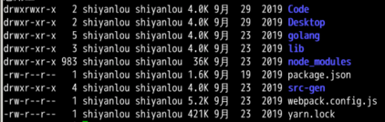
-  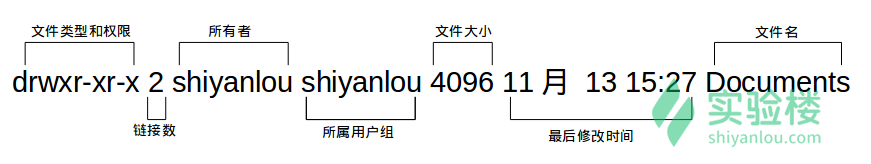
- 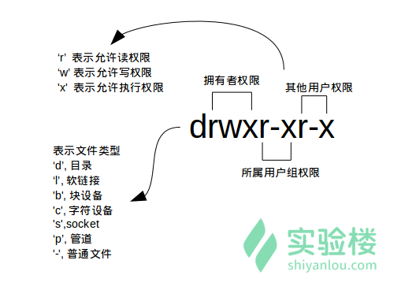
- 一个目录同时具有读权限和执行权限才可以打开并查看内部文件，而一个目录要有写权限才允许在其中创建其它文件
- 文件权限变更
  - `$ sudo chown `:用户名 文件名
  - 数字表示
    - 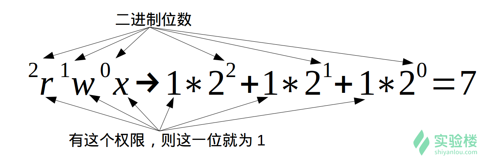
    - rw-rw-rw-，换成对应的十进制表示就是 666
    - 命令:`$ chmod 十进制数字 文件名`
  - 加减赋值操作
    - `$ chmod go-rw 文件名`
    - 说明
      - g、o 还有 u 分别表示 group（用户组）、others（其他用户） 和 user（用户），+ 和 - 分别表示增加和去掉相应的权限
			
### 设备文件

- /dev 目录下有各种设备文件，大都跟具体的硬件设备相关
- socket：网络套接字
- pipe 管道
- 软链接文件

## Linux目录结构及文件基本操作

### FHS标准

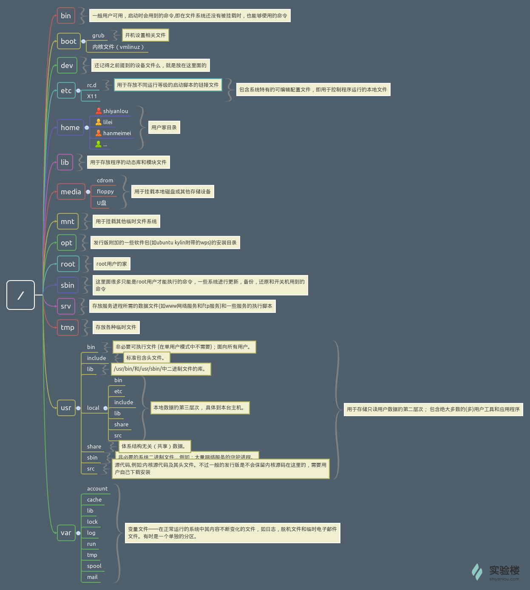

### 文件操作

- 新建空白文件:`$ touch 文件名`
- 新建目录
  - ` mkdir 文件夹名称`
  - `$ mkdir -p father/son/grandson`:创建嵌套文件夹
- 复制文件
  - `$ cp test father/son/grandson`
    - 将当前文件夹下的test文件复制到father/son/grandson文件夹下
  - `$ cp -r father family`
    - 将father文件夹复制到family文件夹下
- 删除文件
  - `$ rm test`:删除test文件
  - `$ rm -f test`:强制删除test文件
  - `$ rm -r family`:递归删除family文件夹和文件夹下的文件和子文件夹
  - `$ rm -rf family`:强制删除文件夹
- 移动文件
  - `$ mv file1 Documents`:将file1文件移动到Documents文件夹
- 重命名文件
  - `$ mv file1 myfile`:将文件file1重命名为myfile
  - 批量重命名
    - `命令rename`
      - 安装:`sudo apt-get install rename `
      - 用法:`rename 正则表达式`
      - 例子: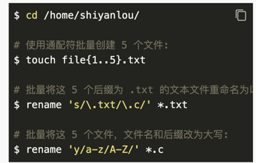
- 查看文件内容
  - `cat`
    - 打印文件内容到标准输出（终端）,正序显示
    - cat 文件名称
      - 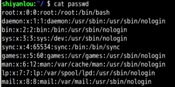
      - `$ cat -n 文件名称`
        - -n 参数显示行号
        - 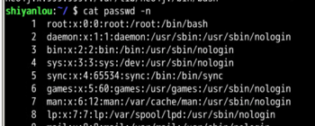
  - `tac`:打印文件内容到标准输出（终端）,倒序显示
  - `nl`
    - nl 命令，添加行号并打印
    - 参数
      - 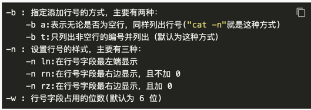
  - `more/less`
    - 使用 more 和 less 命令分页查看文件
    - Enter 键向下滚动一行，使用 Space 键向下滚动一屏，按下 h 显示帮助，q 退出
  - `head 和 tail 命令`
    - 只查看文件的头几行（默认为 10 行，不足 10 行则显示全部）和尾几行
    - `$ tail /etc/passwd`
    - `$ tail -n 1 /etc/passwd`
      - -n 参数表示看几行
- 查看文件类型
  - file 文件名
  - 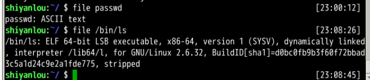
- 编辑文件:`vim`
  - 教程命令vimtutor

## 环境变量与文件查找

### `/etc/bashrc`

- 存放 shell 变量

### `/etc/profile`

- 存放环境变量

### `.profile`

- 每个用户目录下的一个隐藏文件
- 只对当前用户永久生效

### `PATH 环境变量`

- 保存了 Shell 中执行的命令的搜索路径
- 查看命令:`$ echo $PATH`
- 添加自定义路径
  - `$ PATH=$PATH:/home/shiyanlou/mybin`
- 将环境变量添加到文件中
  - `$ echo "PATH=$PATH:/home/shiyanlou/mybin" >> .zshrc`:添加内容到 .zshrc 中
  - `>>` 表示将标准输出以追加的方式重定向到一个文件中
  - `>` 是以覆盖的方式重定向到一个文件中
  - 在指定文件不存在的情况下都会创建新的文件

### 变量操作

- `$ unset mypath` 变量删除

### 环境变量生效

- `source .zshrc` 重新加在.zshrc文件

## 搜索文件

### `whereis`

- `$ whereis who`
  - 特点
    - 搜索很快,因为它并没有从硬盘中依次查找，而是直接从数据库中查询
    - 只能搜索二进制文件(-b)，man 帮助文件(-m)和源代码文件(-s)

### `which`

- Shell 内建的一个命令
- 用 which 来确定是否安装了某个指定的程序
- 只从 PATH 环境变量指定的路径中去搜索命令并且返回第一个搜索到的结果

### `find`

- 最强大
  - 可以通过文件类型、文件名进行查找
  - 可以根据文件的属性（如文件的时间戳，文件的权限等）进行搜索
- 一些常用的内容
  - `$ sudo find /etc/ -name interfaces`
    - 表示去 /etc/ 目录下面 ，搜索名字叫做 interfaces 的文件或者目录
  - `基本命令格式为 find [path][option] [action] `
    - 参数
      - `-atime` 最后访问时间
      - `-ctime` 最后修改文件内容的时间
      - `-mtime ` 最后修改文件属性的时间
        - 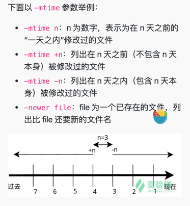
      - `$ find ~ -newer /etc` 列出用户家目录下比 /etc 目录新的文件

### `locate`

- 安装
  - `$ sudo apt-get update`
  - `$ sudo apt-get install locate`
- 更新数据库
  - `$ sudo updatedb`
- 原理
  - locate 命令查找文件也不会遍历硬盘，它通过查询 /var/lib/mlocate/mlocate.db 数据库来检索信息
  - 系统会使用定时任务每天自动执行 updatedb 命令来更新数据库
  - 刚添加的文件，它可能会找不到，需要手动执行一次 updatedb 命令
- 使用
  - `$ locate /etc/sh` 
    - 查找/etc文件夹下sh开头的文件和文件夹
    - 它不只是在 /etc 目录下查找，还会自动递归子目录进行查找
  - `$ locate /usr/share/\*.jpg` 查找 /usr/share/ 下所有 jpg 文件
  - 只统计数目可以加上 -c 参数，-i 参数可以忽略大小写进行查找

## 文件打包压缩

### 常用压缩包文件格式

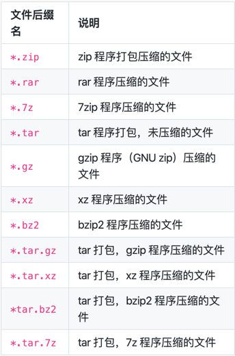

### `zip`

- 压缩
  - `zip -r -q -o shiyanlou.zip /home/shiyanlou/Desktop`
    - 将目录 /home/shiyanlou/Desktop 打包成一个文件
    - -r 参数表示递归打包包含子目录的全部内容
    - -q 参数表示为安静模式，即不向屏幕输出信息
    - -o，表示输出文件，需在其后紧跟打包输出文件名
- 设置压缩级别为 9 和 1（9 最大，1 最小）
	- `zip -r -9 -q -o shiyanlou_9.zip /home/shiyanlou/Desktop -x ~/*.zip`
			   - -x 是为了排除我们上一次创建的 zip 文件，否则又会被打包进这一次的压缩文件中
		- 1 表示最快压缩但体积大，9 表示体积最小但耗时最久
	- 加密 zip
	   - `$ zip -r -e -o shiyanlou_encryption.zip /home/shiyanlou/Desktop`
	   - `$ zip -r -l -o shiyanlou.zip /home/shiyanlou/Desktop`
	- `du -h shiyanlou.zip`
	   - du 命令查看打包后文件的大小
- 解压缩
   - `$ unzip shiyanlou.zip `将 shiyanlou.zip 解压到当前目录
   - `$ unzip -q shiyanlou.zip -d ziptest` 使用安静模式，将文件解压到指定目录
   - `$ unzip -l shiyanlou.zip` 查看压缩包的内容你可以使用 -l 参数

### tar

- 压缩
  - `$ tar -P -cf shiyanlou.tar /home/shiyanlou/Desktop`
    - -P 保留绝对路径符
    - -c 表示创建一个 tar 包文件
    - -f 用于指定创建的文件名，注意文件名必须紧跟在 -f 参数之后
    - -v 参数以可视的的方式输出打包的文件
  - `$ tar -czf shiyanlou.tar.gz /home/shiyanlou/Desktop`
    - -z 参数创建 *.tar.gz 文件
- 解包
  - `$ tar -xf shiyanlou.tar -C tardir`
    - 解包一个文件-x 参数
    - 到指定路径的已存在目录-C 参数
  - `$ tar -xzf shiyanlou.tar.gz` 解压 *.tar.gz 文件
- 查看
  - `$ tar -tf shiyanlou.tar` 只查看不解包文件 -t 参数
  - 其他格式参数:
    - 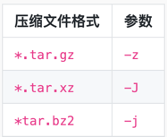

### 常用命令

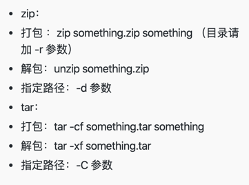

## 文件系统操作与磁盘管理

### 查看磁盘的容量

- `$ df`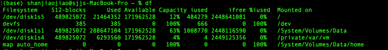
- `$ df -h`

## 任务计划

### 命令：`crontab`

### 格式:

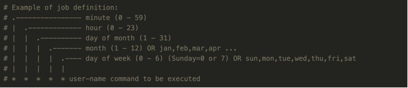

- `*/1 * * * * touch /home/shiyanlou/$(date +\%Y\%m\%d\%H\%M\%S)`
  - 每分钟我们会在/home/shiyanlou 目录下创建一个以当前的年月日时分秒为名字的空白文件
- `crontab -l`  查看我们添加了哪些任务
- `crontab -r `  去删除任务

### 例子

- 任务 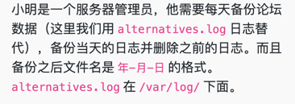

- 目标 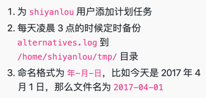

- 命令

  - `sudo cron -f &`
  - `crontab -e 添加`
  - `0 3 * * * sudo rm /home/shiyanlou/tmp/*`
  - `0 3 * * * sudo cp /var/log/alternatives.log /home/shiyanlou/tmp/$(date +\%Y-\%m-\%d)`

## 命令执行顺序控制

### 简单的顺序执行你可以使用

`$ sudo apt-get update;sudo apt-get install some-tool;some-tool`

-  `$ which cowsay>/dev/null && cowsay -f head-in ohch~`
  - && 之前的命令返回0，则后面的命令不执行
- `$ which cowsay>/dev/null || echo "cowsay has not been install, please run 'sudo apt-get install cowsay' to install"`
  - || 之前的命令为0 后面执行
- `$ which cowsay>/dev/null && echo "exist" || echo "not exist"`
  - 第一个命令返回0，执行&&后命令，否则执行||后命令
  - 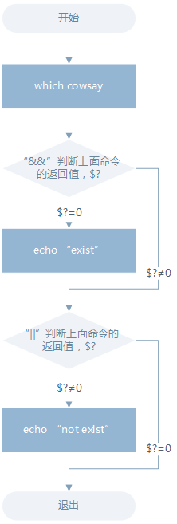

## 管道

### 定义

- 管道是一种通信机制，通常用于进程间的通信（也可通过 socket 进行网络通信），它表现出来的形式就是将前面每一个进程的输出(stdout)直接作为下一个进程的输入(stdin)
- 分为匿名管道和具名管道
- 使用一些过滤程序时经常会用到的就是匿名管道，在命令行中由|分隔符表示

### 例子

- `$ ls -al /etc | less`
  - 通过管道将前一个命令(ls)的输出作为下一个命令(less)的输入，然后就可以一行一行地看			
- `$ cut /etc/passwd -d ':' -f 1,6
  - 打印/etc/passwd文件中以:为分隔符的第 1 个字段和第 6 个字段分别表示用户名和其家目录

### grep 命令

- grep [命令选项]... 用于匹配的表达式 [文件]...
- `$ grep -rnI "shiyanlou" ~`
  - 搜索/home/shiyanlou目录下所有包含"shiyanlou"的文本文件，并显示出现在文本中的行号
  - -r 参数表示递归搜索子目录中的文件
  - -n表示打印匹配项行号
  - -I表示忽略二进制文件
- `$ export | grep ".*yanlou$"`
  - 查看环境变量中以"yanlou"结尾的字符串
  - `$` 就表示一行的末尾

### wc 命令

- wc 命令用于统计并输出一个文件中行、单词和字节的数目
- `$ wc /etc/passwd`
- `$ wc -l /etc/passwd`  行数
- `$ wc -w /etc/passwd` 单词数
- `$ wc -c /etc/passwd` 字节数
- `$ wc -m /etc/passwd` 字符数
- `$ wc -L /etc/passwd` 最长行字节数
- `$ ls -dl /etc/*/ | wc -l` 统计 /etc 下面所有目录数

### sort 排序命令
- `$ cat /etc/passwd | sort` 默认为字典排序
- `$ cat /etc/passwd | sort -r` 反转排序
- `$ cat /etc/passwd | sort -t':' -k 3` 
  - 按特定字段排序
  - -t参数用于指定字段的分隔符
  - -k 字段号用于指定对哪一个字段进行排序
- `$ cat /etc/passwd | sort -t':' -k 3 -n`
  - 照数字排序就要加上-n参数
- uniq 去重命令
  - 过滤重复行

## 软件安装

### ubuntu

#### 软件安装
- `$ sudo apt-get install w3m`

#### 更新软件源
- `$ sudo apt-get update`

#### 升级没有依赖问题的软件包
- `$ sudo apt-get upgrade`

#### 升级并解决依赖关系
- `$ sudo apt-get dist-upgrade`

#### 不保留配置文件的移除
- `$ sudo apt-get purge w3m`
- `$ sudo apt-get --purge remove`

#### 移除不再需要的被依赖的软件包
- `$ sudo apt-get autoremove`

#### apt 包管理工具
> Advance Packaging Tool（高级包装工具）的缩写

- `sudo apt-get update`
  - 定期从服务器上下载一个软件包列表
  - 提示没有公钥无法验证签名
    - sudo apt-key adv --keyserver keyserver.ubuntu.com --recv-keys E40EBBA24FF2FC69
  - 保持本地的软件包列表是最新的
- 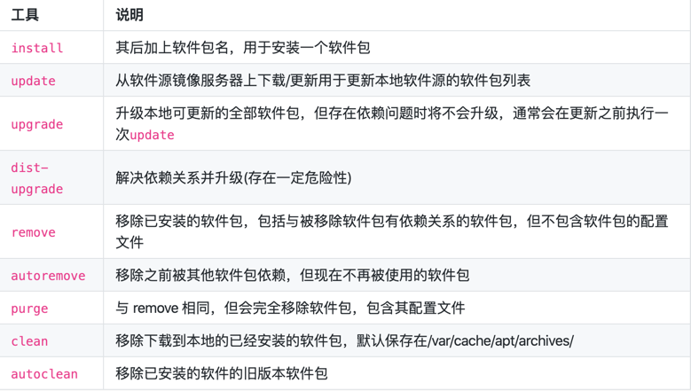
- 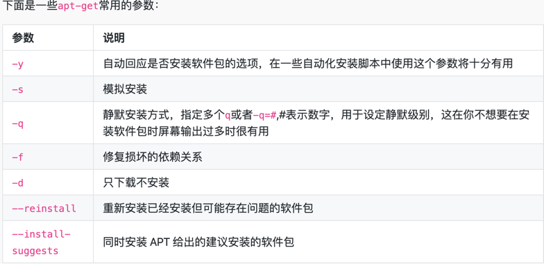
- 确认软件仓库里面有没有
  - `sudo apt-cache search softname1 softname2 softname3……`

## 查看进程

### top 实时的查看进程的状态

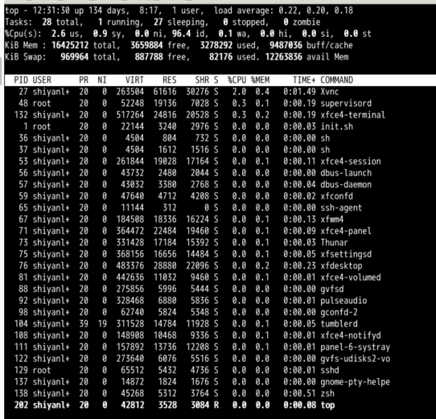

#### 第一行
- top表示当前程序的名称
- 12:31表示当前的系统的时间
- up 134 days,  8:19,表示该机器已经启动了多长时间
- 1 user	表示当前系统中只有一个用户
- load average: 0.22,0.20,0.18	分别对应 1、5、15 分钟内 cpu 的平均负载
  - load < 1 的时候意味着桥上的车并不多，一切都还是很流畅的，cpu 的任务并不多，资源还很充足
  - load = 1 的时候就意味着桥已经被车给占满了，没有一点空隙，cpu 的已经在全力工作了，所有的资源都被用完了，当然还好，这还在能力范围之内，只是有点慢而已
  - load > 1 的时候就意味着不仅仅是桥上已经被车占满了，就连桥外都被占满了，cpu 已经在全力工作，系统资源的用完了，但是还是有大量的进程在请求，在等待。若是这个值大于２、大于３，表示进程请求超过 CPU 工作能力的 2 到 ３ 倍。而若是这个值 > 5 说明系统已经在超负荷运作了

#### 第二行
- Tasks: 28 total	进程总数
- 1 running	1 个正在运行的进程数
- 27 sleeping	25 个睡眠的进程数
- 0 stopped	没有停止的进程数
- 0 zombie	没有僵尸进程数

#### 第三行
- Cpu(s): 2.6%us	用户空间进程占用 CPU 百分比
- 0.9% sy	内核空间运行占用 CPU 百分比
- 0.0%ni	用户进程空间内改变过优先级的进程占用 CPU 百分比
- 96.4%id	空闲 CPU 百分比
- 0.1%wa	等待输入输出的 CPU 时间百分比
- 0.0%hi	硬中断(Hardware IRQ)占用 CPU 的百分比
- 0.0%si	软中断(Software IRQ)占用 CPU 的百分比
- 0.0%st	(Steal time) 是 hypervisor 等虚拟服务中，虚拟 CPU 等待实际 CPU 的时间的百分比

#### 第四行
- 8176740 total	物理内存总量
- 8032104 used	使用的物理内存总量
- 144636 free	空闲内存总量
- 313088 buffers	用作内核缓存的内存量

#### 第五行
- total	交换区总量
- used	使用的交换区总量
- free	空闲交换区总量
- cached	缓冲的交换区总量,内存中的内容被换出到交换区，而后又被换入到内存，但使用过的交换区尚未被覆盖

#### 进程详情
- PID	进程 id
- USER	该进程的所属用户
- PR	该进程执行的优先级 priority 值
- NI	该进程的 nice 值
- VIRT	该进程任务所使用的虚拟内存的总数
- RES	该进程所使用的物理内存数，也称之为驻留内存数
- SHR	该进程共享内存的大小
- S	该进程进程的状态: S=sleep R=running Z=zombie
- %CPU	该进程 CPU 的利用率
- %MEM	该进程内存的利用率
- TIME+	该进程活跃的总时间
- COMMAND	该进程运行的名字

#### 查看物理CPU的个数
- `cat /proc/cpuinfo |grep "physical id"|sort |uniq|wc -l`

#### 每个cpu的核心数
- `cat /proc/cpuinfo |grep "physical id"|grep "0"|wc -l`

### ps 来静态查看当前的进程信息
- `ps aux`
- `ps axjf`

### pstree 来查看当前活跃进程的树形结构
- -A  ：各程序树之间以 ASCII 字元來連接；
- -p  ：同时列出每个 process 的 PID；
- -u  ：同时列出每个 process 的所屬账户名称

### `kill -9 1608`
- 使用9这个信号强制结束  进程

## 网络模式

### 虚拟机网路类型

#### 桥接模式（bridged）

- 和当前主机在同一个网段，相当于在当前主机链接路由器下新增一个网址
- 主机和虚拟机可以互相访问，虚拟机也可以访问和主机在同一个网段下的其他主机

#### 网络地址转换模式（NAT）

- 通过NAT（网络地址转换）,虚拟机通过主机网络进行外网访问
- 虚拟机可以通过主机访问其他主机，但是其他主机不能访问虚拟机（单向访问）

#### 主机模式（host-only）

- 将虚拟机网络和主机网路隔离
- 虚拟机和主机间不能互相访问
- 主机下的所有虚拟机可以互相通信

