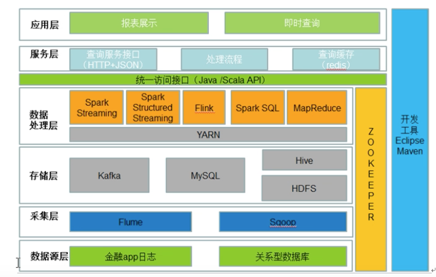
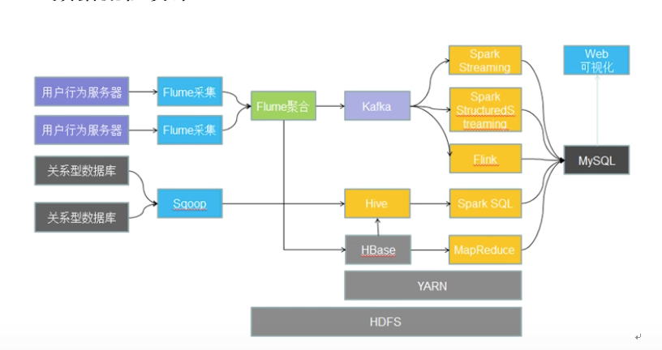
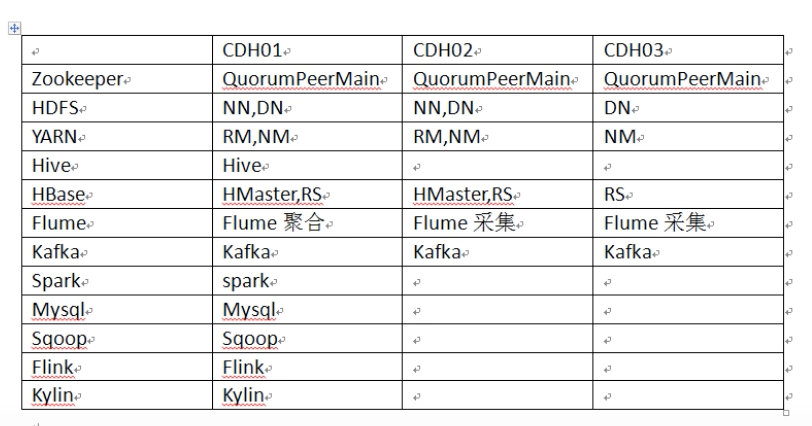
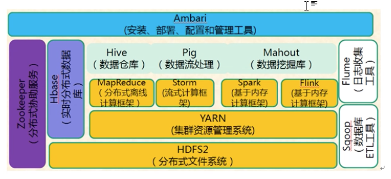
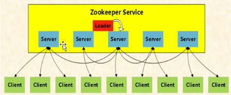

# 金融信贷项目

## 系统架构设计

## 数据流程设计

## 集群规划

# Zookeeper

## 概述

### 定义

- 为分布式应用所设计的高可用、高性能且一致的开源协调服务
- 提供了：分布式锁服务、配置维护、组服务、分布式消息队列、分布式通知/协调等

### 目标

- 封装复杂易出错的关键服务
- 将简单易用的接口和性能高效、功能稳定的系统提供给用户

### 基本架构

- Zookeeper 是由多个Server组成的集群，集群中有一个Leader，多个Follower
- 客户端可以连接任意服务节点来读取数据
- ZK集群中每个Server都保存一份数据副本
- 使用同步策略，保证数据一致：
	- 全局串行化所有写操作
	- 所有读请求由连接的ZK server响应，所有更新插入请求，转发给leader，由leader实施
	- 同一客户端请求队列形式处理
- ZK 通过复制来实现高可用，只要ZK集群中半数以上的机器处于可用状态，就可以提供服务
- Zk 会确保对Znode树的每一个修改都会被复制到超过半数的机器上，其中leader机器一定会被修改
- 如果Leader节点挂了，会再选出一个leader继续提供服务

### 状态角色

- 领导者
	- 负责进行投票的发起和决议，更新系统状态
- 学习者（learner）
	- 跟随者（follower）
		- 接收客户端请求，并向客户端返回结果，在选leader时候，参与投票
	- 观察者（Observer）
		- 只处理客户端请求，不参与投票
		- 目的：扩展系统，提高读取速度
- 客户端（client）
	- 应用程序客户端，请求发起方

### 读写流程

#### 写流程

- server1 接收客户端请求
- 如果server1不是leader，将请求发给leader
- leader广播方式将请求发给各个server
- 如果leader收到半数以上server写成功的返回
- 就将写成成功结果返回给server1，server1再返回给客户端
- 数据写成功后，其他节点同步更新后的数据

#### 读流程

- 每个server数据库的本地副本进行服务，客户端连接那个server，那个server给返回读结果
- 为了提高读取性能，ZK集群中每个服务节点都是将数据全量存储在内存中
- `说明`：ZK适合读多写少的轻量级数据场景（默认设置下，单个znode限制为1MB大小）

> 数据仅存储在内存中很不安全，ZK采用事务日志文件及快照文件的方案将数据存储在磁盘中
>
> 保障数据在丢失情况下能快速恢复

### 服务

#### 服务类型

- 分布式锁
- 分布式队列
- 分布式通知与协调

#### 实现方式

- 数据结构：Znode
- 原语：在数据结构的基础上，定义的一些数据结构操作（增删改查）
- 通知机制-watcher：通过通知机制将消息以网络形式发送给分布式应用程序

#### 相关服务

##### Znode

