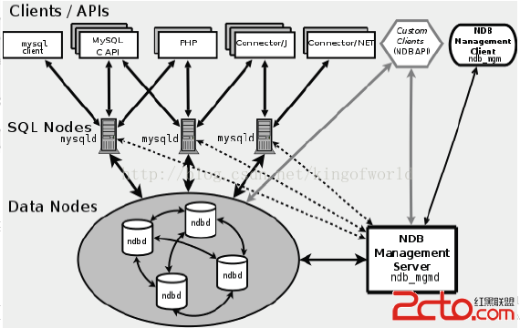

## mysql高可用方案

> Mysql-proxy（oracle）
> Mysql-router（oracle）
> Atlas (Qihoo 360)
> Atlas-sharding (Qihoo 360)
> Cobar（是阿里巴巴（B2B）部门开发）
> Mycat（基于阿里开源的Cobar产品而研发）
> TDDL Smart Client的方式（淘宝）
> Oceanus(58同城数据库中间件)
> OneProxy（原支付宝首席架构师楼方鑫开发 ）
> vitess（谷歌开发的数据库中间件）
> Heisenberg(百度)
> TSharding(蘑菇街白辉)
> Xx-dbproxy（金山的Kingshard、当当网的sharding-jdbc ）


### mysql 分区原理

- 分区表是由多个相关的底层表实现，这些底层表也是由句柄对象表示，所以我们也可以直接访问各个分区
- 存储引擎管理分区的各个底层表和管理普通表一样（所有的底层表都必须使用相同的存储引擎），
- 分区表的索引只是在各个底层表上各自加上一个相同的索引，从存储引擎的角度来看，底层表和一个普通表没有任何不同，存储引擎也无须知道这是一个普通表还是一个分区表的一部分

#### 操作逻辑

- select查询：
  - 当查询一个分区表的时候，分区层先打开并锁住所有的底层表，优化器判断是否可以过滤部分分区，然后再调用对应的存储引擎接口访问各个分区的数据
- insert操作：
  - 当写入一条记录时，分区层打开并锁住所有的底层表，然后确定哪个分区接受这条记录，再将记录写入对应的底层表
- delete操作：
  - 当删除一条记录时，分区层先打开并锁住所有的底层表，然后确定数据对应的分区，最后对相应底层表进行删除操作
- update操作：
  - 当更新一条数据时，分区层先打开并锁住所有的底层表，mysql先确定需要更新的记录在哪个分区，然后取出数据并更新，再判断更新后的数据应该放在哪个分区，然后对底层表进行写入操作，并对原数据所在的底层表进行删除操作
- 虽然每个操作都会打开并锁住所有的底层表，但这并不是说分区表在处理过程中是锁住全表的，如果存储引擎能够自己实现行级锁，如：innodb，则会在分区层释放对应的表锁，这个加锁和解锁过程与普通Innodb上的查询类似。

#### 优势

- 表非常大以至于无法全部都放在内存中，或者只在表的最后部分有热点数据，其他都是历史数据

- 分区表的数据更容易维护，如：想批量删除大量数据可以使用清除整个分区的方式。另外，还可以对一个独立分区进行优化、检查、修复等操作

- 分区表的数据可以分布在不同的物理设备上，从而高效地利用多个硬件设备

- 可以使用分区表来避免某些特殊的瓶颈，如：innodb的单个索引的互斥访问，ext3文件系统的inode锁竞争等

- 如果需要，还可以备份和恢复独立的分区，这在非常大的数据集的场景下效果非常好

- 优化查询，在where字句中包含分区列时，可以只使用必要的分区来提高查询效率，同时在涉及sum()和count()这类聚合函数的查询时，可以在每个分区上面并行处理，最终只需要汇总所有分区得到的结果。

#### 限制

- 一个表最多只能有1024个分区（mysql5.6之后支持8192个分区）

- 在mysql5.1中分区表达式必须是整数，或者是返回整数的表达式，在5.5之后，某些场景可以直接使用字符串列和日期类型列来进行分区（使用varchar字符串类型列时，一般还是字符串的日期作为分区）。

- 如果分区字段中有主键或者唯一索引列，那么所有主键列和唯一索引列都必须包含进来，如果表中有主键或唯一索引，那么分区键必须是主键或唯一索引
- 分区表中无法使用外键约束

- mysql数据库支持的分区类型为水平分区，并不支持垂直分区，因此，mysql数据库的分区中索引是局部分区索引，一个分区中既存放了数据又存放了索引，而全局分区是指的数据库放在各个分区中，但是所有的数据的索引放在另外一个对象中

- 目前mysql不支持空间类型和临时表类型进行分区。不支持全文索引

#### 注意以下几个问题

- 每个子分区的数量必须相同

- 只要在一个分区表的任何分区上使用subpartition来明确定义任何子分区，就必须在所有分区上定义子分区，不能漏掉一些分区不进行子分区。

- 每个subpartition子句必须包括子分区的一个名字

- 子分区的名字必须是唯一的，不能在一张表中出现重名的子分区

- mysql数据库的分区总是把null当作比任何非null更小的值，这和数据库中处理null值的order by操作是一样的，升序排序时null总是在最前面，因此对于不同的分区类型，mysql数据库对于null的处理也各不相同。对于range分区，如果向分区列插入了null，则mysql数据库会将该值放入最左边的分区，注意，如果删除分区，分区下的所有内容都从磁盘中删掉了，null所在分区被删除，null值也就跟着被删除了。在list分区下要使用null，则必须显式地定义在分区的散列值中，否则插入null时会报错。hash和key分区对于null的处理方式和range,list分区不一样，任何分区函数都会将null返回为0.

### mycat+mysql 高可用方案

- mycat 不负责数据同步问题，实现mycat 读写分离，需要 mysql 的主从同步机制
- Mycat的原理中最重要的一个动词是“拦截”，它拦截了用户发送过来的SQL语句，首先对SQL语句做了一些特定的分析：如分片分析、路由分析、读写分离分析、缓存分析等，然后将此SQL发往后端的真实数据库，并将返回的结果做适当的处理，最终再返回给用户。

#### 方案：

- 三台服务器：

	- |         | mysql | mycat |
		| ------- | ----- | ----- |
		| server1 | 主库  | Y     |
		| server2 | 从库  |       |
		| server3 | 从库  | Y     |

		server1 服务器上部署主库和 mycat

	- server2 服务器部署从库，负责业务数据读取
	- server3 服务器部署从库，负责统计业务数据读取

- 分表分库操作：

	- 先垂直拆分出表为基本不和其他业务表关联查询的日志表，比如操作日志、记录日志等表
	- 配置表或需要频繁关联查询的表设置为全局表。
	- 其他业务表在水平拆分
		- 限制：同一个数据库中表数据库可以关联查询，但是不能夸库关联查询。
		- 拆分规则为自增方案，选择时间字段为分区字段，根据业务，将同一段时间的数据放在一个库中
		- 设置：一个分片库存储一个季度数据。
		- 初期配置 8 个数据库，可存储两年数据。

- 配置读写分离

	- 主库负责数据插入更新
	- 第一个从库负责日常业务查询
	- 第二个从库负责统计查询，并作为业务查询备用库。

- 主从配置：

	- 主库和第一个从库配置为半同步复制，解决数据读取延迟问题。（主库已经插入数据，再次查询，不显示数据）
	- 第二个从库不做限制。

#### 说明：

- mycat 为数据库中间件，位置处在业务应用和数据库之间，业务只需要和 mycat 做数据交互，不必关注数据具体分配存储的位置。
- mycat 配置文件有三个：

	- server.xml	mycat 虚拟库账号、参数、权限等配置，
	- schema.xml	mycat 对应物理数据库和数据库表连接配置、读写分离配置
	- rule.xml Mycat分片（分库分表）规则
		- 创建分片规则，确定规则名称、选择规则对应的算法、确定物理表中适配此规则的字段
- 分片规则整体有两种：

	- 固定分片数量，再根据各种算法将数据尽量均匀存储到这些分片库中。
	- 分片增长类型，比如
		- 根据主键 id 数据范围约定，每个分片表存储 500w 条数据
		- 根据时间数据范围决定存储到那个分片库，比如每个分片库存储 1 年数据
- 数据切分的原则：
- 第一原则：能不切分尽量不要切分。
	- 第二原则：如果要切分一定要选择合适的切分规则，提前规划好。
- 第三原则：数据切分尽量通过数据冗余或者表分组（Table Group）来降低跨库 Join 的可能。
	- 第四原则：由于数据库中间件对数据 Join 实现的优劣难以把握，而且实现高性能难度极大，业务读取尽量少使用多表 Join。
- 负载均衡
  - 一主多从结构中，可配置，读只从从库读，写只写入主库，也可以配置，读在随机主库和从库之间读取
- 故障转移：
  - 监控主从状态，如果主库挂掉，在双主的模式下，跳转到第二个主库上，如果是一主多从，可以配置直接在从库读写，后续手动将主变为从，从变为主
  - 如果从库挂掉，直接在主库上实现读写
- 产品修改：
  - 1.对外键关联的表，需要加上冗余的分片字段，保证数据插入的时候，关联数据在同一个分片库中，但是正常查询支持外键
  - 2.排序分组字段必须在查询时候带上，因为 mycat 是将各个分片数据查出来后在内存中分组，所以排序分组字段也必须查出来
  - 3.数据更新 sql 不能更新分片字段
  - 支持主键全局自增

### mysql Fabric

- HA Group 高可用集群
	- 一个是主、其余为从
	- 保证访问指定HA Group的数据总是可用的。
	- 基础数据是基于mysql主从复制
- Fabric提供给的特性：
	- 失效检测和恢复
		- 心跳检测HA中主库，如果主库超时或者失效，Fabric会从HA Group中选取一个，并将其提升为主实例
	- 读写均衡
		- 将写操作发送给主实例
		- 将读请求在多个从库之间负载均衡

### MHA

- manage node 

	- ```
		masterha_check_ssh              检查MHA的SSH配置状况
		masterha_check_repl             检查MySQL复制状况
		masterha_manger                 启动MHA
		masterha_check_status           检测当前MHA运行状态
		masterha_master_monitor         检测master是否宕机
		masterha_master_switch          控制故障转移（自动或者手动）
		masterha_conf_host              添加或删除配置的server信息
		```

- data node

	- ```
		save_binary_logs                保存和复制master的二进制日志
		apply_diff_relay_logs           识别差异的中继日志事件并将其差异的事件应用于其他的slave
		filter_mysqlbinlog              去除不必要的ROLLBACK事件（MHA已不再使用这个工具）
		purge_relay_logs                清除中继日志（不会阻塞SQL线程）
		```

- 好处：自动故障转移，如果主库挂了，会在集群中选择一个从库，升级为主库，其他从库从新主库中复制数据

- 流程：

	- 从宕机崩溃的master保存二进制日志事件（binlog events）
	- 识别含有最新更新的slave
	- 应用差异的中继日志（relay log）到其他的slave；
	- 应用从master保存的二进制日志事件（binlog events）；
	- 提升一个slave为新的master；
	- 使其他的slave连接新的master进行复制；

### mysql Cluster



- 组成部分：
	- NDB Management Server
		- 作用：管理其他类型节点，可以配置Node信息，启动和停止Node
	- Sql Node
		- 作用：一个sql node 就是一个使用NDB引擎的mysql server进程，提供集群访问入口
	- Data Node
		- 用于存储集群数据，数据库存放内存中
- 缺点及限制：
	- 需要分片的表需要修改引擎innodb为NDB，不需要分片的可以不修改
	- NDB的事务隔离只支持Read Committed（读已提交数据）
	- 外键支持，有性能问题，因为外键关联的数据记录可能在别的分片节点上，建议去掉外键
	- DataNode节点数据会尽量存储在内存中，对内存要大