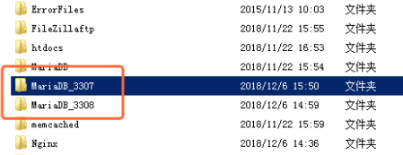
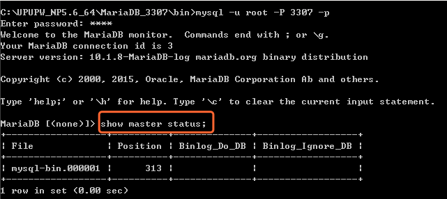
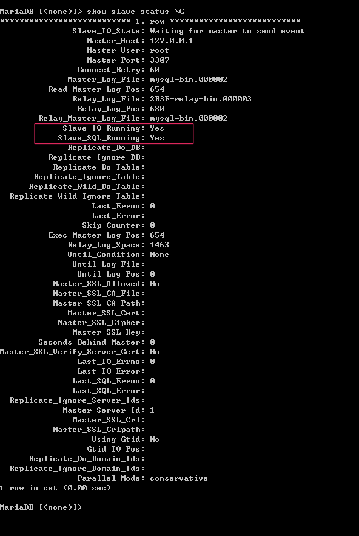

# 部署

- 准备两个数据库服务，一个做主数据库、一个从数据库，如下入图，3307为主数据库，3308为从数据库
- 说明：两个数据库初始设置一致，数据库版本一致



## 修改主库

- 修改主数据库my.ini

	- 添加配置:

		```
		  log-bin=/var/lib/mysql/bin-log  --开启 Binlog 并写明存放日志的位置
		  log_bin_index=/var/lib/mysql/mysql-bin.index --指定索引文件的位置。
		  binlog_format=mixed   --设置方面提到过的三种 Binlog 的日志模式
		  expire_logs_days=7 --删除超出这个变量保留期之前的全部日志被删除
		  server_id=002 --指定一个集群内的 MySQL 服务器 ID，如果做数据库集群那么必须全局唯一，一般来说不推荐 指定 server_id 等于 1
		```

	- 酌情添加的配置:

		```
		  max_binlog_size --binary log 最大的大小
		  binlog_cache_size --当前的多少事务cache在内存中
		  binlog_cache_disk_use --当前有多少事务暂存在磁盘上的，如果这个值有数值的话，就应该要注意调优了。
		  max_binlog_cache_size --最大能有多少事务cache在内存中
		  binlog_do_db和binlog_ignore_db --是一对控制对哪些数据库进行收集的选项。
		  sync_binlog --这个值控制cache的数据commit多少次才刷到磁盘上。默认是0，也就是让数据库自己决定同步的频率。如设置成1的话，则每commit一次就会将cache的数据同步到磁盘上，这样做最安全，但是性能最差。
		```

		

- 查看主库状态：

	- 执行：show master status

		

	- 说明：

		- file 为已经开启的bin-log 日志
		- position 为当前日志起始位置
		- binglog_do_db 为记录日志的库
		- binlog_ignore_db 为不要记录日志的库

## 修改从库

> 备注：如果主库和从库不在同一个服务器中，不能使用root账号监听主库日志

- 修改从数据库my.ini配置

	```sql
	  server_id = 2    #服务器id
	  log-bin=mysql-bin  #开启二进制日志（从服务器不是必须要开启二进制日志）
	  read-only = 1  #开启只读模式
	```

- 验证数据库是否为只读模式read-only

	```sql
	  mysql> show global variables like "%read_only%"; --查询
	  mysql> flush tables with read lock; --锁表，只能只读（限制管理员权限）
	  mysql> set global read_only=1; --设置只读
	  mysql> show global variables like "%read_only%"; 
	  mysql> unlock tables; --解锁表
	```

- 从库执行如下sql语句，添加对主库日志的监听：

	```sql
	  CHANGE MASTER TO master_host = '122.122.0.38',
	      master_user = 'slave',
	      master_password = 'slave',  
	      master_port = 3308,  
	      master_log_file = 'mysql-bin.000002',  
	      master_log_pos = 1579;
	```

	- 说明：
		- master_host:主数据库ip
		- master_user：主数据库用户名
		- master_password：主数据库登陆密码
		- master_port：主数据库端口号
		- master_log_file：
			- 主数据库“show master status”执行后，file字段内容
		- master_log_pos：
			- 主数据库“show master status”执行后，Position字段内容，此字段表示，当前主库日志最新日志内容的位置，从库配置这个参数的意思是从这个位置开始读取主库日志。

- 整体说明：

	```sql
	  mysql> help change master to --查看命令
	  option:
	  MASTER_BIND = 'interface_name' --设置连接接口
	    | MASTER_HOST = 'host_name'     --指定主节点名称
	    | MASTER_USER = 'user_name'       --指定具有复制权限的用户（刚才创建的）
	    | MASTER_PASSWORD = 'password'   --具有复制权限的用户的密码
	    | MASTER_PORT = port_num       --主服务所监听的端口，默认为3306的话可以省略
	    | MASTER_CONNECT_RETRY = interval--无法连接主服务器的时候可以重试连接多少次
	    | MASTER_HEARTBEAT_PERIOD = interval --多长时间探测一次主服务器是否在线
	    | MASTER_LOG_FILE = 'master_log_name'   --从哪个二进制日志中读取事件
	    | MASTER_LOG_POS = master_log_pos   --指定哪个二进制日志中事件的位置
	    | RELAY_LOG_FILE = 'relay_log_name'   --读取哪个中继日志
	    | RELAY_LOG_POS = relay_log_pos     --中继日志中的位置
	    | MASTER_SSL = {0|1}               --是否启动ssl功能    
	    | MASTER_SSL_CA = 'ca_file_name'
	    | MASTER_SSL_CAPATH = 'ca_directory_name'
	    | MASTER_SSL_CERT = 'cert_file_name'
	    | MASTER_SSL_KEY = 'key_file_name'
	    | MASTER_SSL_CIPHER = 'cipher_list'
	    | MASTER_SSL_VERIFY_SERVER_CERT = {0|1}
	    | IGNORE_SERVER_IDS = (server_id_list)
	```

- 开启主从复制： `start slave;`

- 关闭主从复制： `stop slave;`

## 查询主从是否配置成功

- 执行命令：`show slave status`

- 如下图：Slave_io_running:yes,Slave_sql_running:yes 说明配置成功

	

## 其他相关功能

- mysql数据导出（带binlog日志节点到处）


- 主从复制中过滤不同步的库和表：

	- 在主库中过滤（不往binlog日志记录）

	```sql
	  在my.ini中添加：
	  binlog-do-db=数据库名      #需要备份的数据库
	  binlog-ignore-db=数据库名   #不需要备份的数据库
	```

	- 在从库中限制（同步的时候过滤binlog日志中不需要的数据）

	```sql
	命令行执行：CHANGE REPLICATION FILTER + 参数
	参数：
	  REPLICATE_DO_DB = (db_list) --包括基于数据库名称的更新
	  REPLICATE_IGNORE_DB = (db_list) --根据数据库名称排除更新
	  REPLICATE_DO_TABLE = (tbl_list)  --根据表名包含更新
	  REPLICATE_IGNORE_TABLE = (tbl_list) --根据表名排除更新
	  REPLICATE_WILD_DO_TABLE = (wild_tbl_list) --包括基于通配符模式匹配表名称的更新
	  REPLICATE_WILD_IGNORE_TABLE = (wild_tbl_list) --根据通配符模式匹配表名排除更新
	  REPLICATE_REWRITE_DB = (db_pair_list) --在从服务器上替换主服务器上的指定数据库后，对从服务器执行更新
	```

## binlog日志操作命令

- mysqlbinlog

	- 日志导出到文件

		- `mysqlbinlog.exe mysqld-bin.000001 > mysqld-bin.000001.sql`

	- 导出指定数据库的sql

		- 参数：`-d` 或者 `--database`
		- `mysqlbinlog.exe -d yidonghuli mysqld-bin.000001 > mysqld-bin.000001.sql`

	- 禁止在通过日志恢复数据时候数据库继续产生日志

		- 参数：`-D` 或者 `--disable-log-bin`
		- `mysqlbinlog.exe --disable-log-bin mysqld-bin.000001 > mysqld-bin.000001.sql`

	- 跳过前N个条目

		- 说明：通过指定偏移量来读取它的特定部分
		- 参数：`-o`
		- `mysqlbinlog.exe -o 100 mysqld-bin.000001 > mysqld-bin.000001.sql` 偏移100个条目

	- 保存输出到文件

		- 两种方式：

			- 1.`mysqlbinlog.exe mysqld-bin.000001 > mysqld-bin.000001.sql` 导入到sql文件中（windows系统）

			- 2.参数：-r
	
- `mysqlbinlog.exe -r mysqld-bin.000001.sql mysqld-bin.000001`
			
		- `--server-id`mysql服务器
			- `mysqlbinlog.exe --server-id=1 -r mysqld-bin.000001.sql mysqld-bin.000001`

	- 从一个特定位置提取条目

		- 参数：`-j` 从某个位置开始
	
			- `mysqlbinlog.exe -j 15028 mysqld-bin.000001 > mysqld-bin.000001-from-15028.sql`
		
		- 参数：`--stop-position`截止到某个位置

			- `mysqlbinlog.exe --stop-position=15028 mysqld-bin.000001 > mysqld-bin.000001-upto-15028.sql`

	- 在输出中只显示语句

		- 作用：只显示sql语句，其他内容不再显示
	- 参数：`--short-form` 或者 `-s`
	
- 查看特定开始时间的条目
	
		- 参数：`--start-datetime`
		- `mysqlbinlog.exe --start-datetime="2017-08-16 10:00:00" mysqld-bin.000001 > mysqld-bin.000001.sql`

	- 查看特定结束时间的条目

		- 参数：`--stop-datetime`
	- `mysqlbinlog.exe --stop-datetime="2017-08-16 10:00:00" mysqld-bin.000001 > mysqld-bin.000001.sql`
	
- 从远程服务器获取二进制日志
	
	- 参数：`-R` 或者 `-read-from-remote-server`
		- 其他参数：
			- `-h` 或者 `--host` 指定远程服务器的ip地址
			- `-p` 或者 `--password` 将提示输入密码。默认情况下，它将使用“root”作为用户名
		- `-u` 选项指定用户名
			- mysqld-bin.000001 这是在这里读到的远程服务器的二进制日志文件的名称
	- `mysqlbinlog.exe -R --host=127.0.0.1 --port=3307 -u root --password=root mysql-bin.000003 >mysql-bin.000003.sql`
	
- mysql操作日志命令：

	- 刷新日志以清除Binlog输出
		- mysql中输入命令：`flush logs;`
		- 数据库将重新建立一个日志文件，之前的日志文件不再写入内容
	- 获取当前二进制日志列表
		- `SHOW BINARY LOGS;`
	- 查看日志：
		- 只查看第一个binlog文件的内容
			- `show binlog events;`
		- 查看指定binlog文件的内容
			- `show binlog events in 'mysql-bin.000002';`
	
- 用于控制主服务器的SQL语句

   -  PURGE BINARY LOGS语句

   	-  ```sql
   		PURGE { BINARY | MASTER } LOGS {
   		    TO 'log_name'
   		  | BEFORE datetime_expr
   		}
   		```

   	-  作用：删除指定索引文件名或日期之前的日志索引文件中列出的所有二进制日志文件

   	-  例子：

   		-  ```sql
   			PURGE BINARY LOGS TO 'mysql-bin.010';
   			PURGE BINARY LOGS BEFORE '2019-04-02 22:46:26';
   			-- 该BEFORE变种的 datetime_expr参数值应该为一个DATETIME值（一个值格式）。 'YYYY-MM-DD hh:mm:ss'
   			```

   	-  说明：

   		-  执行清除语句的时候，不需要停止 slave，可以安全运行。
   		-  如果你正在删除的日志，slave 正在读取，那么这个 sql 不会删除这个日志文件和这个文件之后的文件，但是会删除之前的文件，这种情况会报警告
   		-  如果现在没有 slave 连接，删除了 slave 还没有读取的日志文件，slave 再次启动的时候会报错，并无法复制。

   	-  安全的删除：

   		-  在每一个从库上执行`show slave status`检查当前正在读取的日志文件。
   		-  在主库上执行`show binary logs`，获取二进制日志列表
   		-  删除所有比正在去读的日志还早的日志文件
   		-  对所有药删除的日志文件进行备份

   	-  `expire_logs_days` 设置日志文件自动过期时间

- `SHOW`语句还用于复制中的主服务器


## mysql GTID 主从复制

- 概念
	- 全局事务标识：global transaction identifiers。
	- GTID是一个事务一一对应，并且全局唯一ID。
	- 一个GTID在一个服务器上只执行一次，避免重复执行导致数据混乱或者主从不一致。
	- GTID用来代替传统复制方法，不再使用MASTER_LOG_FILE+MASTER_LOG_POS开启复制。而是使用MASTER_AUTO_POSTION=1的方式开始复制。
	- MySQL-5.6.5开始支持的，MySQL-5.6.10后开始完善。
	- 在传统的slave端，binlog是不用开启的，但是在GTID中slave端的binlog是必须开启的，目的是记录执行过的GTID（强制）
- GTID 组成
	- GTID = source_id:transaction_id
	- source_id，用于鉴别原服务器，即mysql服务器唯一的的server_uuid，由于GTID会传递到slave，所以也可以理解为源ID。
	- transaction_id，为当前服务器上已提交事务的一个序列号，通常从1开始自增长的序列，一个数值对应一个事务。        
	- 示例：          
		- 3E11FA47-71CA-11E1-9E33-C80AA9429562:23
		- 前面的一串为服务器的server_uuid，即3E11FA47-71CA-11E1-9E33-C80AA9429562，后面的23为transaction_id


