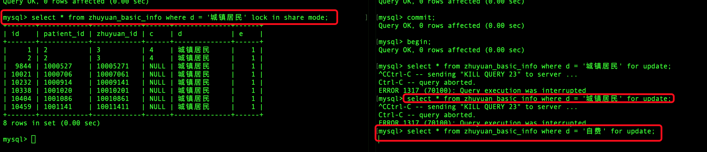

  ## 数据库系统事务隔离级别

  - 读未提交数据（Read Uncommitted）

	- 一个事务在执行过程中，可以看到其他事务没有提交的新插入数据，也能看到其他事务对已有数据的更新
  - 读已提交（Read Committed）

	- 一个事务在执行过程中，可以看到其他事务已经提交的新插入记录，而且能看到其他事务已经提交的对已有记录的更新
  - 可重复读（Repeatable Read）

	- 一个事务在执行过程中可以看到其他事务已经提交的新插入记录，但是不能看到其他事务已经提交的对已有记录的更新
  - 串行化（Serializable）

	- 一个事务在执行过程中完全看不到其他事务对数据库所做的更新，对同一数据操作的两个事务船型执行，同一时间只能一个事务执行。


# 数据库锁原理

### 数据库锁一般分为两类

- 悲观锁
- 乐观锁

### 乐观锁

- 用户自己实现的一种锁机制
- 假设认为数据一般不会造成冲突，所以在数据进行提交更新的时候，才会正对数据的冲突与否进行检测
- 如果发现冲突，就让返回错误信息，让用户决定如果去做

### 悲观锁

> 一般说的是数据库的锁机制

#### 数据格式的分类：表锁、行锁、页锁

- MyISAM只用到表锁
	- 特点：
		- 不会有死锁问题、锁的开销小
		- 并发能力差
- innodb实现了行级锁和表锁
	- 特点：
		- 锁的颗粒度变小、并发能力更强
		- 锁的开销变大、有可能出现死锁问题
		- 为了协调两种锁，算法变得更复杂
	- 行锁实现：
		- 通过给索引上的索引项加锁实现，所以只有通过索引条件检索数据，innodb才能使用行级锁
		- 否则就会使用表锁

#### 功能层面的分类：共享锁、排它锁（独享锁）、更新锁

- 共享锁：

	- 执行select时候出现，比如：

		- 表锁的共享锁：会阻塞其他事物修改表数据，但是可以读表数据
		- 行锁的共享锁：其他事物只能读取本行数据，不能修改本行数据，需要等到共享锁解锁后，其他事物才能修改本数据

	- ``` select * from user```   行锁解析

		- 执行查询的时候，数据库系统先共享锁锁第一行，读取之后，第一行解锁，然后锁定第二行
		- 所以在查询数据的时候，是可以其他事物同时更新表中未锁定的行

	- 权限：

		- 数据加上共享锁，其他共享锁也可以加到这个数据上，但是独享锁不行，需要等待这个数据上的其他锁都解锁了在加上
		- 在有共享锁的数据上也可以加上更新锁，但是只能添加1个

	- 并发性能：好

	- 实现：

		- ```sql
			select ..... lock in share mode
			```

- 排它锁（独享锁）

	- 执行insert、update、delete语句时候产生独享锁

	- 此锁表述对数据独占，如果有了独享锁，其他锁都不可以再加上

	- 有了其他锁，独享锁也不可以加上

	- 并发方面：最差

	- 实现：

		- ```sql
			select ..... for update
			```

- 更新锁

	- 目的：避免共享锁造成的死锁问题
	- 来源：
		- update语句执行过程：``` update user set user_number=999 where id =1```
			- 两步：先读取user表中id为1的记录，再执行更新操作
			- 第一步读操作的时候用更新锁，但是不用共享锁，是因为第二步修改数据时候需要将之前的锁改为独享锁，如果是共享锁，其他事物给加一个更新锁，就会出现死锁问题
	- 特点：
		- 更新锁和共享锁可以共存，但是只能有一个更新锁

#### 避免死锁、提高效率：意向锁

- 死锁的例子：
	- 事务A给表中一条数据添加了共享锁（只能读，不能改），事务B申请整个表的写锁，如果B申请成功，那么B就可以修改表中任意一条数据，和事务A锁冲突
		- 避免冲突（B申请表写锁步骤）：
			- 第一步：判断表中是否有其他表锁
			- 第二步：判断表中的每一行是否被行锁锁住
				- 第二步效率不高，因为要遍历整个表
				- 添加意向锁
		- 意向锁
			- A在申请共享行锁时候必须先申请表的意向共享锁，申请成功后，再深申请行锁
			- 避免冲突：
				- 第一步：判断表中是否有表锁
				- 第二部：判断表中是否有意向共享锁

# 数据库事务

## 事务特性

### 原子性

- 事务包含的所有操作要么全部成功、要么出现失败全部回滚
- 要求：
	- 如果执行成功，完全应用到数据库
	- 如果失败，不能对数据库有任何影响

### 一致性

- 事务必须使数据库从一个一致性状态变换到两外一个一致性状态
- 事务执行前和执行后，都必须处于一致性状态
- 比如用户A和用户B互相转账，两个用户钱加起来一共5000，事务完成后，两个用户的钱总额不变

### 隔离性

- 当多个用户并发访问数据库时，比如操作同一张表，数据库为每个用户开启的事务，不能被其他事务的操作干扰，多个并发的事务之间要相互隔离
- 比如任意两个事务t1和t2，在t1开来，t2要么在t1开始前就已经结束，或者t1结束后才开始，这样每个事务感受不到其他事务在并发的执行

### 持久性

- 表示一个事务一旦提交，那么对数据库中数据的改变是永久的，即便在数据库遇到故障的情况下，也不会丢失提交事务的操作

## 事务隔离

### mysql数据库提供的隔离级别

- **Read Uncommitted**（读未提交）
	- 说明
		- 最低隔离级别、什么都不需要做、一个事务可以读取到另一个事务未提交的结果
		- 所有并发事务问题都会遇到
	- 锁说明：
- **Read Committed**（读已提交）
	- 说明
		- 只有在事务提交后，其更新结果才能被其他事务看见。
		- 解决脏读问题
	- 锁说明：
		- 共享锁只会对 select 查到的数据加锁,其他数据不会加锁，所以其他事务可以对其他数据进行增删改
- **Repeated Read**（重复阅读）***mysql默认隔离级别***
	- 在一个事务中同一份数据的读取结果总是相同的，无论是否有其他事务对这份数据进行操作，以及这个事务是否提交
	- 可解决脏读、不可重复读问题
	- 所说明：
		- 符合 select 条件的数据都会加共享锁，不止当前查到的数据
		- 所以其他事务增删改涉及到之前事务中读的 where 条件数据的时候，都会等待
		- 
- **Serialization**（串行化）
	- 事务串形化执行，隔离级别最高，牺牲系统并发性。
	- 可解决并发事务的所有问题

### 隔离级别特点

- 级别越高，执行效率越低
	- **Serialization**级别是以锁表的方式，使得其他操作排队等待解锁后执行（类似java中的多线程锁）
- oracle数据库只支持**Read Committed**和**Serialization**，默认为**Read Committed**

### 事务隔离解决的问题

1. **脏读(Drity Read)**
	- 事务A修改了一个数据，但是未提交，事务B读到了事务A未提交的更新结果，如果事务A提交失败，事务B读到的就是脏数据