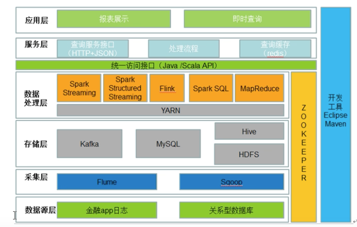
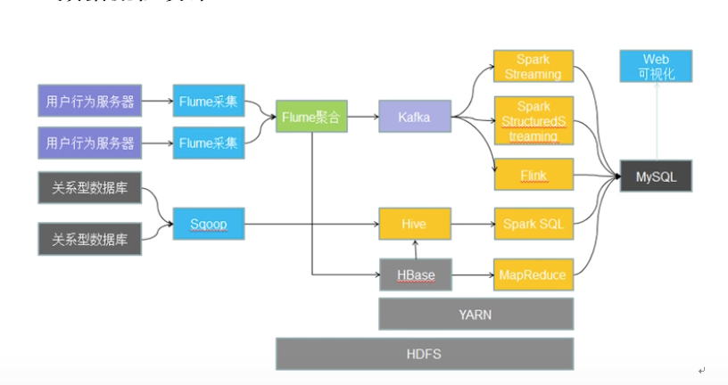
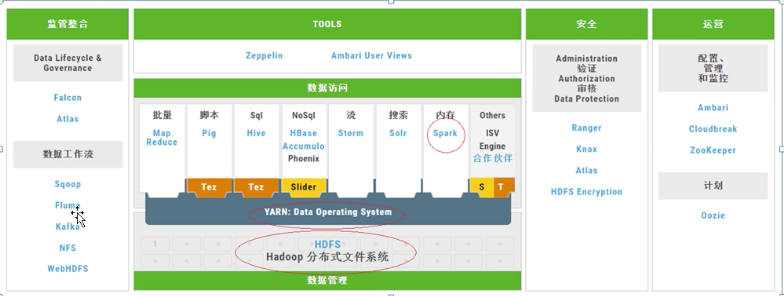
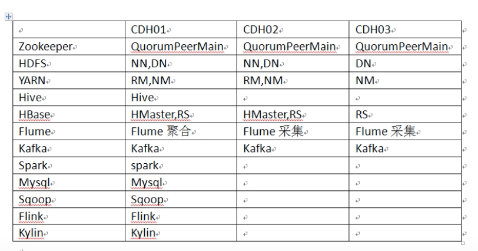

[TOC]


# 系统架构设计



# 数据流程设计




# 数据生态




# 集群规划



# 学习版本


| 软件      | 版本                                                         | 位数 |
| --------- | ------------------------------------------------------------ | ---- |
| jdk       | 1.8                                                          | 64   |
| Centos    | 7                                                            |      |
| Zookeeper | [zookeeper-3.4.5-cdh5.10.0.tar](http://archive.cloudera.com/cdh5/cdh/5/zookeeper-3.4.5-cdh5.10.0.tar.gz) |      |
| Hadoop    | [hadoop-2.6.0-cdh5.10.0.tar.gz](http://archive.cloudera.com/cdh5/cdh/5/hadoop-2.6.0-cdh5.10.0.tar.gz) |      |
| HBase     | [hbase-1.2.0-cdh5.10.0.tar.gz](http://archive.cloudera.com/cdh5/cdh/5/hbase-1.2.0-cdh5.10.0.tar.gz) |      |

| 名称         | 路径                            |
| ------------ | ------------------------------- |
| 所有软件目录 | /home/parallels/app             |
| 脚本目录     | /home/parallels/tools           |
| 日志目录     | /home/parallels/data/hbase/logs |
| Pids 目录    |                                 |


- 文档地址
	
- https://hadoop.apache.org/docs/r2.6.5/
	
- 命令快捷查看（详细内容在后续文章中）

	```shell
	
	##############################---ZooKeeper---#################################
	#启动所有 Zookeeper节点
	zhixing_yuancheng.sh "/home/parallels/app/zookeeper/bin/zkServer.sh start" all
	
	
	###########################---HDFS----############
	
	#启动所有 journalnode 节点
	zhixing_yuancheng.sh "/home/parallels/app/hadoop/sbin/hadoop-daemon.sh start journalnode" all
	
	#测试查看所有 journalnode 是否启动
	zhixing_yuancheng.sh "jps" all
	
	# nn1 节点格式化 NameNode
	cd /home/parallels/app/hadoop
	bin/hdfs namenode -format
	
	# nn1节点格式化 ZKFC
	cd /home/parallels/app/hadoop
	bin/hdfs zkfc -formatZK
	
	# nn1节点启动 NameNode
	cd /home/parallels/app/hadoop
	bin/hdfs namenode
	
	# nn2 节点同步nn1 节点元数据信息
	cd /home/parallels/app/hadoop
	bin/hdfs namenode -bootstrapStandby
	
	# nn2 同步完nn1 节点信息后，Ctrl+c 关闭 nn1 节点 NameNode 进程
	
	# 关闭所有节点 journalnode
	zhixing_yuancheng.sh "/home/parallels/app/hadoop/sbin/hadoop-daemon.sh stop journalnode" all
	
	# 一键启动 hdfs
	cd /home/parallels/app/hadoop
	sbin/start-dfs.sh 
	
	# 查看 NameNode 状态命令
	bin/hdfs haadmin -getServiceState nn1
	bin/hdfs haadmin -getServiceState nn2
	
	# 一键关闭 hdfs
	cd /home/parallels/app/hadoop
	sbin/stop-dfs.sh
	
	# Hdfs 文件系统创建 test 目录
	cd /home/parallels/app/hadoop
	bin/hdfs dfs -mkdir /test
	
	# 创建 test.txt 文件，并将文件上传到 hdfs 文件系统/test目录下
	bin/hdfs dfs -put /home/parallels/Documents/test.txt /test
	
	
	####################----YARN----########################
	
	# 一键启动yarn（只启动了当前节点的 resourcemanager 和所有节点的 datamanager）
	cd /home/parallels/app/hadoop
	sbin/start-yarn.sh
	
	# 在 rm2 节点上启动resourcemanager
	cd /home/parallels/app/hadoop
	sbin/yarn-daemon.sh start resourcemanager
	
	# 查看 RM 状态
	 bin/yarn rmadmin -getServiceState rm1
	 bin/yarn rmadmin -getServiceState rm2
	 
	################---hadoop---#########################
	
	# 对此文件进行 wordcount 测试
	bin/hadoop jar share/hadoop/mapreduce2/hadoop-mapreduce-examples-2.6.0-cdh5.10.0.jar wordcount /test/test.txt /test/out
	```

	


