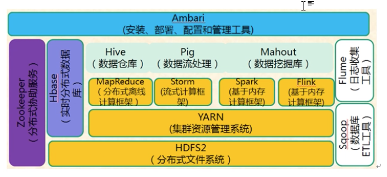
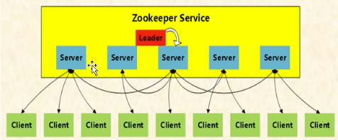
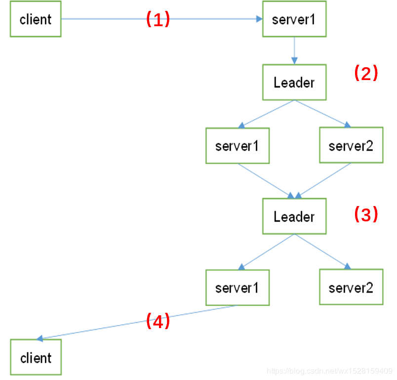
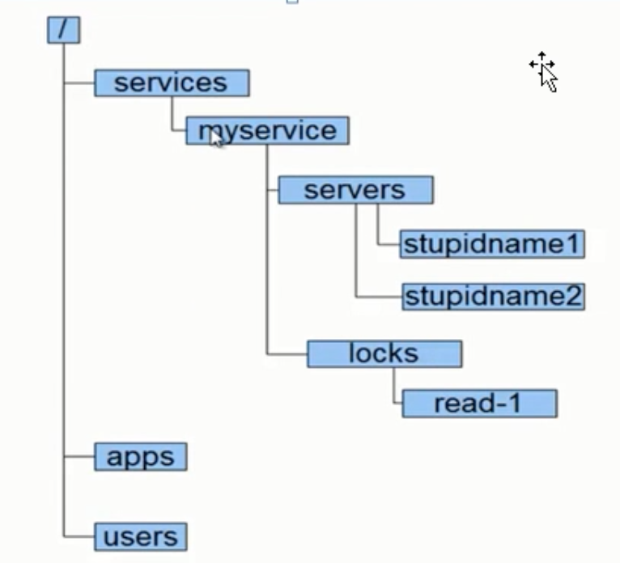
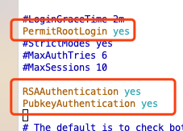
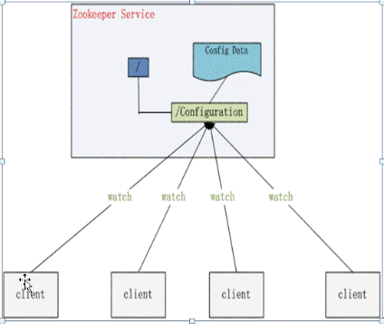

[TOC]

# Zookeeper

## zookeeper概述

### 定义

- 为分布式应用所设计的高可用、高性能且一致的开源协调服务
- 提供了：分布式锁服务、配置维护、组服务、分布式消息队列、分布式通知/协调等

### 目标

- 封装复杂易出错的关键服务
- 将简单易用的接口和性能高效、功能稳定的系统提供给用户



### 基本架构



- Zookeeper 是由多个Server组成的集群，集群中有一个Leader，多个Follower
- 客户端可以连接任意服务节点来读取数据
- ZK集群中每个Server都保存一份数据副本
- 使用同步策略，保证数据一致：
	- 全局串行化所有写操作
	- 所有读请求由连接的ZK server响应，所有更新插入请求，转发给leader，由leader实施
	- 同一客户端请求队列形式处理
- ZK 通过复制来实现高可用，只要ZK集群中半数以上的机器处于可用状态，就可以提供服务
- Zk 会确保对Znode树的每一个修改都会被复制到超过半数的机器上，其中leader机器一定会被修改
- 如果Leader节点挂了，会再选出一个leader继续提供服务

### 状态角色

- 领导者
	- 负责进行投票的发起和决议，更新系统状态
- 学习者（learner）
	- 跟随者（follower）
		- 接收客户端请求，并向客户端返回结果，在选leader时候，参与投票
	- 观察者（Observer）
		- 只处理客户端请求，不参与投票
		- 目的：扩展系统，提高读取速度
- 客户端（client）
	- 应用程序客户端，请求发起方

### 读写流程

#### 写流程



- server1 接收客户端请求
- 如果server1不是leader，将请求发给leader
- leader广播方式将请求发给各个server
- 如果leader收到半数以上server写成功的返回
- 就将写成成功结果返回给server1，server1再返回给客户端
- 数据写成功后，其他节点同步更新后的数据

#### 读流程

- 每个server数据库的本地副本进行服务，客户端连接那个server，那个server给返回读结果
- 为了提高读取性能，ZK集群中每个服务节点都是将数据全量存储在内存中
- `说明`：ZK适合读多写少的轻量级数据场景（默认设置下，单个znode限制为1MB大小）

> 数据仅存储在内存中很不安全，ZK采用事务日志文件及快照文件的方案将数据存储在磁盘中
>
> 保障数据在丢失情况下能快速恢复

### 服务

#### 服务类型

- 分布式锁
- 分布式队列
- 分布式通知与协调

#### 实现方式

- `数据结构`：Znode
- `原语`：在数据结构的基础上，定义的一些数据结构操作（增删改查）
- `通知机制-watcher`：通过通知机制将消息以网络形式发送给分布式应用程序

#### 相关服务

##### Znode



- 树形层次结构，节点称为Znode

- 每个Znode可以拥有子节点

- Znode具备文件和目录双重特点

- Znode组成：

	- stat：状态信息，描述Znode版本、权限等信息
	- data：该Znode相关数据
	- children：该znode的子节点

- Znode类型：

	- 短暂型 
		- 短暂节点（临时节点）
		- 在创建短暂Znode的客户端会话结束时，Zookeeper会将该短暂节点删除
		- 每个短暂节点都会绑定到一个客户端会话，但它们对所有客户端是可见的
		- 短暂节点不可以有子节点，即使短暂子节点都不可以
	- 持久型
		- 持久节点
		- 不依赖与客户端会话，只有客户端明确要删除该持久节点时，才会被删除

- Znode操作（原语）

	- `create`    创建Znode（父Znode必须存在）
	- `delete`    删除Znode（Znode没有子节点）
	- `exists`    测试Znode是否存在，并获取它的元数据
	- `getACL/setACL`    为znode获取/设置ACL
	- `getChildren`    获取znode所有子节点列表
	- `getDate/setDate`    获取/设置znode的相关数据
	- `sync`    使客户端的Znode视图与zookeeper同步

- `Watcher`

	> 监听（观察）读写操作，通过方法：`exits()`、`getChildren()`、`getDate()`
	>
	> 这些监听，可以被写操作create、delete和setData触发
	>
	> 监听被触发时会产生一个观察事件，这个观察和触发它的操作共同决定了观察事件的类型

	类型：

	- 数据watch(data  watch):
		- getData和exits负责设置数据watch，返回关于节点的数据信息
	- 孩子watch(child  watch):
		- getChildren负责设置孩子watch，返回孩子列表

## Zookeeper集群安装

### 版本介绍

#### 安装模式-三种

- 单机模式
	- 只运行在一台服务器上，适合测试环境
- 伪集群模式
	- 一台物理机上运行多的Zookeeper实例，适合测试环境
- 分布式集群模式
	- Zookeeper运行于一个集群中，适合生产环境

#### 版本选择

- 目前Hadoop版本：
	- 基础版本：Apache Hadoop
	- 衍生版本：
		- 华为发行版
		- inter发行版
		- Cloudera发行版（CDH）等
	- 不收费版本
		- Cloudera版本（Cloudera‘s Distribution including apache hadoop,简称CDH） 收取服务费
		- apache Hadoop
		- Hortonworks版本（HDP）收取服务费
- CDH版本好处
	- CDH对Hadoop版本划分比较明确，分为：cdh3、cdh4、cdh5和cdh6
		- CDH4:http://archive.cloudera.com/cdh4/cdh/4/
		- CDH5:http://archive.cloudera.com/cdh5/cdh/5/
	- CDH文档清晰
	- 组件集成做了很多兼容处理，使用方便，避免兼容性问题

#### 集群规划

- 主机规划

	|           | HD01 | HD02 | HD03 |
	| :---- | :--: | :--: | :--: |
	| Zookeeper |  是  |  是  |  是  |

- 软件规划

	| 软件      | 版本                                                         | 位数 |
	| --------- | ------------------------------------------------------------ | ---- |
	| jdk       | 1.8                                                          | 64   |
	| Centos    | 7                                                            |      |
	| Zookeeper | [zookeeper-3.4.5-cdh5.10.0.tar](http://archive.cloudera.com/cdh5/cdh/5/zookeeper-3.4.5-cdh5.10.0.tar.gz) |      |
	| Hadoop    | [hadoop-2.6.0-cdh5.10.0.tar.gz](http://archive.cloudera.com/cdh5/cdh/5/hadoop-2.6.0-cdh5.10.0.tar.gz) |      |

- 目录规划

	| 名称         | 路径                  |
	| ------------ | --------------------- |
	| 所有软件目录 | /home/parallels/app   |
	| 脚本目录     | /home/parallels/tools |
	| 数据目录     | /home/parallels/data  |

#### 环境准备

##### 时钟同步

- Hadoop对集群中各个机器的事件同步要求比较高，要求各个机器系统事件相差不能太多

- 时间不同步，会出现连接超时问题

- 搭建时间服务器：

	- 用`date` 命令查看当前系统时间

		- 将时区改为上海命令：`$ sudo cp /usr/share/zoneinfo/Asia/Shanghai /etc/localtime`

	- 配置NTP服务器

		- 其他服务器和这个服务器定时进行时间同步

	- 检查NTP服务是否安装

		- 命令：`rpm -qa | grep ntp`
		- 安装命令：`yum install -y ntp`
			- ntp-4.2.6p5-25.el7.centos.2.x86_64  用于和某台服务器进行同步
			- ntpdate-4.2.6p5-25.el7.centos.2.x86_64   用来提供时间同步服务

	- 修改配置文件 ntp.conf

		- 命令：`vim /etc/ntp.conf `

		-  启动restrict，限定该机器网段

			- `restrict 192.168.1.0 mask 255.255.255.0 nomodify notrap` 去掉注释
				- 将网段改为机网段，或者改为本机IP地址

		- 注释server域名配置

			- `server 0.centos.pool.ntp.org iburst` 
			- `server 1.centos.pool.ntp.org iburst`                                                                                                         
			- `server 2.centos.pool.ntp.org iburst`                                                                                                         
			- `server 3.centos.pool.ntp.org iburst` 

			- 添加注释
			- server 是时间服务器域名，目的是连接互联网从时间服务器更新时间

		- 在文件中添加下面命令，让那个本机和本地硬件时间同步

			- `server 127.127.1.0`    # 和本地硬件时间同步
			- `fudge 127.127.1.0 stratum 10`  # 10分钟同步一次
			- 本机不能连接外网的情况下，做如下配置

	- 启动ntp服务，并开机自启动

		- `systemctl start ntpd`
		- `systemctl enable ntpd`

	- 查看ntp是否同步

		- `ntpq -p`

	- 开启防火墙ntp默认端口udp123

		- `firewall-cmd --permanent --zone=public --add-port=123/udp`
		- `firewall-cmd --reload` #重新加载防火墙

- 客户端同步时间

	- `crontab -e`
		- `0-59/10 **** /usr/sbin/ntpdate 时间服务器ip` 
			- 每隔10分钟同步一次时间
		- 说明：
			- `*****命令 `    多长时间执行一次命令
			- 第一个`*` 表示分钟，取值范围00-59 ，* 代表任意分钟
			- 第二个`*` 表示小时，取值范围00-23
			- 第三个`*` 表示日期，取值范围01-31
			- 第四个`*` 表示月份，取值范围01-12
			- 第五个`*` 表示星期，取值范围0-7，0和7都表示星期日

##### host文件配置

- 配置集群所有节点ip与hostname的映射关系
	- 命令`sudo `
		- `10.211.55.17  CDH01`                                                                                                               
		- `10.211.55.20  CDH02`                                                                                                               
		- `10.211.55.21  CDH03` 

##### 关闭防火墙

- 临时关闭
	- `service iptables stop`
- 禁止开机启动
	- `chkconfig iptables off`
- 查看防火墙状态
	- `service iptables status`

##### SSH 免密码登陆

- 修改配置文件

	- 去掉注释

		- `PermitRootLogin yes  `

		- PubkeyAuthentication yes

	- 添加配置

		- `RSAAuthentication yes`

	- 

- 重启SSh

	- `systemctl status sshd.service`

- 生成公钥和私钥

	- `ssh-keygen -t rsa`

- 将各个主机公钥拷贝到一个主机中

	- `cat /home/parallels/.ssh/id_rsa.pub | ssh 主机ip 'cat >> /home/parallels/.ssh/authorized_keys'`

- 再将authorized_keys复制到各个主机中

##### 集群脚本准备

- 集群配置文件

	```shell
	# 集群角色规划
	cdh01,master,all,zk,
	cdh02,slave,all,zk,
	cdh03,slave,all,zk,
	```

	

- 集群分发shell脚本 `fenfa_jiqun.sh`

	```shell
	#!/bin/bash
	if [ $# -lt 3 ]
	then
	    echo "Usage:./deploy.sh srcFile(or Dir) descFile(or Dir) MachineTag"
	    echo "Usage:./deploy.sh srcFile(or Dir) descFile(or Dir) MachineTag configFile"
	    exit
	fi
	
	src=$1
	dest=$2
	tag=$3
	
	if [ 'b'$4'b' == 'bb' ]
	then
	    confFile=/home/parallels/tools/deploy.conf
	else
	    confFile=$4
	fi
	
	if [ -f $confFile ]
	then
	    if [ -f $src ]
	    then
	        for server in `cat $confFile | grep -v '^#' | grep ','$tag',' | awk -F ',' '{print $1}'`
	        do
	            scp $src $server":"$dest
	        done
	    elif [ -d $src ]
	    then
	        for server in `cat $confFile | grep -v '^#' | grep ','$tag',' | awk -F ',' '{print $1}'`
	        do
	            scp -r $src $server":"$dest
	        done
	    else
	        echo "Error:no cource file exits"
	    fi
	else
	    echo "Error:Please assign config file"
	fi
	```

- 远程执行sell脚本-`zhixing_yuancheng.sh`

	```shell
	#!/bin/bash
	if [ $# -lt 2 ]
	then
	    echo "Usage:./yuancheng_zhixing.sh 命令 远程机子"
	    echo "Usage:./yuancheng_zhixing.sh 命令 远程机子 配置文件"
	    exit
	fi
	
	cmd=$1
	tag=$2
	
	if [ 'b'$3'b' == 'bb' ]
	then
	    confFile=/home/parallels/tools/deploy.conf
	else
	    confFile=$3
	fi
	
	if [ -f $confFile ]
	then
	    for server in `cat $confFile | grep -v '^#' | grep ','$tag',' | awk -F ',' '{print $1}'`
	        do
	            echo "**************$server************************"
	            ssh $server "source ~/.bashrc; $cmd"
	        done
	else
	    echo "Error:Please assign config file"
	fi
	```

##### JDK安装

- 将下载好的jdk安装包放到/home/parallels/app目录下

- 解压缩安装包

	- `rm -rf ` jdk安装包文件

- 创建软链接

	- `ln -s jdk1.8.0_181 jdk` 

- 添加环境变量

	- 修改`.bashrc`文件

	- ```shell
		export JAVA_HOME=/home/parallels/app/jdk
		export CLASSPATH=.:$JAVA_HOME/lib/dt.jar:$JAVA_HOME/lib/tools.jar
		export PATH=$JAVA_HOME/bin:$PATH
		```

### Zookeeper 集群安装

- 软件下载,放到 /home/parallels/app 文件夹下

	- hadoop-2.6.0-cdh5.10.0.tar.gz.tar
	- zookeeper-3.4.5-cdh5.10.0.tar.gz.tar

- 解压缩安装包

	- `rm -rf hadoop-2.6.0-cdh5.10.0.tar.gz.tar` 
	- `rm -rf zookeeper-3.4.5-cdh5.10.0.tar.gz.tar `

- 修改zoo.cfg配置文件

	```
	# The number of milliseconds of each tick
	# 这个时间是作为zookeeper服务器之间或客户端与服务器之间维持心跳时间间隔
	tickTime=2000
	# The number of ticks that the initial 
	# synchronization phase can take
	# 配置 zookeeper 接受客户端连接的时最常能忍受多少个心跳时间间隔
	initLimit=10
	# The number of ticks that can pass between 
	# sending a request and getting an acknowledgement
	# leader与follower之间发送消息,请求和应答时间长度
	syncLimit=5
	# the directory where the snapshot is stored.
	# do not use /tmp for storage, /tmp here is just 
	# example sakes.
	# 数据目录需要提前创建
	dataDir=/home/parallels/data/zookeeper/zkdata
	# 日志目录需要提前创建
	dataLogDir=/home/parallels/data/zookeeper/zkdatalog
	# the port at which the clients will connect
	# 访问端口号
	clientPort=2181
	#
	# Be sure to read the maintenance section of the 
	# administrator guide before turning on autopurge.
	#
	# http://zookeeper.apache.org/doc/current/zookeeperAdmin.html#sc_maintenance
	#
	# The number of snapshots to retain in dataDir
	#autopurge.snapRetainCount=3
	# Purge task interval in hours
	# Set to "0" to disable auto purge feature
	#autopurge.purgeInterval=1
	
	# server.每个节点服务编号=服务器ip地址:集群通信端口:选举端口
	
	server.1=cdh01:2888:3888
	server.2=cdh02:2888:3888
	server.3=cdh03:2888:3888
	
	```

- 将安装好的程序分发到其他主机上

	- ```shell
		fenfa_jiqun.sh zookeeper-3.4.5-cdh5.10.0 /home/parallels/app/ slave
		```

	- 

- 创建数据目录和日志目录

	- ```shell
		zhixing_yuancheng.sh "mkdir -p /home/parallels/data/zookeeper/zkdata /home/parallels/data/zookeeper/zkdatalog" all
		```

	- 

- 修改每个节点的服务编号

	- 分别在每个节点/home/parallels/data/zookeeper/zkdata目录下创建 myid 文件
	- 内容分别为 1、2、3
	- 例如：
		- cdh01 节点为 1
		- cdh02 节点为 2
		- cdh03 节点为 3

### 启动zookeeper

```shell
# 集群启动
zhixing_yuancheng.sh "/home/parallels/app/zookeeper/bin/zkServer.sh start" all

# 集群时停
zhixing_yuancheng.sh "/home/parallels/app/zookeeper/bin/zkServer.sh stop" all

# 集群重启
zhixing_yuancheng.sh "/home/parallels/app/zookeeper/bin/zkServer.sh restart" all

# 集群状态
zhixing_yuancheng.sh "/home/parallels/app/zookeeper/bin/zkServer.sh status" all

```


## Zookeeper 操作

### 常用四字命令

```shell
	[parallels@cdh01 ~]$ echo conf | nc localhost 2181 
	clientPort=2181
	dataDir=/home/parallels/data/zookeeper/zkdata/version-2
	dataLogDir=/home/parallels/data/zookeeper/zkdatalog/version-2
	tickTime=2000
	maxClientCnxns=60
	minSessionTimeout=4000
	maxSessionTimeout=40000
	serverId=1
	initLimit=10
	syncLimit=5
	electionAlg=3
	electionPort=3888
	quorumPort=2888
	peerType=0
```

| 命令参数 | 作用                                                         |
| -------- | ------------------------------------------------------------ |
| conf     | 输出 server 的详细配置信息                                   |
| cons     | 列出所有连接到服务器的客户端的完全的连接 / 会话的详细信息,包括 ip,会话 ID 等 |
| stat     | 来查看哪个节点被选择作为follower或者leader                   |
| ruok     | 测试是否启动了该Server，若回复imok表示已经启动               |
| dump     | 列出未经处理的会话和临时节点,针对 leader 执行                |
| kill     | 关掉 server                                                  |
| envi     | 输出关于服务环境的详细信息（区别于 conf 命令）包括 java 环境 |
| reqs     | 列出未经处理的请求                                           |
| wchs     | 列出服务器 watch 的详细信息                                  |
| wchc     | 通过 session 列出服务器 watch 的详细信息，它的输出是一个与 watch 相关的会话的列表 |
| wchp     | 通过路径,列出服务器 watch 的详细信息。它输出一个与 session 相关的路径 |

### shell 操作

```shell
# 连接 Zookeeper
/home/parallels/app/zookeeper/bin/zkCli.sh -server 127.0.0.1:2181

# 帮助命令
[zk: 127.0.0.1:2181(CONNECTED) 2] help
ZooKeeper -server host:port cmd args
        stat path [watch]
        set path data [version]
        ls path [watch]
        delquota [-n|-b] path
        ls2 path [watch]
        setAcl path acl
        setquota -n|-b val path
        history 
        redo cmdno
        printwatches on|off
        delete path [version]
        sync path
        listquota path
        rmr path
        get path [watch]
        create [-s] [-e] path data acl
        addauth scheme auth
        quit 
        getAcl path
        close 
        connect host:port

# 使用 ls 命令来查看当前 ZooKeeper 中所包含的内容
[zk: 127.0.0.1:2181(CONNECTED) 0] ls /
[zookeeper]

# 查看当前节点数据并能看到更新次数等数据
[zk: 127.0.0.1:2181(CONNECTED) 1] ls2 /
[zookeeper]
cZxid = 0x0
ctime = Thu Jan 01 08:00:00 CST 1970
mZxid = 0x0
mtime = Thu Jan 01 08:00:00 CST 1970
pZxid = 0x0
cversion = -1
dataVersion = 0
aclVersion = 0
ephemeralOwner = 0x0
dataLength = 0
numChildren = 1

# 创建 Znode 节点 test
[zk: 127.0.0.1:2181(CONNECTED) 5] create /test helloworld                                             
Created /test

# 查看节点内容
[zk: 127.0.0.1:2181(CONNECTED) 6] get /test
helloworld
cZxid = 0x30000000a
ctime = Thu May 14 17:47:43 CST 2020
mZxid = 0x30000000a
mtime = Thu May 14 17:47:43 CST 2020
pZxid = 0x30000000a
cversion = 0
dataVersion = 0
aclVersion = 0
ephemeralOwner = 0x0
dataLength = 12
numChildren = 0

# 修改 Znode 节点内容
[zk: 127.0.0.1:2181(CONNECTED) 9] set /test zookeeper                                                    
cZxid = 0x30000000a
ctime = Thu May 14 17:47:43 CST 2020
mZxid = 0x30000000d
mtime = Thu May 14 17:51:24 CST 2020
pZxid = 0x30000000a
cversion = 0
dataVersion = 2
aclVersion = 0
ephemeralOwner = 0x0
dataLength = 9
numChildren = 0

[zk: 127.0.0.1:2181(CONNECTED) 10] get /test                                                             
zookeeper
cZxid = 0x30000000a
ctime = Thu May 14 17:47:43 CST 2020
mZxid = 0x30000000d
mtime = Thu May 14 17:51:24 CST 2020
pZxid = 0x30000000a
cversion = 0
dataVersion = 2
aclVersion = 0
ephemeralOwner = 0x0
dataLength = 9
numChildren = 0

# 删除节点  不能删除有子节点的节点
[zk: 127.0.0.1:2181(CONNECTED) 12] delete /test  
[zk: 127.0.0.1:2181(CONNECTED) 13] ls /
[zookeeper]
[zk: 127.0.0.1:2181(CONNECTED) 14] get /test
Node does not exist: /test

# 删除节点 可以删除有子节点的节点
[zk: 127.0.0.1:2181(CONNECTED) 12] rmr /test

# 退出连接
[zk: 127.0.0.1:2181(CONNECTED) 15] quit
Quitting...
2020-05-14 17:53:50,668 [myid:] - INFO  [main:ZooKeeper@684] - Session: 0x1721256b1430004 closed
2020-05-14 17:53:50,668 [myid:] - INFO  [main-EventThread:ClientCnxn$EventThread@512] - EventThread shut down


```

### java Api操作

#### 服务连接

```java
package zookeeper_operation;

import java.io.IOException;
import java.util.concurrent.CountDownLatch;

import org.apache.zookeeper.WatchedEvent;
import org.apache.zookeeper.Watcher;
import org.apache.zookeeper.Watcher.Event.EventType;
import org.apache.zookeeper.ZooKeeper;

/**
 *
 * @author Arno 连接zookeeper
 *
 */

public class ConnectionWatch implements Watcher {
	private static final int SESSIONTIMEOUT = 5000;
	protected ZooKeeper zk;
	private CountDownLatch _connectionSingal = new CountDownLatch(1);

	public void connect(String hosts) throws  InterruptedException {
		try {
			zk = new ZooKeeper(hosts, SESSIONTIMEOUT, this);
			_connectionSingal.await();
		} catch (IOException e) {
			// TODO Auto-generated catch block
			e.printStackTrace();
		}
	}
	
	public void close() {
		try {
			zk.close();
		} catch (InterruptedException e) {
			// TODO Auto-generated catch block
			e.printStackTrace();
		}
	}

	@Override
	public void process(WatchedEvent event) {
		// TODO Auto-generated method stub
		if(event.getState()==Event.KeeperState.SyncConnected) {
			//等待 Zookeeper 连接完成,释放等待
			_connectionSingal.countDown();
		}

	}

}

```


#### 节点操作基本方法

```java
package zookeeper_operation;

import org.apache.zookeeper.CreateMode;
import org.apache.zookeeper.KeeperException;
import org.apache.zookeeper.ZooDefs.Ids;
import org.apache.zookeeper.data.Stat;

import java.nio.charset.Charset;
import java.util.List;

/**
 * zookeeper 读写操作
 */

public class ReadWriteZookeeper extends ConnectionWatch {

    private static final Charset CHASET = Charset.forName("utf-8");

    public String creat_znode(String path, String data) throws KeeperException, InterruptedException {
        /**
         * 节点类型 CreateMode PERSISTENT : 持久节点 PERSISTENT_SEQUENTIAL : 持久顺序节点 EPHEMERAL :
         * 临时节点 EPHEMERAL_SEQUENTIAL : 临时顺序节点
         * 无论是同步还是异步接口，ZooKeeper都不支持递归创建，即无法在父节点不存在的情况下创建一个子节点。
         * 另外，如果一个节点已经存在了，那么创建同名节点的时候，会抛出NodeExistException异常。如果是顺序节点,那么永远不会抛出NodeExistException异常
         * 临时节点不能有子节点,创建节点时,如果给定的父节点是临时节点,则会抛出NoChildrenForEphemeralsException
         * 创建节点同时，也可以在节点上设置Watcher 当删除节点或者setData时，将会触发Watcher
         */
        return zk.create(path, data.getBytes(), Ids.OPEN_ACL_UNSAFE, CreateMode.PERSISTENT);
    }

    /**
     * 判断Znode节点是否存在
     *
     * @param path  节点路径
     * @param watch
     * @return
     * @throws KeeperException
     * @throws InterruptedException
     */
    public Stat exits_znode(String path, boolean watch) throws KeeperException, InterruptedException {
        return zk.exists(path, watch);
    }

    public String get_znode_data(String path, boolean watch, Stat state) throws KeeperException, InterruptedException {
        byte[] result = zk.getData(path, watch, state);
        return new String(result,CHASET);
    }

    /**
     * 更新 Znode 节点数据
     * @param path
     * @param data
     * @return
     * @throws KeeperException
     * @throws InterruptedException
     */
    public Stat set_znode_data(String path, String data) throws KeeperException, InterruptedException {
        int version = -1; // 将版本设置为-1 可以跳过版本检查
        return zk.setData(path,data.getBytes(),version);
    }

    /**
     * 获取Znode子节点信息
     * @param path
     * @param watch
     * @return
     * @throws KeeperException
     * @throws InterruptedException
     */
    public List<String> get_children_znode(String path, boolean watch) throws KeeperException, InterruptedException {
        List<String> children = zk.getChildren(path,watch);
        return children;
    }

    /**
     * Znode节点删除
     * @param path
     * @throws KeeperException
     * @throws InterruptedException
     */
    public void delete_znode(String path) throws KeeperException, InterruptedException {
        int version = -1; // 将版本设置为-1 可以跳过版本检查
        zk.delete(path,version);
    }

}

```

#### 增删改查功能实现

```java
package zookeeper_operation;

import org.apache.zookeeper.KeeperException;
import org.apache.zookeeper.data.Stat;

import java.util.List;

public class Test {
    private Stat state = new Stat();
    private ReadWriteZookeeper zk;

    /**
     * 构造方法
     * @param hosts 服务连接地址，如果有多个服务，地址用逗号隔开
     * @throws InterruptedException
     */
    public Test(String hosts) throws InterruptedException {
        zk = new ReadWriteZookeeper();
        zk.connect(hosts);
    }

    /**
     * 创建 Znode
     *
     * @param path 节点路径
     * @param data 节点数据
     * @throws KeeperException
     * @throws InterruptedException
     */
    public void creat_znode(String path, String data) throws KeeperException, InterruptedException {
        Stat stat = zk.exits_znode(path, false);
        if (stat == null) {
            String result = zk.creat_znode(path, data);
            System.out.println("成功创建Znode节点:" + result);
        } else {
            System.out.println(path + " Znode节点已存在");
        }
    }

    /**
     * 判断znode节点是否存在
     * @param path 节点路径
     * @return
     * @throws KeeperException
     * @throws InterruptedException
     */
    public void exits_znode(String path) throws KeeperException, InterruptedException {
        Stat stat = zk.exits_znode(path, false);
        if (stat != null) {
            System.out.println("znode data version:" + stat.getVersion());
        } else {
            System.out.println(path + "znode 不存在");
        }
    }

    /**
     * 获取节点数据
     *
     * @param path
     * @throws KeeperException
     * @throws InterruptedException
     */
    public void get_znode_data(String path) throws KeeperException, InterruptedException {
        Stat stat = zk.exits_znode(path, false);
        if (stat != null) {
            String result = zk.get_znode_data(path, false, state);
            System.out.println(path + "Znode节点数据为:" + result);
        } else {
            System.out.println(path + "znode 不存在");
        }

    }

    /**
     * 获取节点数据
     *
     * @param path
     * @param data
     * @throws KeeperException
     * @throws InterruptedException
     */
    public void set_znode_data(String path, String data) throws KeeperException, InterruptedException {
        Stat stat = zk.exits_znode(path, false);
        if (stat != null) {
            Stat state = zk.set_znode_data(path, data);
            System.out.println(state.getVersion());
        } else {
            System.out.println(path + "znode 不存在");
        }
    }

    /**
     * 获取子节点信息
     *
     * @param path
     * @throws KeeperException
     * @throws InterruptedException
     */
    public void get_children_znode(String father_path) throws KeeperException, InterruptedException {
        boolean watch = false;
        Stat father_stat = zk.exits_znode(father_path, false);
        if (father_stat != null) {
            List<String> children = zk.get_children_znode(father_path, watch);
            System.out.println(children);
        } else {
            System.out.println("父节点-" + father_path + "不存在");
        }
    }

    public void delete_znode(String path) throws KeeperException, InterruptedException {
        if (zk.exits_znode(path, false) != null){
            List<String> children = zk.get_children_znode(path, false);
            if (children.size()>0){
                for (int num = 0; num < children.size(); num++) {
                    String child_path = path+"/"+children.get(num);
//                    System.out.println(child_path);
                    delete_znode(child_path);
                }
            }
            zk.delete_znode(path);
            System.out.println(path);
        }
//        zk.delete_znode(path);
    }

    public static void main(String[] args) throws InterruptedException, KeeperException {
        // TODO Auto-generated method stub

        String hosts = "10.211.55.22:2181,10.211.55.23:2181,10.211.55.24:2181";
        String path = "/test";
        String child_path = "/test/app3/and1";
        String data = "test";
        String child_data = "and1_test";
        String new_data = "fish";
        Test test = new Test(hosts);
//        test.creat_znode(child_path, child_data);
//        test.get_znode_data(child_path);
//        test.get_znode_data(child_path);
//        test.set_znode_data(path, new_data);
//        test.get_znode_data(path);
//        test.get_children_znode(path);
//        test.get_children_znode(path);
        test.delete_znode(path);
    }

}
```

## zookeeper 集群配置管理项目案例

> 使集群中的机器可以共享配置信息
>
> zookeeper可作为一个具有高可用性的配置存储系统，允许分布式系统各个节点检索和更新配置信息



- 要求：
	- 分布式应用中各个节点配置信息一致
	- 配置文件修改后，希望能快速同步到各个节点中

#### 节点监听

`ConfigWatcher.java`

```java
package zookeeper_operation;

import org.apache.zookeeper.KeeperException;
import org.apache.zookeeper.WatchedEvent;
import org.apache.zookeeper.Watcher;

public class ConfigWatcher implements Watcher {
    private  ReadWriteZookeeper rwzk;
    public static final String path = "/config";

    /**
     * 构造函数，传入节点地址
     * @param hosts
     * @throws InterruptedException
     */
    public ConfigWatcher(String hosts) throws InterruptedException {
        rwzk = new ReadWriteZookeeper();
        rwzk.connect(hosts);
    }

    /**
     * 节点数据变化后，读取节点数据
     * @throws KeeperException
     * @throws InterruptedException
     */
    public void display_config() throws KeeperException, InterruptedException {
        String result = rwzk.read_znode_data(path,this,null);
        System.out.println(result);
    }

    /**
     * 监听节点数据
     * @param event
     */
    @Override
    public void process(WatchedEvent event) {
        if(event.getType() == Event.EventType.NodeDataChanged){
            try {
                display_config();
            } catch (KeeperException e) {
                e.printStackTrace();
            } catch (InterruptedException e) {
                e.printStackTrace();
            }
        }
    }

    public static void main(String[] args) throws InterruptedException, KeeperException {
        String hosts = "10.211.55.22:2181,10.211.55.23:2181,10.211.55.24:2181";
        ConfigWatcher confwather = new ConfigWatcher(hosts);
        confwather.display_config();
//        一直处于运行监听状态
        Thread.sleep(Long.MAX_VALUE);

    }
}

```

#### 节点数据更新

`ConfigUpdater.java`

```java
package zookeeper_operation;

import org.apache.zookeeper.KeeperException;
import org.apache.zookeeper.data.Stat;

import java.util.Random;
import java.util.concurrent.TimeUnit;

public class ConfigUpdater {
    private  ReadWriteZookeeper rwzk;
    public static final String path = "/config";

    /**
     * 构造函数，传入节点地址
     * @param hosts
     * @throws InterruptedException
     */
    public ConfigUpdater(String hosts) throws InterruptedException {
        rwzk = new ReadWriteZookeeper();
        rwzk.connect(hosts);
    }

    public void run() throws KeeperException, InterruptedException {
        while (true){
            String data = (int)(Math.random()*100)+"";
            Stat state = rwzk.set_znode_data(path,data);
            System.out.println("写入数据:"+data);
            TimeUnit.SECONDS.sleep(5);
        }
    }

    public static void main(String[] args) throws InterruptedException, KeeperException {
        String hosts = "10.211.55.22:2181,10.211.55.23:2181,10.211.55.24:2181";
        ConfigUpdater conf_update = new ConfigUpdater(hosts);
        conf_update.run();
    }
}

```