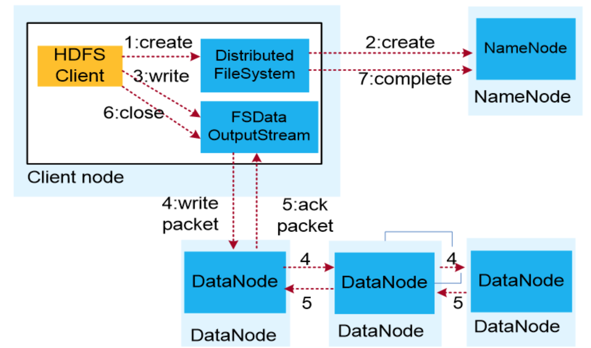
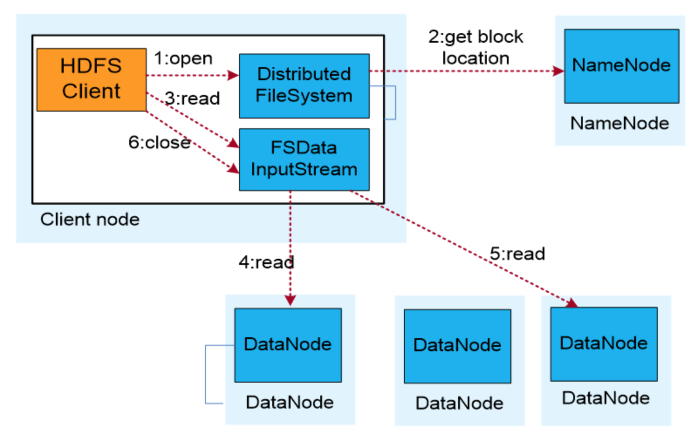
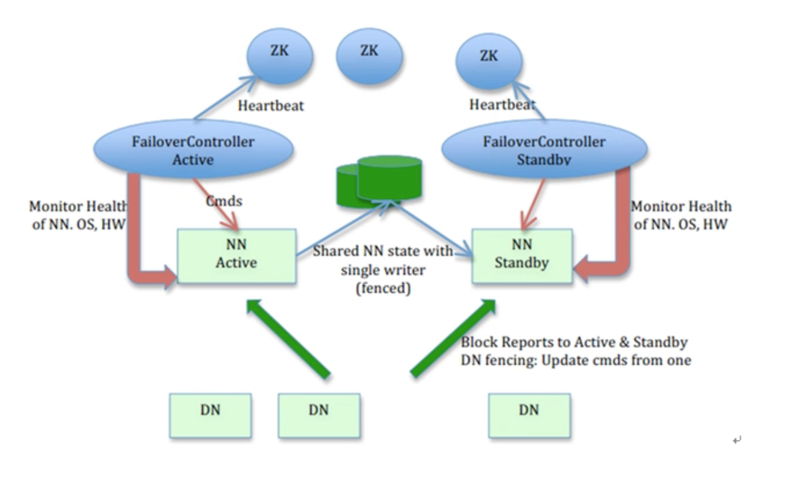
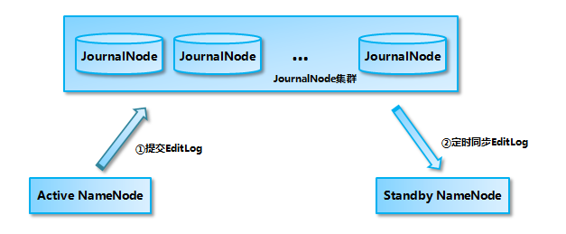
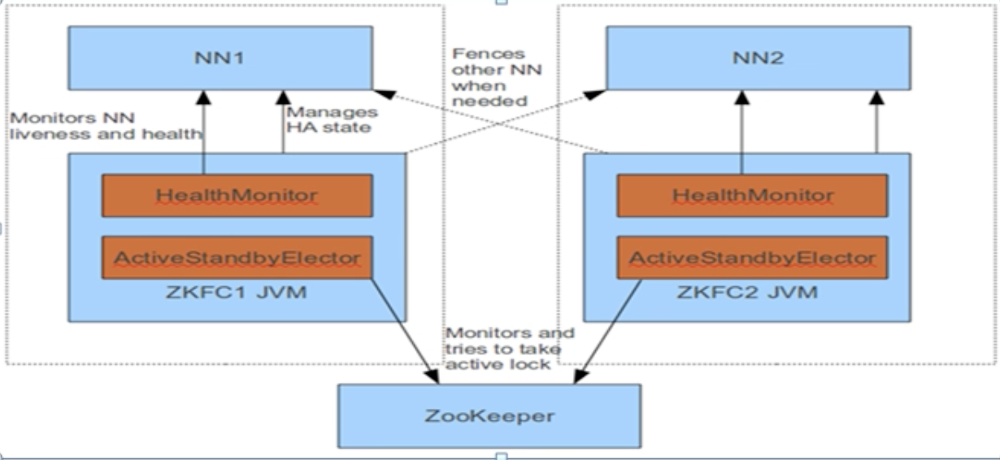
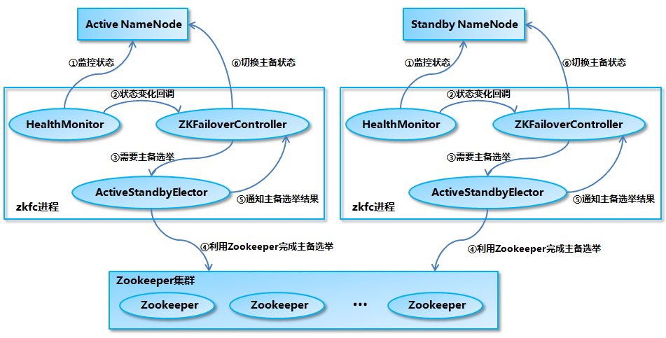

[TOC]

# HDFS分布式文件系统

- 特点：
	- 支持硬件错误
	- 高容错性
	- 支持超大文件
	- 流式数据访问
	- 简单化的一致性模型

## HDFS体系结构

- client

	- 文件切分
		- 将大文件切分为数据块
	- 与 NameNode 交互
		- 获取文件在 DataNode 中的位置信息等
	- 与 DataNode 交互
		- 读取对应的数据块
	- 管理和访问 HDFS

- NameNode

	> Mater、管理者，是主从结构中主节点上运行的进程

	- 管理 HDFS 的命名空间
	- 管理数据块的映射关系
	- 配置副本策略
	- 处理客户端的读写请求

- DataNode

	> Slave

	- 将 HDFS 数据块写到 Linux 本地文件系统的实际文件中
	- 将当前存储的数据块（block）报告给 NameNode
	- 接收 NameNode 指令创建、删除、移动本地磁盘的数据块
	- 说明：
		- 存储实际数据块
		- 执行数据局快读写操作

- Block（数据块）

	- 一个文件被切分为多个 Block
	- 每个 block 有多个副本
	- 被分布存储在多个 DataNode 上
	- 是 HDFS 的最小存储单元

- Metadata（元数据）

	- 文件系统中文件和目录的信息
	- 文件和 block 的对应关系

- 命名空间镜像（FSImage）

	- 保存某一时刻元数据的信息的磁盘文件
	- 作用：
		- 元数据存储在内存中，不稳定，容易受到硬件影响而丢失，所以需要定期将数据存储到磁盘中

- 镜像编辑日志（EditLog）

	> 和 FSimage 一起解决元数据丢失后恢复问题

	- 将元数据每次改动保存到磁盘日志中
	- 工作流程：
		- 最开始生成 FSimage，保存当前元数据信息
		- 后面元数据修改过程，存储到 EditLog 中
		- 元数据对时候恢复：
			- 读取 FSimage 数据，再通过 EditLog 恢复到最新状态的元数据

## HDFS 数据读写流程

### 写入流程

- 业务调用 HDFS Client 提供的 API，请求写入文件
- HDFS Client 连接NameNode，NameNode 在元数据中创建文件节点
- 业务应用 write Api 写入文件
- HDFS CLient 收到业务写入的数据后，从 NameNode 获取 文件节点信息（数据快编号、位置信息等）,联系 DataNode，就近将数据写入到 DataNode1
- DataNode1 将数据复制到 DataNode2，DataNode2 将数据复制到 DataNode3，
- DataNode3 存储完毕后，将确认消息发给 2，2 在发给 1，1 返回给客户端（client）
- client 关闭文件
- 业务调用 close 后，HDFS 联系 NameNode，确认数据写完成

### 读取流程

- 业务应用调用**HDFS Client**提供的API打开文件。
- HDFS Client联系**NameNode**，**获取**到文件信息（数据块、DataNode位置信息）。
- 业务应用调用**read API读取文件**。
- HDFS Client根据**从NameNode获取到的信息，联系DataNode，获取相应的数据块。**(Client采用**就近原则**读取数据)。
- HDFS Client会与多个DataNode**通讯**获取数据块。
- 数据读取完成后，业务调用**close关闭连接**

### HDFS HA 机制

> HDFS 高可用，解决单个 NameNode挂掉后，导致 HDFS不能使用问题

- 整体架构：

	

- 解决方案：
	- 采用主备结构，部署多个 NameNode
	- 平时只有一个 NameNode 处于活跃状态（active）进行 DataNode 管理
	- 其他 NameNode 处于备用状态（standby），同步主 NameNode 数据，保证和主 NameNode 数据一致
	- 当主 NameNode 宕掉后，备 NameNode 中迅速产生一个主 NameNode 继续提供服务
- 方案详解：
	- 解决` active NameNode` 与` standby NameNode `数据保持一致
		- 方案：基于 QJM 的共享存储系统的数据同步机制
			- 原理图：
				- 
			- `active NameNode`中的修改操作，会记录修改日志EditLog到半数以上的`journalNode`集群中
			- `standby NameNode` 监听`journalNode`，如果 `journalNode` 发生变化，读取`journalNode`修改的数据，更新自己
			- 当active NameNode挂掉后，`standby NameNode`成为`active NameNode` 之前，会读取所有`journalNode`里面的修改日志，保证数据一致
	- 解决怎样控制进行主备切换-ZKFC进程
		- 原理图
			- 
			- 原理：
				- ZKFC进程能及时检测 NameNode 健康状态，在主 NameNode 出现故障的时候，借助 zookeeper 实现主备选举和切换
				- 每个 NameNode 节点上都会运行一个 zkfc
			- zkfc 介绍和作用
				- 组成介绍：
					- `ZKFailoverController`负责NameNode 的主备状态切换
					- `HealthMonitor`主要负责检测 NameNode 的健康状态
						- 具体实现：
							- 定期向本地 NameNode 发送健康检查命令，检查 NameNode 两类状态
								- `HealthMonitor.State`  磁盘存储资源是否充足     (**主要作用**)
								- `HAServiceStatus`  （**辅助作用**）
									- 状态：
										- `NITIALIZING`：HealthMonitor 在初始化过程中，还没有开始进行健康状况检测；
										- `SERVICE_HEALTHY`：NameNode 状态正常；
										- `SERVICE_NOT_RESPONDING`：调用 NameNode 的 monitorHealth 方法调用无响应或响应超时；
										- `SERVICE_UNHEALTHY`：NameNode 还在运行，但是 monitorHealth 方法返回状态不正常，磁盘存储资源不足；
										- `HEALTH_MONITOR_FAILED`：HealthMonitor 自己在运行过程中发生了异常，不能继续检测 NameNode 的健康状况，会导致 ZKFailoverController 进程退出；
					- `ActiveStandbyElector`主要负责完成自动的主备选举，内部封装了 Zookeeper 的处理逻辑
				- ZooKeeper会话管理
					- 当本地NameNode是健康的，ZKFC保持一个在ZooKeeper中打开的会话。
					- 如果本地NameNode处于active状态，ZKFC也保持一个特殊的znode锁，该锁使用了ZooKeeper对短暂节点的支持，如果会话终止，锁节点将自动删除
				- ZooKeeper选举：
					- 如果本地 NameNode 是健康的，zkfc 也没有看到其他 NameNode 持有 lockZnode，它将尝试获取 lockZnode，如果成功，他本地的NameNode 变为 active
	- 整体流程：
		- 
		- HealthMonitor 初始化完成之后会启动内部的线程来定时调用对应 NameNode 的 HAServiceProtocol RPC 接口的方法，对 NameNode 的健康状态进行检测。
		- HealthMonitor 如果检测到 NameNode 的健康状态发生变化，会回调 ZKFailoverController 注册的相应方法进行处理。
		- 如果 ZKFailoverController 判断需要进行主备切换，会首先使用 ActiveStandbyElector 来进行自动的主备选举。
		- ActiveStandbyElector 与 Zookeeper 进行交互完成自动的主备选举。
		- ActiveStandbyElector 在主备选举完成后，会回调 ZKFailoverController 的相应方法来通知当前的 NameNode 成为主 NameNode 或备 NameNode。
		- ZKFailoverController 调用对应 NameNode 的 HAServiceProtocol RPC 接口的方法将 NameNode 转换为 Active 状态或 Standby 状态。