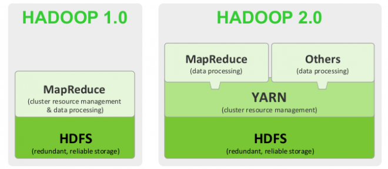
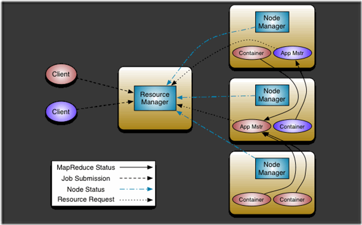
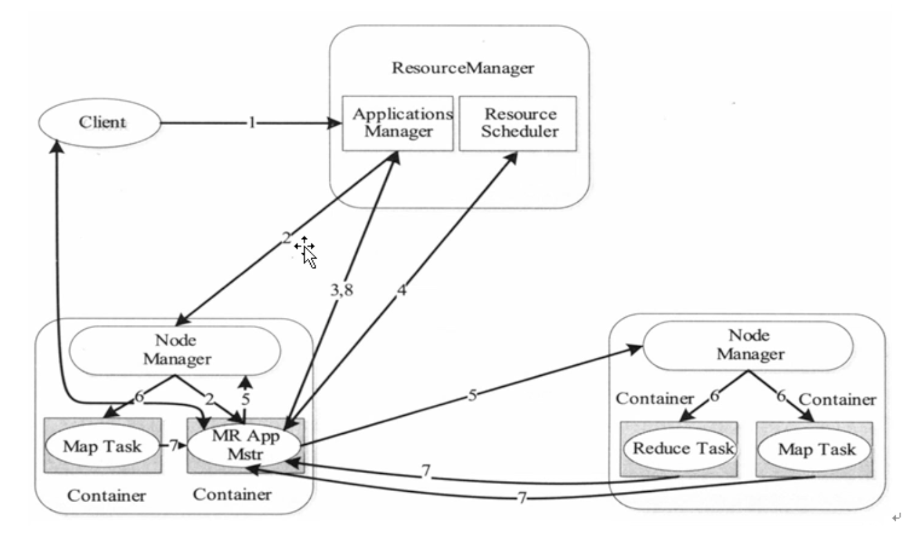
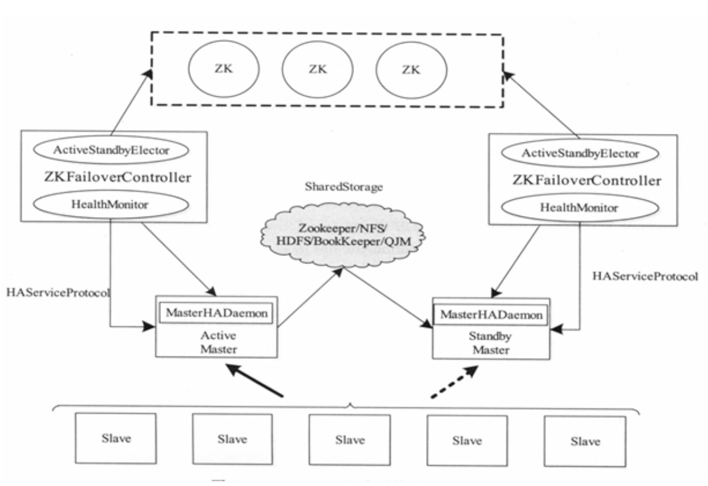

[TOC]

# yarn 资源管理系统

## yarn 与 MapReduce 的关系

 

- yarn 是一个资源管理系统，负责资源管理和调度
- MapReduce 只是运行在 yarn 上的一个应用程序
- 如果把 yarn 看做安卓，MapReduce 是安卓上的一个 app
- MapReduce1.0 是独立系统运行在 Linux 上
- MapReduce2.0 是运行在 yarn 上

## yarn 的基本框架

- 组成：
	- `ResourceManager (RM)`   一个全局的资源管理器

		- 负责整个系统的资源管理和分配
			- 处理客户端请求，启动调度过程，分配一个 container 作为 AM
			- 与运行在每个节点上的 NM 进程交互，通过心跳机制达到监控 NM 的目的
			- 资源调度，纯粹的调度器，不负责应用的监控与状态跟踪

	- `ApplicationMaster (AM)`   每个应用程序持有

		- 任务调度与监控
		- 与 RM 协商申请资源，一个周期会向 RM 汇报 app 的进展

	- `NodeManager (NM)`  负责每个节点的资源监控与管理

		- 负责处理 RM 的任务
		- 接收 AM的 Container 启动、停止
		- 向 RM 汇报各个 Container 运行状态和节点健康状况，并领取有段 Container 的命令，并执行

	- ###### `Container（slave）`

		- 任务运行环境的抽象封装
		- AM向NM提供更多的信息来启动Container
		- 申请的资源依据提交的run.sh中的参数，如没有设置，则按照yarn默认参数
		- 资源container进行封装，按需分配，需要多少资源就分配多少资源

### MapReduce On Yarn

- yarn 任务类型：
	- 短应用程序
		- 一定时间可以运行完成并正常退出的应用程序
	- 长应用程序
		- 不出意外永不终止运行的应用程序，通常是一些服务
- yarn 上程序运行阶段：
	- 启动 AM
	- 由 AM 创建应用程序，申请资源，并监控它整个运行过程，知道运行完成
- 操作流程：
	- 
	- Client提交application任务，向RM申请资源，
	- RM根据资源分布情况来分配一个NodeManager下的container作为AM
	- 初始化任务所需的资源并向RM发出资源请求
	- RM分配指定NodeManager下的container资源计划
	- AM根据RM分配的资源计划去指定的NodeManager来启动对应的container
	- 任务运行时，对应的container通过心跳机制向AM汇报任务的运行情况，从而达到监控任务的目的。
	- NodeManager监控该节点下的container的资源使用情况并向RM汇报（心跳机制）。AM在一定周期内会向RM汇报该任务的进度。
		

### yarn容错能力

- RM挂掉：
	- 单点故障，RM可以基于Zookeeper实现HA高可用集群，为主RM设置一个备用RM，主RM提供服务，备用RM同步主RM的信息，一旦主RM挂掉，立刻切换到备用RM。
- NM挂掉：
	- 当一个NM挂掉后，会通过心跳机制通知RM，RM将情况通知对应的AM，AM进一步做处理。
- AM挂掉：
	- 当AM挂掉时，RM负责重启，选择另一个AM来执行上一个AM未完成的task。事实上RM有一个RMApplicationManager（AM的Amanager），保存着已经完成的task，若重启AM，无需重新运行已完成的task

### yarn 高可用

> 解决 Rm 单点故障

和 HDFS 解决 NameNode 单点故障原理类似