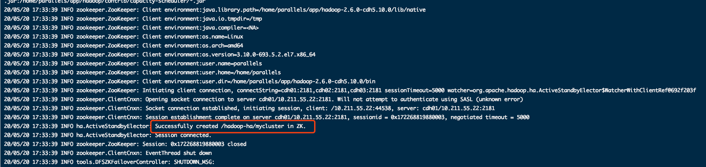
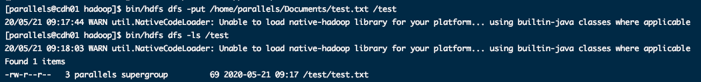

# Hadoop 集群安装

## HDFS 安装

### 下载 Hadoop 安装包

- 下载版本：[Zookeeper.md/集群规划](001-Zookeeper.md)

### 解压 Hadoop

- 通过 `tar -zvxf` 命令对 Hadoop 安装包进行解压

### 创建软链接

- 创建软链接指向 Hadoop 真是安装目录
- 命令：`ln -s 安装文件夹 软链接名称`


### 修改配置文件

> 核心配置文件：
>
> ​	core-site.xml、hdfs-site.xml 、slaves、hadoop-env.sh  

- 官方配置

	- [core-site.xml ](http://hadoop.apache.org/docs/current/hadoop-project-dist/hadoop-common/core-default.xml)

		

| **序号** | **配置文件名**  | **配置对象**         | **主要内容**                                                 |
| -------- | --------------- | -------------------- | ------------------------------------------------------------ |
| 1        | hadoop-env.sh   | hadoop运行环境       | 用来定义hadoop运行环境相关的配置信息                         |
| 2        | core-site.xml   | 集群全局参数         | 用于定义系统级别的参数，如HDFS URL 、Hadoop的临时目录等      |
| 3        | hdfs-site.xml   | HDFS                 | 如名称节点和数据节点的存放位置、文件副本的个数、文件的读取权限等 |
| 4        | mapred-site.xml | Mapreduce参数        | 包括JobHistory Server 和应用程序参数两部分，如reduce任务的默认个数、任务所能够使用内存的默认上下限等 |
| 5        | yarn-site.xml   | 集群资源管理系统参数 | 配置ResourceManager ，nodeManager的通信端口，web监控端口等   |


#### core-site.xml

```xml
<configuration>
  <!--默认 hdfs 路径-->
  <property>
    <name>fs.defaultFS</name>
    <value>hdfs://mycluster</value>
  </property>
  <!-- Hadoop 的临时目录，用来指定使用hadoop时产生文件的存放目录-->
  <property>
    <name>hadoop.tmp.dir</name>
    <value>/home/parallels/data/hadoop-2.6.0/tmp</value> 
  </property>
  <!-- 配置 Zookeeper 管理 Hdfs -->
  <property>
    <name>ha.zookeeper.quorum</name>
    <value>cdh01:2181,cdh02:2181,cdh03:2181</value> 
  </property>
  
</configuration>
```

#### hdfs-site.xml

```xml
<?xml version="1.0" encoding="UTF-8"?>
<?xml-stylesheet type="text/xsl" href="configuration.xsl"?>
<!--
  Licensed under the Apache License, Version 2.0 (the "License");
  you may not use this file except in compliance with the License.
  You may obtain a copy of the License at

    http://www.apache.org/licenses/LICENSE-2.0

  Unless required by applicable law or agreed to in writing, software
  distributed under the License is distributed on an "AS IS" BASIS,
  WITHOUT WARRANTIES OR CONDITIONS OF ANY KIND, either express or implied.
  See the License for the specific language governing permissions and
  limitations under the License. See accompanying LICENSE file.
-->

<!-- Put site-specific property overrides in this file. -->

<configuration>
    <!--指定hdfs保存数据的副本数量-->
    <property>
            <name>dfs.replication</name>
            <value>3</value>
    </property>

    <!--文件操作时的权限检查标识-->
    <property>
            <name>dfs.permissions</name>
            <value>false</value>
    </property>

    <!-- 命名空间 ,值与fs.defaultFS的值对应，NameNode 高可用之后，有两个 NameNode，mycluster是对我提供统一入口-->
    <property>  
      <name>dfs.nameservices</name>
      <value>mycluster</value>
    </property>
    <!-- 指定 nameService 是 mycluster 时候的 NameNode有哪些，这里的值是逻辑名称，名字随便起，不要重复-->
    <property>
      <name>dfs.ha.namenodes.mycluster</name>
      <value>nn1,nn2</value>
    </property>
    <!--the fully-qualified RPC address for each NameNode to listen on -->
    <property>
      <name>dfs.namenode.rpc-address.mycluster.nn1</name>
      <value>cdh01:9000</value>
    </property>
    <property>
      <name>dfs.namenode.rpc-address.mycluster.nn2</name>
      <value>cdh02:9000</value>
    </property>
    <!--the fully-qualified HTTP address for each NameNode to listen on -->
    <property>
      <name>dfs.namenode.http-address.mycluster.nn1</name>
      <value>cdh01:50070</value>
    </property>
    <property>
      <name>dfs.namenode.http-address.mycluster.nn2</name>
      <value>cdh02:50070</value>
    </property>
    <!-- 故障自动恢复 -->
    <property>
       <name>dfs.ha.automatic-failover.enabled</name>
       <value>true</value>
    </property>

    <!--
      指定 NameNode 的元数据在 journalNode 上存放位置
      the URI which identifies the group of JNs where the NameNodes will write/read edits 
    -->
    <property>
      <name>dfs.namenode.shared.edits.dir</name>
      <value>qjournal://cdh01:8485;cdh02:8485;cdh03:8485/mycluster</value>
    </property>

    <!-- 
      指定 mycluster 出故障时候，那个实现类负责执行故障切换
      the Java class that HDFS clients use to contact the Active NameNode 
    -->
    <property>
      <name>dfs.client.failover.proxy.provider.mycluster</name>
      <value>org.apache.hadoop.hdfs.server.namenode.ha.ConfiguredFailoverProxyProvider</value>
    </property>

    <!--
      the path where the JournalNode daemon will store its local state
      JournalNode在本地磁盘中存放数据的位置
    -->
    <property>
      <name>dfs.journalnode.edits.dir</name>
      <value>/home/parallels/data/journaldata/jn</value>
    </property>

    <!--
      a list of scripts or Java classes which will be used to fence the Active NameNode during a failover
      配置隔离机制，shell 通过 ssh 连接 active NameNode 节点，杀掉进程
    -->
    <property>
      <name>dfs.ha.fencing.methods</name>
      <value>shell(/bin/true)</value>
    </property>

    <!-- 配置免密登录的 ssh 秘钥信息 -->
    <property>
      <name>dfs.ha.fencing.ssh.private-key-files</name>
      <value>/home/parallels/.ssh/id_rsa </value>
    </property>
     

</configuration>


```

#### hadoop-env.sh 

```shell
# Licensed to the Apache Software Foundation (ASF) under one
# or more contributor license agreements.  See the NOTICE file
# distributed with this work for additional information
# regarding copyright ownership.  The ASF licenses this file
# to you under the Apache License, Version 2.0 (the
# "License"); you may not use this file except in compliance
# with the License.  You may obtain a copy of the License at
#
#     http://www.apache.org/licenses/LICENSE-2.0
#
# Unless required by applicable law or agreed to in writing, software
# distributed under the License is distributed on an "AS IS" BASIS,
# WITHOUT WARRANTIES OR CONDITIONS OF ANY KIND, either express or implied.
# See the License for the specific language governing permissions and
# limitations under the License.

# Set Hadoop-specific environment variables here.

# The only required environment variable is JAVA_HOME.  All others are
# optional.  When running a distributed configuration it is best to
# set JAVA_HOME in this file, so that it is correctly defined on
# remote nodes.

# The java implementation to use.
# 重点修改 java 和 Hadoop 路径
export JAVA_HOME=/home/parallels/app/jdk
export HADOOP_HOME=/home/parallels/app/hadoop
# The jsvc implementation to use. Jsvc is required to run secure datanodes
# that bind to privileged ports to provide authentication of data transfer
# protocol.  Jsvc is not required if SASL is configured for authentication of
# data transfer protocol using non-privileged ports.
#export JSVC_HOME=${JSVC_HOME}

export HADOOP_CONF_DIR=${HADOOP_CONF_DIR:-"/etc/hadoop"}

# Extra Java CLASSPATH elements.  Automatically insert capacity-scheduler.
for f in $HADOOP_HOME/contrib/capacity-scheduler/*.jar; do
  if [ "$HADOOP_CLASSPATH" ]; then
    export HADOOP_CLASSPATH=$HADOOP_CLASSPATH:$f
  else
    export HADOOP_CLASSPATH=$f
  fi
done

# The maximum amount of heap to use, in MB. Default is 1000.
#export HADOOP_HEAPSIZE=
#export HADOOP_NAMENODE_INIT_HEAPSIZE=""

# Extra Java runtime options.  Empty by default.
export HADOOP_OPTS="$HADOOP_OPTS -Djava.net.preferIPv4Stack=true"

# Command specific options appended to HADOOP_OPTS when specified
export HADOOP_NAMENODE_OPTS="-Dhadoop.security.logger=${HADOOP_SECURITY_LOGGER:-INFO,RFAS} -Dhdfs.audit.logger=${HDFS_AUDIT_LOGGER:-INFO,NullAppender} $HADOOP_NAMENODE_OPTS"
export HADOOP_DATANODE_OPTS="-Dhadoop.security.logger=ERROR,RFAS $HADOOP_DATANODE_OPTS"

export HADOOP_SECONDARYNAMENODE_OPTS="-Dhadoop.security.logger=${HADOOP_SECURITY_LOGGER:-INFO,RFAS} -Dhdfs.audit.logger=${HDFS_AUDIT_LOGGER:-INFO,NullAppender} $HADOOP_SECONDARYNAMENODE_OPTS"

export HADOOP_NFS3_OPTS="$HADOOP_NFS3_OPTS"
export HADOOP_PORTMAP_OPTS="-Xmx512m $HADOOP_PORTMAP_OPTS"

# The following applies to multiple commands (fs, dfs, fsck, distcp etc)
export HADOOP_CLIENT_OPTS="-Xmx512m $HADOOP_CLIENT_OPTS"
#HADOOP_JAVA_PLATFORM_OPTS="-XX:-UsePerfData $HADOOP_JAVA_PLATFORM_OPTS"

# On secure datanodes, user to run the datanode as after dropping privileges.
# This **MUST** be uncommented to enable secure HDFS if using privileged ports
# to provide authentication of data transfer protocol.  This **MUST NOT** be
# defined if SASL is configured for authentication of data transfer protocol
# using non-privileged ports.
export HADOOP_SECURE_DN_USER=${HADOOP_SECURE_DN_USER}

# Where log files are stored.  $HADOOP_HOME/logs by default.
#export HADOOP_LOG_DIR=${HADOOP_LOG_DIR}/$USER

# Where log files are stored in the secure data environment.
export HADOOP_SECURE_DN_LOG_DIR=${HADOOP_LOG_DIR}/${HADOOP_HDFS_USER}

###
# HDFS Mover specific parameters
###
# Specify the JVM options to be used when starting the HDFS Mover.
# These options will be appended to the options specified as HADOOP_OPTS
# and therefore may override any similar flags set in HADOOP_OPTS
#
# export HADOOP_MOVER_OPTS=""

###
# Advanced Users Only!
###

# The directory where pid files are stored. /tmp by default.
# NOTE: this should be set to a directory that can only be written to by 
#       the user that will run the hadoop daemons.  Otherwise there is the
#       potential for a symlink attack.
export HADOOP_PID_DIR=${HADOOP_PID_DIR}
export HADOOP_SECURE_DN_PID_DIR=${HADOOP_PID_DIR}

# A string representing this instance of hadoop. $USER by default.
export HADOOP_IDENT_STRING=$USER

```

#### slaves

> datenode 节点配置

```shell
cdh01
cdh02
cdh03
```

### 将安装目录同步到其他节点

- 命令
	- `fenfa_jiqun.sh hadoop-2.6.0-cdh5.10.0 /home/parallels/app/ slave`
- 各个节点分别创建软链接
	- `ln -s hadoop-2.6.0-cdh5.10.0 hadoop `

### 启动测试 HDFS

```shell
#启动所有 Zookeeper节点
zhixing_yuancheng.sh "/home/parallels/app/zookeeper/bin/zkServer.sh start" all

#启动所有 journalnode 节点
zhixing_yuancheng.sh "/home/parallels/app/hadoop/sbin/hadoop-daemon.sh start journalnode" all

#测试查看所有 journalnode 是否启动
zhixing_yuancheng.sh "jps" all

# nn1 节点格式化 NameNode
cd /home/parallels/app/hadoop
bin/hdfs namenode -format

# nn1节点格式化 ZKFC
cd /home/parallels/app/hadoop
bin/hdfs zkfc -formatZK

# nn1节点启动 NameNode
cd /home/parallels/app/hadoop
bin/hdfs namenode

# nn2 节点同步nn1 节点元数据信息
cd /home/parallels/app/hadoop
bin/hdfs namenode -bootstrapStandby

# nn2 同步完nn1 节点信息后，Ctrl+c 关闭 nn1 节点 NameNode 进程

# 关闭所有节点 journalnode
zhixing_yuancheng.sh "/home/parallels/app/hadoop/sbin/hadoop-daemon.sh stop journalnode" all

# 一键启动 hdfs
cd /home/parallels/app/hadoop
sbin/start-dfs.sh 

# 查看 NameNode 状态命令
bin/hdfs haadmin -getServiceState nn1
bin/hdfs haadmin -getServiceState nn2

# 一键关闭 hdfs
cd /home/parallels/app/hadoop
sbin/stop-dfs.sh
```

- 启动所有 journalnode 节点

	

- 测试查看所有 journalnode 是否启动

	

- nn1 节点格式化 NameNode

	

	

- nn1节点格式化 ZKFC

	

- nn1节点启动 NameNode

	

- nn2 节点同步nn1 节点元数据信息

	

- 关闭所有节点 journalnode

	

	

- 一键启动 hdfs

	

	- 先启动 NameNode 在 cdh01、cdh02 节点上
	- 再启动 DataNode，在 cdh01、cdh02、cdh03 节点上
	- 再启动 journalnode，在 cdh01、cdh02、cdh03 节点上
	- 再启动 ZKFC，在 cdh01、cdh02节点上

- 各节点上启动的进程

	

- 节点HDFS 状态


- 查看 NameNode 状态命令

	

- 一键关闭 hdfs

	

	

	

###  web界面查看 hdfs

- 网址：

	- ```url
		http://master:500700
		```

	

	

### hdfs基本操作命令

```shell
[parallels@cdh01 hadoop]$ bin/hdfs
Usage: hdfs [--config confdir] COMMAND
       where COMMAND is one of:
  dfs                  run a filesystem command on the file systems supported in Hadoop.
  namenode -format     format the DFS filesystem 
  secondarynamenode    run the DFS secondary namenode
  namenode             run the DFS namenode
  journalnode          run the DFS journalnode
  zkfc                 run the ZK Failover Controller daemon
  datanode             run a DFS datanode
  dfsadmin             run a DFS admin client
  diskbalancer         Distributes data evenly among disks on a given node
  haadmin              run a DFS HA admin client
  fsck                 run a DFS filesystem checking utility
  balancer             run a cluster balancing utility
  jmxget               get JMX exported values from NameNode or DataNode.
  mover                run a utility to move block replicas across
                       storage types
  oiv                  apply the offline fsimage viewer to an fsimage
  oiv_legacy           apply the offline fsimage viewer to an legacy fsimage
  oev                  apply the offline edits viewer to an edits file
  fetchdt              fetch a delegation token from the NameNode
  getconf              get config values from configuration
  groups               get the groups which users belong to
  snapshotDiff         diff two snapshots of a directory or diff the
                       current directory contents with a snapshot
  lsSnapshottableDir   list all snapshottable dirs owned by the current user
                                                Use -help to see options
  portmap              run a portmap service
  nfs3                 run an NFS version 3 gateway
  cacheadmin           configure the HDFS cache
  crypto               configure HDFS encryption zones
  storagepolicies      list/get/set block storage policies
  version              print the version

Most commands print help when invoked w/o parameters.
[parallels@cdh01 hadoop]$ 

```

## Yarn 安装

### 配置修改

- 官方配置：
	- [mapred-site.xml](http://hadoop.apache.org/docs/current/hadoop-mapreduce-client/hadoop-mapreduce-client-core/mapred-default.xml)
	- [yarn-site.xml](http://hadoop.apache.org/docs/current/hadoop-yarn/hadoop-yarn-common/yarn-default.xml)

#### yarn-site.xml

```xml
<?xml version="1.0"?>
<!--
  Licensed under the Apache License, Version 2.0 (the "License");
  you may not use this file except in compliance with the License.
  You may obtain a copy of the License at

    http://www.apache.org/licenses/LICENSE-2.0

  Unless required by applicable law or agreed to in writing, software
  distributed under the License is distributed on an "AS IS" BASIS,
  WITHOUT WARRANTIES OR CONDITIONS OF ANY KIND, either express or implied.
  See the License for the specific language governing permissions and
  limitations under the License. See accompanying LICENSE file.
-->
<configuration>

  <!-- 多久尝试连接到ResourceManager -->
  <property>
    <name>yarn.resourcemanager.connect.retry-interval.ms</name>
    <value>2000</value>
  </property>

  <!-- 启用RM高可用性。启用后，
        （1）默认情况下，RM在待机模式下启动，并过渡到
        提示时进入活动模式。
        （2）RM集合中的节点在
        yarn.resourcemanager.ha.rm-ids
        （3）每个RM的id都来自yarn.resourcemanager.ha.id
        如果明确指定yarn.resourcemanager.ha.id或可以
        通过将yarn.resourcemanager.address。{id}与本地地址匹配来确定
        （4）实际的物理地址来自模式的配置
        -{rpc-config}。{id} -->
  <property>
    <name>yarn.resourcemanager.ha.enabled</name>
    <value>true</value>
  </property>

  <!-- 启用自动故障转移。
      默认情况下，仅在启用HA时启用 -->
  <property>
    <name>yarn.resourcemanager.ha.automatic-failover.enabled</name>
    <value>true</value>
  </property>

  <!-- rm 启动内置选举 active -->
  <property>
    <name>yarn.resourcemanager.ha.automatic-failover.embedded</name>
    <value>true</value>
  </property>

  <!-- 
    集群名称。在高可用性设置中，这用于确保RM参与领导者选择该集群，并确保它不影响其他集群 
    给 yarn cluster 取个名字 yarn-rm-cluster
  -->
  <property>
    <name>yarn.resourcemanager.cluster-id</name>
    <value>yarn-rm-cluster</value>
  </property>

  <!-- 
    RM 高可用，rm1，rm2
  -->
  <property>
    <name>yarn.resourcemanager.ha.rm-ids</name>
    <value>rm1,rm2</value>
  </property>

  <!-- Resource Manager Configuration -->

  <!-- The hostname of the RM -->
  <property>
    <name>yarn.resourcemanager.hostname.rm1</name>
    <value>cdh01</value>
  </property> 

  <!-- RM1中应用程序管理器界面的地址 -->
  <property>
    <name>yarn.resourcemanager.address.rm1</name>
    <value>cdh01:8032</value>
  </property>

  <!-- 
    RM1 Web应用程序的http地址。如果仅提供主机作为值，该webapp将在随机端口上提供。 
  -->
  <property>
    <name>yarn.resourcemanager.webapp.address.rm1</name>
    <value>cdh01:8088</value>
  </property>

  <!-- 调度程序接口的地址。 -->
  <property>
    <name>yarn.resourcemanager.scheduler.address.rm1</name>
    <value>cdh01:8030</value>
  </property>


  <property>
    <name>yarn.resourcemanager.hostname.rm2</name>
    <value>cdh02</value>
  </property>

  <!-- RM1中应用程序管理器界面的地址 -->
  <property>
    <name>yarn.resourcemanager.address.rm2</name>
    <value>cdh02:8032</value>
  </property>

  <!-- 
    RM1 Web应用程序的http地址。如果仅提供主机作为值，该webapp将在随机端口上提供。 
  -->
  <property>
    <name>yarn.resourcemanager.webapp.address.rm2</name>
    <value>cdh02:8088</value>
  </property>

  <!-- 调度程序接口的地址。 -->
  <property>
    <name>yarn.resourcemanager.scheduler.address.rm2</name>
    <value>cdh02:8030</value>
  </property>

  <!-- 
    启动后使RM恢复状态。如果为真，则必须指定yarn.resourcemanager.store.class 
    RM 自动回复启动
  -->
  <property>
    <name>yarn.resourcemanager.recovery.enabled</name>
    <value>true</value>
  </property>

  <!-- 状态存储地址 -->
  <property>
    <name>yarn.resourcemanager.zk.state-store.address</name>
    <value>cdh01:2181,cdh02:2181,cdh03:2181</value>
  </property>

  <!-- 配置zookeeper 地址 -->
  <property>
    <name>yarn.resourcemanager.zk-address</name>
    <value>cdh01:2181,cdh02:2181,cdh03:2181</value>
  </property>

  <!-- 以逗号分隔的服务列表，其中服务名称应仅
      包含a-zA-Z0-9_，并且不能以数字开头</ description>
    <名称> yarn.nodemanager.aux-services -->
  <property>
    <name>yarn.nodemanager.aux-services</name>
    <value></value>
    <value>mapreduce_shuffle</value>
  </property>

  <!-- Map Reduce Configuration -->
  <property>
    <name>yarn.nodemanager.aux-services.mapreduce_shuffle.class</name>
    <value>org.apache.hadoop.mapred.ShuffleHandler</value>
  </property>

</configuration>

```

#### mapred-site.xml

```xml
<?xml version="1.0"?>
<?xml-stylesheet type="text/xsl" href="configuration.xsl"?>
<!--
  Licensed under the Apache License, Version 2.0 (the "License");
  you may not use this file except in compliance with the License.
  You may obtain a copy of the License at

    http://www.apache.org/licenses/LICENSE-2.0

  Unless required by applicable law or agreed to in writing, software
  distributed under the License is distributed on an "AS IS" BASIS,
  WITHOUT WARRANTIES OR CONDITIONS OF ANY KIND, either express or implied.
  See the License for the specific language governing permissions and
  limitations under the License. See accompanying LICENSE file.
-->

<!-- Put site-specific property overrides in this file. -->


<configuration>
  <!-- 指明hadoop的MR将来运行于YARN上。Yarn为资源调度系统（可运行MR,STORM,SPARK等计算框架 -->
  <property>
    <name>mapreduce.framework.name</name>
    <value>yarn</value>
  </property>
</configuration>

```

###  yarn启动和测试

```shell
# 一键启动（只启动了当前节点的 resourcemanager 和所有节点的 datamanager）
cd /home/parallels/app/hadoop
sbin/start-yarn.sh

# 在 rm2 节点上启动resourcemanager
cd /home/parallels/app/hadoop
sbin/yarn-daemon.sh start resourcemanager

# 查看 RM 状态
 bin/yarn rmadmin -getServiceState rm1
 bin/yarn rmadmin -getServiceState rm2
```

- 一键启动


- 启动 rm2 节点上的 resourcemanager


- 查看 RM 状态


#### web界面查看 yarn

```
http://master:8088
```

- `http://10.211.55.22:8088/cluster`

	


### yarn 测试运行

- 运行 Hadoop 自带 Wordcount 程序

- 命令：

	- ```shell
		# 进入 Hadoop 安装目录
		cd /home/parallels/app/hadoop
		
		# Hdfs 文件系统创建 test 目录
		bin/hdfs dfs -mkdir /test
		
		# 创建 test.txt 文件，并将文件上传到 hdfs 文件系统/test目录下
		bin/hdfs dfs -put /home/parallels/Documents/test.txt /test
		
		# 对此文件进行 wordcount 测试
		bin/hadoop jar share/hadoop/mapreduce2/hadoop-mapreduce-examples-2.6.0-cdh5.10.0.jar wordcount /test/test.txt /test/out
		
		```

	- 创建 test.txt 文件

		

	- 将 test.txt 文件放入 hdfs 文件系统中 /test 文件夹下

		

	- wordcount 程序测试

		

