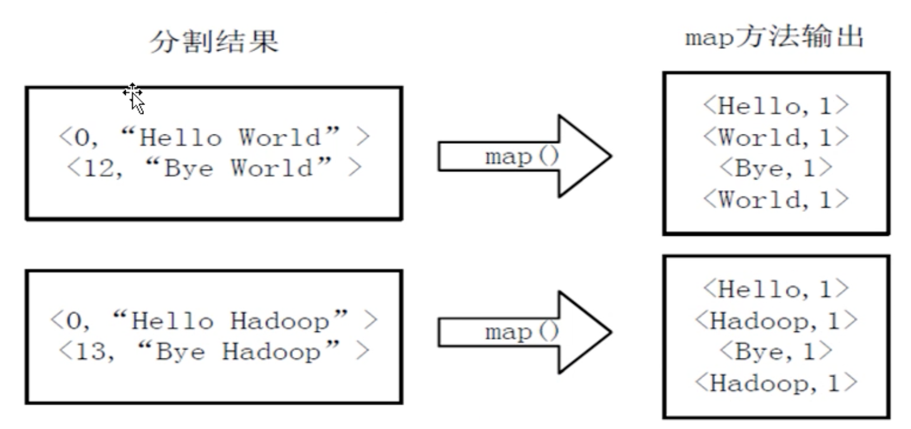
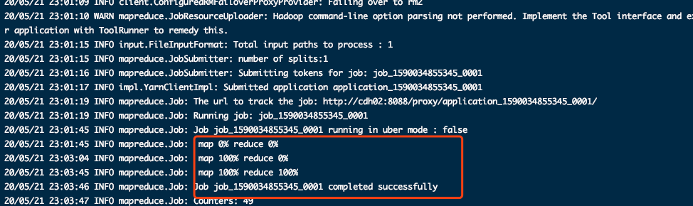

[TOC]

# MapReduce 分布式计算框架

## 背景介绍

- 起源：google 的 MapReduce 论文

	> 材料内容来自互联网，并有中文翻译，感谢他们
	>
	> 此处做集中展示

	- 中文译本：
		- [Google-MapReduce中文版_1.0.pdf](Google-MapReduce中文版_1.0.pdf)
		- [Google-Bigtable中文版_1.0.pdf](Google-Bigtable中文版_1.0.pdf)
		- [Google-File-System中文版_1.0.pdf](Google-File-System中文版_1.0.pdf)
	- [mapreduce 中文版 中文翻译](https://blog.csdn.net/active1001/article/details/1675920)
	- [Google File System(中文翻译)](https://blog.csdn.net/xuleicsu/article/details/526386)
	- [Google's BigTable 原理 （翻译）](https://blog.csdn.net/accesine960/article/details/595628)

- 定义：

	- MapReduce 是一个简单地软件框架，基于此框架写出来的程序能够`并行`运行在由上千个商品机组成的集群中,并以一种可靠的容错方式并行处理 TB 级别的数据集
	- 总分来说：
		- MapReduce 是面向大规模数据并行处理及计算模型、框架和平台

- 优点：

	- 易于编程
	- 良好的扩展性
	- 高容错性
	- 适合 PB 级别以上的海量数据离线处理

- 缺点（不合适的场景）：

	- 实时计算
	- 流式计算
	- DAG 计算

## 设计思想

- 面向大规模数据处理的三个基本设计思想：
	- 分而治之
	- 抽象成模型
		- 把函数式编程思想构建成抽象模型（map 和 reduce）
	- 上升到架构
		- 统一架构，为程序员隐藏系统底层实现细节
			- 计算任务的自动划分和调度
			- 数据的自动化分布存储和划分
			- 处理数据与计算任务同步
			- 结果数据的收集（sorting，combining，partitioning 等）
			- 系统通信、负载均衡、计算性能优化处理
			- 处理系统节点出错检测和失效恢复

### 分而治之


### 抽象成模型


## 编程模型

### 整体模型


### 具体模型


 


## 案例分析

- 业务场景：有大量文件，每个文件里面存储的都是单词
- 业务需求：统计所有文件中各个单词出现的次数
- 解决思路：
	- 先分别统计出每个文件中各个单词出现的次数，然后再累加不同文件中同一个单词出现次数 

- 输入数据：

	- 

- map 输出：

	- 

- 排序合并

	- 

- reduce 输出

	- 

- 代码：

	- 获取：[ApacheHadoop 官方示例代码](https://hadoop.apache.org/docs/r2.9.1/hadoop-mapreduce-client/hadoop-mapreduce-client-core/MapReduceTutorial.html#Example:_WordCount_v1.0)

		```java
		//代码注释，为个人理解添加，不保证完全正确
		
		package org.example.test001;
		
		import java.io.IOException;
		import java.util.StringTokenizer;
		
		import org.apache.hadoop.conf.Configuration;
		import org.apache.hadoop.fs.Path;
		import org.apache.hadoop.io.IntWritable;
		import org.apache.hadoop.io.Text;
		import org.apache.hadoop.mapreduce.Job;
		import org.apache.hadoop.mapreduce.Mapper;
		import org.apache.hadoop.mapreduce.Reducer;
		import org.apache.hadoop.mapreduce.lib.input.FileInputFormat;
		import org.apache.hadoop.mapreduce.lib.output.FileOutputFormat;
		
		public class WordCount {
		
		    
		    public static class TokenizerMapper
		            extends Mapper<Object, Text, Text, IntWritable>{
		
		        // IntWritable 类似 int,  Text类似 String
		        // one 变量初始化为 1
		        private final static IntWritable one = new IntWritable(1);
		        private Text word = new Text();
		
		        public void map(Object key, Text value, Context context
		        ) throws IOException, InterruptedException {
		            // 对文本value内容进行格式化，拆分为一个个单词
		            StringTokenizer itr = new StringTokenizer(value.toString());
		            // 循环遍历每一个单词，组成 key:单词 value:1
		            while (itr.hasMoreTokens()) {
		                word.set(itr.nextToken());
		                context.write(word, one);
		            }
		        }
		    }
		
		    public static class IntSumReducer
		            extends Reducer<Text,IntWritable,Text,IntWritable> {
		        private IntWritable result = new IntWritable();
		        
		        // key:单词  values：[1,1,1,1]
		        public void reduce(Text key, Iterable<IntWritable> values,
		                           Context context
		        ) throws IOException, InterruptedException {
		            /**
		             * 对每个key 的 value 进行求和，返回 key/value 结果
		             */
		            int sum = 0;
		            for (IntWritable val : values) {
		                sum += val.get();
		            }
		            result.set(sum);
		            context.write(key, result);
		        }
		    }
		
		    public static void main(String[] args) throws Exception {
		        Configuration conf = new Configuration();
		        Job job = Job.getInstance(conf, "word count");
		        job.setJarByClass(WordCount.class);
		        job.setMapperClass(TokenizerMapper.class);
		        job.setCombinerClass(IntSumReducer.class);
		        job.setReducerClass(IntSumReducer.class);
		        job.setOutputKeyClass(Text.class);
		        job.setOutputValueClass(IntWritable.class);
		        FileInputFormat.addInputPath(job, new Path(args[0])); //命令第一个参数是文档地址，读取文档内容计算
		        FileOutputFormat.setOutputPath(job, new Path(args[1])); //命令第二个参数为计算结果输出路径
		        System.exit(job.waitForCompletion(true) ? 0 : 1);
		    }
		}
		```

- 执行代码：

	- project 创建自行百度
	- 输入：
		- 
	- 输出：
		- 

- 打包到 yarn 中执行

	- 打包 自行百度

		- 结果：

	- 上传到集群中，并执行命令：

		```shell
		bin/hadoop jar /home/parallels/app/test/com.hadoop_test.jar org.example.test001.WordCount /test/test.txt /test/wc_out
		```

		

	- 查看结果

		```shell
		bin/hdfs dfs -cat /test/wc_out/part-r-00000
		```

		

