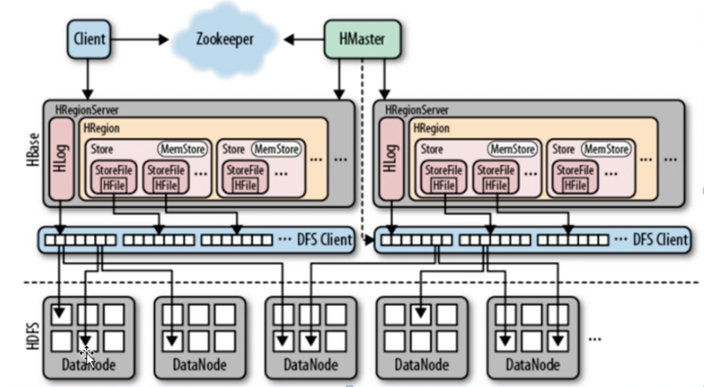
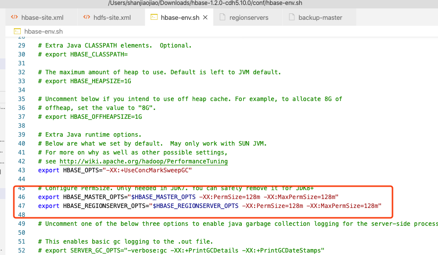
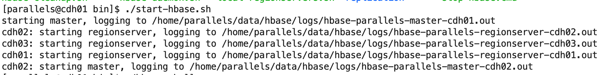
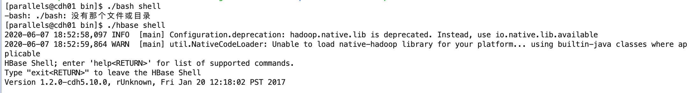
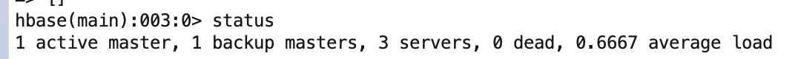
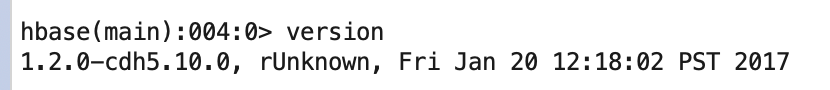
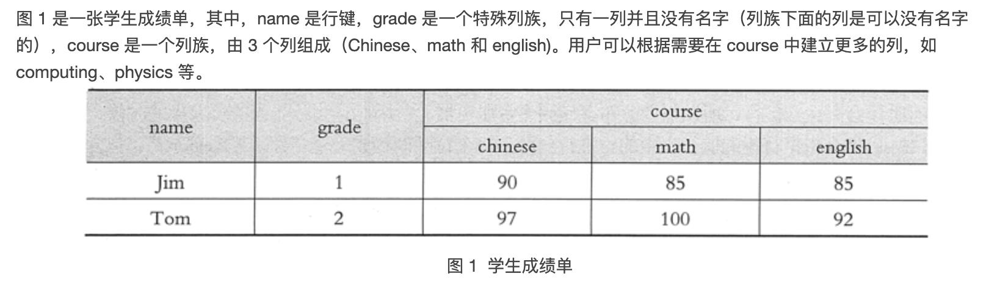

# HBASE

- 了解：
	- HBase是Hadoop的生态系统，是建立在Hadoop文件系统（HDFS）之上的分布式、面向列的数据库，通过利用Hadoop的文件系统提供容错能力
	- 与 Google 的关系：
		- HBase作为Google Bigtable的开源实现
		- Google通过运行MapReduce来处理Bigtable中的海量数据，同样，HBase利用Hadoop MapReduce来处理HBase中的海量数据
		- Google Bigtable利用Chubby作为协同服务，HBase利用Zookeeper作为对应
	- 与传统数据库比较：
		- 大：单表可以数十亿行，数百万列
		- 无模式：同一个表的不同行可以有不同的列
		- 面向列：存储、权限控制、检索均面向列
		- 稀疏：空列不占用存储，表示稀疏的
		- 多版本：每个单元中的数据可以有多个版本，默认情况下版本号自动分配，是单元格插入时的时间戳
		- 数据类型单一：数据都是字符串，没有类型

## 数据模型

| ROW KEY | version | Column Family                                       | Column Family     |
| ------- | ------- | --------------------------------------------------- | ----------------- |
|         |         | URI                                                 | Parser            |
| r1      | t2      | url=https://www.bilibili.com/video/BV1pE411R77g?p=2 | name=哔哩哔哩     |
|         | t1      | host=bilibili.com                                   |                   |
| r2      | t5      | url=https://translate.google.cn/                    | content =谷歌翻译 |
|         | t4      | host=translate.google.cn                            |                   |
|         |         |                                                     |                   |

> 表、行、列族、列限定符、单元格和时间戳

- **表（Table）**
	- HBase 会将数据组织进一张张的表里面，一个 HBase 表由多行组成
- **行（Row）**
	- HBase 中的一行包含一个行键和一个或多个与其相关的值的列。在存储行时，行按字母顺序排序。
	- 出于这个原因，行键的设计非常重要。目标是以相关行相互靠近的方式存储数据。常用的行键模式是网站域。如果你的行键是域名，则你可能应该将它们存储在相反的位置（org.apache.www，org.apache.mail，org.apache.jira）。这样，表中的所有 Apache 域都彼此靠近，而不是根据子域的第一个字母分布
- **列（Column）**
	- HBase 中的列由一个列族和一个列限定符组成，它们由`:`（冒号）字符分隔。
- **列族（Column Family）**
	- 出于性能原因，列族在物理上共同存在一组列和它们的值。在 HBase 中每个列族都有一组存储属性，例如其值是否应缓存在内存中，数据如何压缩或其行编码是如何编码的等等。表中的每一行都有相同的列族，但给定的行可能不会在给定的列族中存储任何内容
	- 列族一旦确定后，就不能轻易修改，因为它会影响到 HBase 真实的物理存储结构，但是列族中的列标识(Column Qualifier)以及其对应的值可以动态增删。
- **列限定符（Column Qualifier）**
	- 列限定符被添加到列族中，以提供给定数据段的索引。鉴于列族的`content`，列限定符可能是`content:html`，而另一个可能是`content:pdf`。虽然列族在创建表时是固定的，但列限定符是可变的，并且在行之间可能差别很大
- **单元格（Cell）**
	- 单元格是行、列族和列限定符的组合，并且包含值和时间戳，它表示值的版本
- **时间戳（Timestamp）**
	- 时间戳与每个值一起编写，并且是给定版本的值的标识符。默认情况下，时间戳表示写入数据时 RegionServer 上的时间，但可以在将数据放入单元格时指定不同的时间戳值




## 集群规划

|               | cdh01 | cdh02 | cdh03 |
| ------------- | ----- | ----- | ----- |
| namenode      | y     | y     |       |
| datanode      | y     | y     | y     |
| HMaster       | y     | y     |       |
| HRegionServer | y     | y     | y     |
| Zookeeper     | y     | y     | y     |

## 安装

- 软件：[hbase-1.2.0-cdh5.10.0.tar.gz](http://archive.cloudera.com/cdh5/cdh/5/hbase-1.2.0-cdh5.10.0.tar.gz)

- 解压到：/home/parallels/app

- 创建软链接：

	- ```
		ln -s hbase-1.2.0-cdh5.10.0 hbase
		```

	- 

- 修改配置文件：

	- hbase-site.xml

		- ```xml
			<?xml version="1.0"?>
			<?xml-stylesheet type="text/xsl" href="configuration.xsl"?>
			<!--
			/**
			 *
			 * Licensed to the Apache Software Foundation (ASF) under one
			 * or more contributor license agreements.  See the NOTICE file
			 * distributed with this work for additional information
			 * regarding copyright ownership.  The ASF licenses this file
			 * to you under the Apache License, Version 2.0 (the
			 * "License"); you may not use this file except in compliance
			 * with the License.  You may obtain a copy of the License at
			 *
			 *     http://www.apache.org/licenses/LICENSE-2.0
			 *
			 * Unless required by applicable law or agreed to in writing, software
			 * distributed under the License is distributed on an "AS IS" BASIS,
			 * WITHOUT WARRANTIES OR CONDITIONS OF ANY KIND, either express or implied.
			 * See the License for the specific language governing permissions and
			 * limitations under the License.
			 */
			-->
			<configuration>
			  <property>
			  <!-- 指定 zookeeper 集群节点 -->
			    <name>hbase.zookeeper.quorum</name>
			    <value>cdh01,cdh02,cdh03</value>
			  </property>
			  <property>
			    <!-- zookeeper 数据存储目录 -->
			    <name>hbase.zookeeper.property.dataDir</name>
			    <value>/home/parallels/data/zookeeper/zkdata</value>
			  </property>
			  <property>
			    <!-- zookeeper 端口号 -->
			    <name>hbase.zookeeper.property.clientPort</name>
			    <value>2181</value>
			  </property>
			  <property>
			    <!-- hbase 在 hdfs 上的根目录 -->
			    <name>hbase.rootdir</name>
			    <value>hdfs://mycluster/hbase</value>
			    </description>
			  </property>
			  <property>
			  <!-- 是否分布式集群部署 -->
			    <name>hbase.cluster.distributed</name>
			    <value>true</value>
			  </property>
			</configuration>
			
			```

	- hbase-env.sh

		- ```sh
			#
			#/**
			# * Licensed to the Apache Software Foundation (ASF) under one
			# * or more contributor license agreements.  See the NOTICE file
			# * distributed with this work for additional information
			# * regarding copyright ownership.  The ASF licenses this file
			# * to you under the Apache License, Version 2.0 (the
			# * "License"); you may not use this file except in compliance
			# * with the License.  You may obtain a copy of the License at
			# *
			# *     http://www.apache.org/licenses/LICENSE-2.0
			# *
			# * Unless required by applicable law or agreed to in writing, software
			# * distributed under the License is distributed on an "AS IS" BASIS,
			# * WITHOUT WARRANTIES OR CONDITIONS OF ANY KIND, either express or implied.
			# * See the License for the specific language governing permissions and
			# * limitations under the License.
			# */
			
			# Set environment variables here.
			
			# This script sets variables multiple times over the course of starting an hbase process,
			# so try to keep things idempotent unless you want to take an even deeper look
			# into the startup scripts (bin/hbase, etc.)
			
			# The java implementation to use.  Java 1.7+ required.
			export JAVA_HOME=/home/parallels/app/jdk
			
			# Extra Java CLASSPATH elements.  Optional.
			# export HBASE_CLASSPATH=
			
			# The maximum amount of heap to use. Default is left to JVM default.
			# export HBASE_HEAPSIZE=1G
			
			# Uncomment below if you intend to use off heap cache. For example, to allocate 8G of 
			# offheap, set the value to "8G".
			# export HBASE_OFFHEAPSIZE=1G
			
			# Extra Java runtime options.
			# Below are what we set by default.  May only work with SUN JVM.
			# For more on why as well as other possible settings,
			# see http://wiki.apache.org/hadoop/PerformanceTuning
			export HBASE_OPTS="-XX:+UseConcMarkSweepGC"
			
			# Configure PermSize. Only needed in JDK7. You can safely remove it for JDK8+
			export HBASE_MASTER_OPTS="$HBASE_MASTER_OPTS -XX:PermSize=128m -XX:MaxPermSize=128m"
			export HBASE_REGIONSERVER_OPTS="$HBASE_REGIONSERVER_OPTS -XX:PermSize=128m -XX:MaxPermSize=128m"
			
			# Uncomment one of the below three options to enable java garbage collection logging for the server-side processes.
			
			# This enables basic gc logging to the .out file.
			# export SERVER_GC_OPTS="-verbose:gc -XX:+PrintGCDetails -XX:+PrintGCDateStamps"
			
			# This enables basic gc logging to its own file.
			# If FILE-PATH is not replaced, the log file(.gc) would still be generated in the HBASE_LOG_DIR .
			# export SERVER_GC_OPTS="-verbose:gc -XX:+PrintGCDetails -XX:+PrintGCDateStamps -Xloggc:<FILE-PATH>"
			
			# This enables basic GC logging to its own file with automatic log rolling. Only applies to jdk 1.6.0_34+ and 1.7.0_2+.
			# If FILE-PATH is not replaced, the log file(.gc) would still be generated in the HBASE_LOG_DIR .
			# export SERVER_GC_OPTS="-verbose:gc -XX:+PrintGCDetails -XX:+PrintGCDateStamps -Xloggc:<FILE-PATH> -XX:+UseGCLogFileRotation -XX:NumberOfGCLogFiles=1 -XX:GCLogFileSize=512M"
			
			# Uncomment one of the below three options to enable java garbage collection logging for the client processes.
			
			# This enables basic gc logging to the .out file.
			# export CLIENT_GC_OPTS="-verbose:gc -XX:+PrintGCDetails -XX:+PrintGCDateStamps"
			
			# This enables basic gc logging to its own file.
			# If FILE-PATH is not replaced, the log file(.gc) would still be generated in the HBASE_LOG_DIR .
			# export CLIENT_GC_OPTS="-verbose:gc -XX:+PrintGCDetails -XX:+PrintGCDateStamps -Xloggc:<FILE-PATH>"
			
			# This enables basic GC logging to its own file with automatic log rolling. Only applies to jdk 1.6.0_34+ and 1.7.0_2+.
			# If FILE-PATH is not replaced, the log file(.gc) would still be generated in the HBASE_LOG_DIR .
			# export CLIENT_GC_OPTS="-verbose:gc -XX:+PrintGCDetails -XX:+PrintGCDateStamps -Xloggc:<FILE-PATH> -XX:+UseGCLogFileRotation -XX:NumberOfGCLogFiles=1 -XX:GCLogFileSize=512M"
			
			# See the package documentation for org.apache.hadoop.hbase.io.hfile for other configurations
			# needed setting up off-heap block caching. 
			
			# Uncomment and adjust to enable JMX exporting
			# See jmxremote.password and jmxremote.access in $JRE_HOME/lib/management to configure remote password access.
			# More details at: http://java.sun.com/javase/6/docs/technotes/guides/management/agent.html
			# NOTE: HBase provides an alternative JMX implementation to fix the random ports issue, please see JMX
			# section in HBase Reference Guide for instructions.
			
			# export HBASE_JMX_BASE="-Dcom.sun.management.jmxremote.ssl=false -Dcom.sun.management.jmxremote.authenticate=false"
			# export HBASE_MASTER_OPTS="$HBASE_MASTER_OPTS $HBASE_JMX_BASE -Dcom.sun.management.jmxremote.port=10101"
			# export HBASE_REGIONSERVER_OPTS="$HBASE_REGIONSERVER_OPTS $HBASE_JMX_BASE -Dcom.sun.management.jmxremote.port=10102"
			# export HBASE_THRIFT_OPTS="$HBASE_THRIFT_OPTS $HBASE_JMX_BASE -Dcom.sun.management.jmxremote.port=10103"
			# export HBASE_ZOOKEEPER_OPTS="$HBASE_ZOOKEEPER_OPTS $HBASE_JMX_BASE -Dcom.sun.management.jmxremote.port=10104"
			# export HBASE_REST_OPTS="$HBASE_REST_OPTS $HBASE_JMX_BASE -Dcom.sun.management.jmxremote.port=10105"
			
			# File naming hosts on which HRegionServers will run.  $HBASE_HOME/conf/regionservers by default.
			# export HBASE_REGIONSERVERS=${HBASE_HOME}/conf/regionservers
			
			# Uncomment and adjust to keep all the Region Server pages mapped to be memory resident
			#HBASE_REGIONSERVER_MLOCK=true
			#HBASE_REGIONSERVER_UID="hbase"
			
			# File naming hosts on which backup HMaster will run.  $HBASE_HOME/conf/backup-masters by default.
			# export HBASE_BACKUP_MASTERS=${HBASE_HOME}/conf/backup-masters
			
			# Extra ssh options.  Empty by default.
			# export HBASE_SSH_OPTS="-o ConnectTimeout=1 -o SendEnv=HBASE_CONF_DIR"
			
			# Where log files are stored.  $HBASE_HOME/logs by default.
			export HBASE_LOG_DIR=/home/parallels/data/hbase/logs
			
			# Enable remote JDWP debugging of major HBase processes. Meant for Core Developers 
			# export HBASE_MASTER_OPTS="$HBASE_MASTER_OPTS -Xdebug -Xrunjdwp:transport=dt_socket,server=y,suspend=n,address=8070"
			# export HBASE_REGIONSERVER_OPTS="$HBASE_REGIONSERVER_OPTS -Xdebug -Xrunjdwp:transport=dt_socket,server=y,suspend=n,address=8071"
			# export HBASE_THRIFT_OPTS="$HBASE_THRIFT_OPTS -Xdebug -Xrunjdwp:transport=dt_socket,server=y,suspend=n,address=8072"
			# export HBASE_ZOOKEEPER_OPTS="$HBASE_ZOOKEEPER_OPTS -Xdebug -Xrunjdwp:transport=dt_socket,server=y,suspend=n,address=8073"
			
			# A string representing this instance of hbase. $USER by default.
			# export HBASE_IDENT_STRING=$USER
			
			# The scheduling priority for daemon processes.  See 'man nice'.
			# export HBASE_NICENESS=10
			
			# The directory where pid files are stored. /tmp by default.
			export HBASE_PID_DIR=/home/parallels/data/hbase/pids
			
			# Seconds to sleep between slave commands.  Unset by default.  This
			# can be useful in large clusters, where, e.g., slave rsyncs can
			# otherwise arrive faster than the master can service them.
			# export HBASE_SLAVE_SLEEP=0.1
			
			# Tell HBase whether it should manage it's own instance of Zookeeper or not.
			export HBASE_MANAGES_ZK=false
			
			# The default log rolling policy is RFA, where the log file is rolled as per the size defined for the 
			# RFA appender. Please refer to the log4j.properties file to see more details on this appender.
			# In case one needs to do log rolling on a date change, one should set the environment property
			# HBASE_ROOT_LOGGER to "<DESIRED_LOG LEVEL>,DRFA".
			# For example:
			# HBASE_ROOT_LOGGER=INFO,DRFA
			# The reason for changing default to RFA is to avoid the boundary case of filling out disk space as 
			# DRFA doesn't put any cap on the log size. Please refer to HBase-5655 for more context.
			
			```

	- regionservers

		- ```
			cdh01
			cdh02
			cdh03
			```

	- 添加backup-master

		- ```
			cdh02
			```

		- 添加备用节点

	- 将 hdfs 配置复制到 hbase 配置目录下

		- core-site.xml 

			- ```shell
				cp core-site.xml /home/parallels/app/hbase-1.2.0-cdh5.10.0/conf/
				
				```

		- hdfs-site.xml

			- ```shell
				cp hdfs-site.xml /home/parallels/app/hbase-1.2.0-cdh5.10.0/conf/
				```

- 将 hbase 文件夹复制到其他节点

	- ```shell
		fenfa_jiqun.sh hbase-1.2.0-cdh5.10.0 /home/parallels/app/ slave
		```

- 给其他节点添加软链接

- 如果 jdk 版本大于7，注释下面显示的配置

	- 

- hbase 启动：

	- ```
	cd /home/parallels/app/hbase/bin
		./start-hbase.sh 
		```
		
	- 


## shell 操作

- 进入 shell 操作命令：

	```shell
	cd /home/parallels/app/hbase/bin
	./hbase shell 
	```

	

- 查看服务器状态：

	- ```
		status
		```

	- 

- 查看 hbase 版本

	- ```
		version
		```

	- 

- DDL 操作

	> 数据定义语言（Data Defination Language，DDL）操作主要用来定义、修改和查询表的数据库模式

	- ```shell
		# 创建一个表
		create'table','column_famaly'
		
		hbase(main):001:0> create 'table','column_famaly'                                                                                                        
		0 row(s) in 2.6930 seconds
		
		# 列出所有表
		list
		
		TABLE                                                                                                                                                    
		table                                                                                                                                                    
		1 row(s) in 0.0280 seconds
		
		
		# 获取表描述
		describe'table'
		
		Table table is ENABLED                                                                                                                                   
		table                                                                                                                                                    
		COLUMN FAMILIES DESCRIPTION                                                                                                                              
		{NAME => 'column_famaly', BLOOMFILTER => 'ROW', VERSIONS => '1', IN_MEMORY => 'false', KEEP_DELETED_CELLS => 'FALSE', DATA_BLOCK_ENCODING => 'NONE', TTL 
		=> 'FOREVER', COMPRESSION => 'NONE', MIN_VERSIONS => '0', BLOCKCACHE => 'true', BLOCKSIZE => '65536', REPLICATION_SCOPE => '0'}                          
		1 row(s) in 0.2050 seconds
		
		# 删除一个列簇
		alter'table',{NAME=>'column_famaly',METHOD=>'delete'}
		
		hbase(main):024:0> alter 'user', {NAME=>'column_famaly',METHOD=>'delete'}                                                                                
		Updating all regions with the new schema...
		1/1 regions updated.
		Done.
		0 row(s) in 2.2260 seconds
		
		# 删除表
		# 1.将表设置为 disable
		disable 'user'
		0 row(s) in 2.2640 seconds
		
		# 2.删除表
		hbase(main):028:0> drop 'user'
		0 row(s) in 1.2740 seconds
		
		# 查看表是否可用
		hbase(main):031:0> is_enabled 'user'                                                                                                                     
		true                                                                                                                                                     
		0 row(s) in 0.0350 seconds
		
		```

- DML 操作

	> DML（Data Manipulation Language，数据操作语言）操作主要用来对表的数据进行添加、修改、获取、删除和查询

	```shell
	create 'emp','col_f1'
	# 插入数据
	hbase(main):035:0> put 'emp','1','col_f1:name','Arno'                                                                                                    
	0 row(s) in 0.1820 seconds
	
	hbase(main):036:0> put 'emp','1','col_f1:age','30'                                                                                                       
	0 row(s) in 0.0130 seconds
	
	hbase(main):037:0> put 'emp','1','col_f1:sex','man'                                                                                                      
	0 row(s) in 0.0070 seconds
	
	# 获取数据
	 # 1.获取row key 为 1 的数据
	hbase(main):039:0> get 'emp','1'
	COLUMN                                  CELL                                                                                                             
	 col_f1:age                             timestamp=1591536314981, value=30                                                                                
	 col_f1:name                            timestamp=1591536288664, value=Arno                                                                              
	 col_f1:sex                             timestamp=1591536354672, value=man                                                                               
	3 row(s) in 0.0710 seconds
	
	 # 2.获取row key 为 1，列簇为col_f1 的数据
	hbase(main):040:0> get 'emp','1','col_f1'                                                                                                                
	COLUMN                                  CELL                                                                                                             
	 col_f1:age                             timestamp=1591536314981, value=30                                                                                
	 col_f1:name                            timestamp=1591536288664, value=Arno                                                                              
	 col_f1:sex                             timestamp=1591536354672, value=man                                                                               
	3 row(s) in 0.0160 seconds
	
	 # 3.获取row key 为 1，列簇为col_f1,列为 age 的数据
	hbase(main):042:0> get 'emp','1','col_f1:age'                                                                                                            
	COLUMN                                  CELL                                                                                                             
	 col_f1:age                             timestamp=1591536314981, value=30                                                                                
	1 row(s) in 0.0150 seconds
	
	# 更新数据
	hbase(main):002:0> put 'emp','1','col_f1:age','23'                                                                                                       
	0 row(s) in 0.0960 seconds
	
	# 通过时间戳获取不同版本数据
	hbase(main):004:0> get 'emp','1',{COLUMN=>'col_f1:age',TIMESTAMP=>1591536314981}                                                                         
	COLUMN                                  CELL                                                                                                             
	 col_f1:age                             timestamp=1591536314981, value=30                                                                                
	1 row(s) in 0.0190 seconds
	
	hbase(main):005:0> get 'emp','1',{COLUMN=>'col_f1:age',TIMESTAMP=>1591536717555}                                                                         
	COLUMN                                  CELL                                                                                                             
	 col_f1:age                             timestamp=1591536717555, value=23                                                                                
	1 row(s) in 0.0040 seconds
	
	# 删除一列
	hbase(main):006:0> delete 'emp','1','col_f1:sex'
	0 row(s) in 0.0570 seconds
	
	hbase(main):009:0> get 'emp','1'                                                                                                                         
	COLUMN                                  CELL                                                                                                             
	 col_f1:age                             timestamp=1591536717555, value=23                                                                                
	 col_f1:name                            timestamp=1591536288664, value=Arno                                                                              
	2 row(s) in 0.0070 seconds
	
	# 删除行的所有单元格
	hbase(main):014:0> deleteall 'emp','1'
	0 row(s) in 0.0170 seconds
	
	# 统计表中的行数
	hbase(main):017:0> count 'emp'
	0 row(s) in 0.1010 seconds
	
	=> 0
	
	# 清空整张表
	hbase(main):018:0> truncate 'emp'
	Truncating 'emp' table (it may take a while):
	 - Disabling table...
	 - Truncating table...
	0 row(s) in 3.8400 seconds
	```

## shell 操作实例



```shell
# 建立scores 表，两个列簇 grade，course
hbase(main):023:0> create 'scores','grade','course'
0 row(s) in 1.2960 seconds

# 按照成绩单添加数据
hbase(main):025:0> put 'scores','Jim','grade:','1'                                                                                                       
0 row(s) in 0.0310 seconds

hbase(main):027:0> put 'scores','Jim','course:Chinese','90'                                                                                              
0 row(s) in 0.0170 seconds

hbase(main):028:0> put 'scores','Jim','course:math','85'                                                                                                 
0 row(s) in 0.0070 seconds

hbase(main):029:0> put 'scores','Jim','course:english','85'                                                                                              
0 row(s) in 0.0070 seconds

hbase(main):030:0> put 'scores','Tom','course:english','92'                                                                                              
0 row(s) in 0.0110 seconds

hbase(main):031:0> put 'scores','Tom','course:math','100'                                                                                                
0 row(s) in 0.0080 seconds

hbase(main):032:0> put 'scores','Tom','course:Chinese','97'                                                                                              
0 row(s) in 0.0080 seconds

hbase(main):033:0> put 'scores','Tom','grade:','2'                                                                                                       
0 row(s) in 0.0070 seconds

# 根据键值查询数据
hbase(main):035:0> get 'scores','Jim'
COLUMN                                  CELL                                                                                                             
 course:Chinese                         timestamp=1591538420656, value=90                                                                                
 course:english                         timestamp=1591538454918, value=85                                                                                
 course:math                            timestamp=1591538444995, value=85                                                                                
 grade:                                 timestamp=1591538365622, value=1                                                                                 
4 row(s) in 0.0310 seconds

hbase(main):036:0> get 'scores','Tom'                                                                                                                    
COLUMN                                  CELL                                                                                                             
 course:Chinese                         timestamp=1591538520899, value=97                                                                                
 course:english                         timestamp=1591538487238, value=92                                                                                
 course:math                            timestamp=1591538507046, value=100                                                                               
 grade:                                 timestamp=1591538541303, value=2                                                                                 
4 row(s) in 0.0090 seconds

# 扫描所有数据
hbase(main):038:0> scan 'scores'
ROW                                     COLUMN+CELL                                                                                                      
 Jim                                    column=course:Chinese, timestamp=1591538420656, value=90                                                         
 Jim                                    column=course:english, timestamp=1591538454918, value=85                                                         
 Jim                                    column=course:math, timestamp=1591538444995, value=85                                                            
 Jim                                    column=grade:, timestamp=1591538365622, value=1                                                                  
 Tom                                    column=course:Chinese, timestamp=1591538520899, value=97                                                         
 Tom                                    column=course:english, timestamp=1591538487238, value=92                                                         
 Tom                                    column=course:math, timestamp=1591538507046, value=100                                                           
 Tom                                    column=grade:, timestamp=1591538541303, value=2  
 
 ### 为了限制返回的结果，用户可以指定一些修饰词，如 TIMERANGE、FILTER、LIMIT、STARTROW、STOPROW、TIMESTAMP、MAXLENGTH 或 COLUMN
 # 获取 Jim 和 Tom 的 english 的成绩
hbase(main):042:0> scan 'scores',{COLUMN=>'course:Chinese'}                                                                                              
ROW                                     COLUMN+CELL                                                                                                      
 Jim                                    column=course:Chinese, timestamp=1591538420656, value=90                                                         
 Tom                                    column=course:Chinese, timestamp=1591538520899, value=97                                                         
2 row(s) in 0.0160 seconds

hbase(main):043:0> scan 'scores',{COLUMN=>'course:Chinese',STARTROW=>'Jim',ENDROW=>'Tom'}
ROW                                     COLUMN+CELL                                                                                                      
 Jim                                    column=course:Chinese, timestamp=1591538420656, value=90                                                         
1 row(s) in 0.0400 seconds

```

## java 操作 hbase

