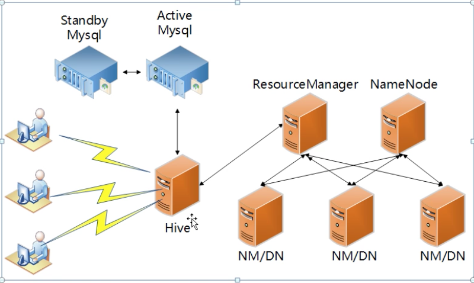

- mysql 安装
	- yum 在线安装mysql
		- 参考：https://blog.csdn.net/Mrqiang9001/article/details/101377149
	
- 安装 hive
	
	- 软件包下载地址：http://archive.cloudera.com/cdh5/cdh/5/hive-1.1.0-cdh5.10.0.tar.gz
	
- hive 配置

	- hive-site.xml

	- ```xml
		<?xml version="1.0" encoding="UTF-8" standalone="no"?>                                                                                             
		<?xml-stylesheet type="text/xsl" href="configuration.xsl"?>                                                                                        
		<!--                                                                                                                                               
		   Licensed to the Apache Software Foundation (ASF) under one or more                                                                              
		   contributor license agreements.  See the NOTICE file distributed with                                                                           
		   this work for additional information regarding copyright ownership.                                                                             
		   The ASF licenses this file to You under the Apache License, Version 2.0                                                                         
		   (the "License"); you may not use this file except in compliance with                                                                            
		   the License.  You may obtain a copy of the License at                                                                                           
		                                                                                                                                                   
		       http://www.apache.org/licenses/LICENSE-2.0                                                                                                  
		                                                                                                                                                   
		   Unless required by applicable law or agreed to in writing, software                                                                             
		   distributed under the License is distributed on an "AS IS" BASIS,                                                                               
		   WITHOUT WARRANTIES OR CONDITIONS OF ANY KIND, either express or implied.                                                                        
		   See the License for the specific language governing permissions and                                                                             
		   limitations under the License.                                                                                                                  
		-->                                                                                                                                                
		<configuration>                                                                                                                                    
		        <property>                                                                                                                                 
		                <name>javax.jdo.option.ConnectionUserName</name>                                                                                   
		                <value>root</value>                                                                                                                
		        </property>                                                                                                                                
		                                                                                                                                                   
		        <property>                                                                                                                                 
		                <name>javax.jdo.option.ConnectionPassword</name>                                                                                   
		                <value>root</value>                                                                                                                
		        </property>                                                                                                                                
		                                                                                                                                                   
		        <property>                                                                                                                                 
		                <name>javax.jdo.option.ConnectionURL</name>                                                                               
		                <value>jdbc:mysql://localhost:3306/hive?createDatabaseIfNotExist=true</value>                                                      
		        </property>                                                                                                                                
		                                                                                                                                                   
		        <property>                                                                                                                                 
		                <name>javax.jdo.option.ConnectionDriverName</name>                                                                                 
		                <value>com.mysql.jdbc.Driver</value>                                                                                               
		        </property>                                                                                                                                
		                                                                                                                                                   
		        <property>                                                                                                                                 
		                <name>hive.cli.print.header</name>                                                                                                 
		                <value>true</value>                                                                                                                
		                <description>password to use against metastore database</description>                                                              
		        </property>                                                                                                                                
		                                                                                                                                                   
		        <property>
		                <name>hive.cli.print.current.db</name>
		                <value>true</value>
		                <description>password to use against metastore database</description>
		        </property>
		        
		        <property>
		                <name>hive.server2.thrift.port</name>
		                <value>10000</value>
		        </property>
		        
		        <property>
		                <name>hive.server2.thrift.bind.host</name>
		                <value>0.0.0.0</value>
		        </property>
		        # hive-site.xml增加zookeeper的配置
		        <property>
		            <name>hbase.zookeeper.quorum</name>
		            <value>cdh01,cdh02,cdh03</value>
		        </property>
		</configuration>
		
		```
		
- hive-env.sh
	
	- ```shell
			# Licensed to the Apache Software Foundation (ASF) under one
			# or more contributor license agreements.  See the NOTICE file
			# distributed with this work for additional information
			# regarding copyright ownership.  The ASF licenses this file
			# to you under the Apache License, Version 2.0 (the
			# "License"); you may not use this file except in compliance
			# with the License.  You may obtain a copy of the License at
			#
			#     http://www.apache.org/licenses/LICENSE-2.0
			#
			# Unless required by applicable law or agreed to in writing, software
			# distributed under the License is distributed on an "AS IS" BASIS,
			# WITHOUT WARRANTIES OR CONDITIONS OF ANY KIND, either express or implied.
			# See the License for the specific language governing permissions and
			# limitations under the License.
			
			# Set Hive and Hadoop environment variables here. These variables can be used
			# to control the execution of Hive. It should be used by admins to configure
			# the Hive installation (so that users do not have to set environment variables
			# or set command line parameters to get correct behavior).
			#
			# The hive service being invoked (CLI/HWI etc.) is available via the environment
			# variable SERVICE
			
			
			# Hive Client memory usage can be an issue if a large number of clients
			# are running at the same time. The flags below have been useful in 
			# reducing memory usage:
			#
			# if [ "$SERVICE" = "cli" ]; then
			#   if [ -z "$DEBUG" ]; then
			#     export HADOOP_OPTS="$HADOOP_OPTS -XX:NewRatio=12 -Xms10m -XX:MaxHeapFreeRatio=40 -XX:MinHeapFreeRatio=15 -XX:+UseParNewGC -XX:-UseGCOverheadLimit"
			#   else
			#     export HADOOP_OPTS="$HADOOP_OPTS -XX:NewRatio=12 -Xms10m -XX:MaxHeapFreeRatio=40 -XX:MinHeapFreeRatio=15 -XX:-UseGCOverheadLimit"
			#   fi
			# fi
			
			# The heap size of the jvm stared by hive shell script can be controlled via:
			#
			# export HADOOP_HEAPSIZE=1024
			#
			# Larger heap size may be required when running queries over large number of files or partitions. 
			# By default hive shell scripts use a heap size of 256 (MB).  Larger heap size would also be 
			# appropriate for hive server (hwi etc).
			
			
			# Set HADOOP_HOME to point to a specific hadoop install directory
			export HADOOP_HOME=/home/parallels/app/hadoop
			
			export HBASE_HOME=/home/parallels/app/hbase
			export HIVE_HOME=/home/parallels/app/hive
			
			
			# Hive Configuration Directory can be controlled by:
			export HIVE_CONF_DIR=home/parallels/app/hive/conf
			
			# Folder containing extra ibraries required for hive compilation/execution can be controlled by:
			# export HIVE_AUX_JARS_PATH=
			```
	
- hive-log4j.properties
	
	- ```log
			# Licensed to the Apache Software Foundation (ASF) under one                                                                                       
			# or more contributor license agreements.  See the NOTICE file                                                                                     
			# distributed with this work for additional information                                                                                            
			# regarding copyright ownership.  The ASF licenses this file                                                                                       
			# to you under the Apache License, Version 2.0 (the                                                                                                
			# "License"); you may not use this file except in compliance                                                                                       
			# with the License.  You may obtain a copy of the License at                                                                                       
			#                                                                                                                                                  
			#     http://www.apache.org/licenses/LICENSE-2.0                                                                                                   
			#                                                                                                                                                  
			# Unless required by applicable law or agreed to in writing, software                                                                              
			# distributed under the License is distributed on an "AS IS" BASIS,                                                                                
			# WITHOUT WARRANTIES OR CONDITIONS OF ANY KIND, either express or implied.                                                                         
			# See the License for the specific language governing permissions and                                                                              
			# limitations under the License.                                                                                                                   
			                                                                                                                                                   
			# Define some default values that can be overridden by system properties                                                                           
			hive.log.threshold=ALL                                                                                                                             
			hive.root.logger=WARN,DRFA                                                                                                                         
			hive.log.dir=/home/parallels/data/hive/logs                                                                                                        
			hive.log.file=hive.log                                                                                                                             
			                                                                                                                                                   
			# Define the root logger to the system property "hadoop.root.logger".                                                                              
			log4j.rootLogger=${hive.root.logger}, EventCounter                                                                                                 
			                                                                                                                                                   
			# Logging Threshold                                                                                                                                
			log4j.threshold=${hive.log.threshold}                                                                                                              
			                                                                                                                                                   
			#                                                                                                                                                  
			# Daily Rolling File Appender                                                                                                                      
			#                                                                                                                                                  
			# Use the PidDailyerRollingFileAppend class instead if you want to use separate log files                                                          
			# for different CLI session.                                                                                                                       
			#                                                                                                                                                  
			# log4j.appender.DRFA=org.apache.hadoop.hive.ql.log.PidDailyRollingFileAppender                                                                    
			                                                                                                                                                   
			log4j.appender.DRFA=org.apache.log4j.DailyRollingFileAppender                                                                                      
			                                                                                                                                                   
			log4j.appender.DRFA.File=${hive.log.dir}/${hive.log.file}                                                                                          
			                                                                                                                                                   
			# Rollver at midnight                                                                                                                              
			log4j.appender.DRFA.DatePattern=.yyyy-MM-dd                                                                                                        
			                                                                                                                                                   
			# 30-day backup                                                                                                                                    
			#log4j.appender.DRFA.MaxBackupIndex=30                                                                                                             
			log4j.appender.DRFA.layout=org.apache.log4j.PatternLayout
			
			# Pattern format: Date LogLevel LoggerName LogMessage
			#log4j.appender.DRFA.layout.ConversionPattern=%d{ISO8601} %p %c: %m%n
			# Debugging Pattern format
			log4j.appender.DRFA.layout.ConversionPattern=%d{ISO8601} %-5p [%t]: %c{2} (%F:%M(%L)) - %m%n
			
			
			#
			# console
			# Add "console" to rootlogger above if you want to use this
			#
			
			log4j.appender.console=org.apache.log4j.ConsoleAppender
			log4j.appender.console.target=System.err
			log4j.appender.console.layout=org.apache.log4j.PatternLayout
			log4j.appender.console.layout.ConversionPattern=%d{yy/MM/dd HH:mm:ss} [%t]: %p %c{2}: %m%n
			log4j.appender.console.encoding=UTF-8
			
			#custom logging levels
			#log4j.logger.xxx=DEBUG
			
			#
			# Event Counter Appender
			# Sends counts of logging messages at different severity levels to Hadoop Metrics.
			#
			log4j.appender.EventCounter=org.apache.hadoop.hive.shims.HiveEventCounter
			
			
			log4j.category.DataNucleus=ERROR,DRFA
			log4j.category.Datastore=ERROR,DRFA
			log4j.category.Datastore.Schema=ERROR,DRFA
			log4j.category.JPOX.Datastore=ERROR,DRFA
			log4j.category.JPOX.Plugin=ERROR,DRFA
			log4j.category.JPOX.MetaData=ERROR,DRFA
			log4j.category.JPOX.Query=ERROR,DRFA
			log4j.category.JPOX.General=ERROR,DRFA
			log4j.category.JPOX.Enhancer=ERROR,DRFA
			
			
			# Silence useless ZK logs
			log4j.logger.org.apache.zookeeper.server.NIOServerCnxn=WARN,DRFA
			log4j.logger.org.apache.zookeeper.ClientCnxnSocketNIO=WARN,DRFA
			
			#custom logging levels
			log4j.logger.org.apache.hadoop.hive.ql.parse.SemanticAnalyzer=INFO
			log4j.logger.org.apache.hadoop.hive.ql.Driver=INFO
			log4j.logger.org.apache.hadoop.hive.ql.exec.mr.ExecDriver=INFO
			log4j.logger.org.apache.hadoop.hive.ql.exec.mr.MapRedTask=INFO
			log4j.logger.org.apache.hadoop.hive.ql.exec.mr.MapredLocalTask=INFO
			log4j.logger.org.apache.hadoop.hive.ql.exec.Task=INFO
			log4j.logger.org.apache.hadoop.hive.ql.session.SessionState=INFO
			```
	
- jdbc 访问 hiveserver2

	- https://blog.csdn.net/u010745505/article/details/72770958

- beeline 访问 hiveserver2

	- 连接：

		- ```shell
			[parallels@cdh01 bin]$ ll                                                                                                                          
			总用量 36                                                                                                                                          
			-rwxr-xr-x. 1 parallels parallels 1261 1月  21 2017 beeline                                                                                        
			-rw-rw-r--. 1 parallels parallels  726 6月  23 15:29 derby.log                                                                                     
			drwxr-xr-x. 3 parallels parallels 4096 1月  21 2017 ext                                                                                            
			-rwxr-xr-x. 1 parallels parallels 7751 1月  21 2017 hive                                                                                           
			-rwxr-xr-x. 1 parallels parallels 1900 1月  21 2017 hive-config.sh                                                                                 
			-rwxr-xr-x. 1 parallels parallels  885 1月  21 2017 hiveserver2                                                                                    
			drwxrwxr-x. 5 parallels parallels  133 6月  23 15:29 metastore_db                                                                                  
			-rwxr-xr-x. 1 parallels parallels  832 1月  21 2017 metatool                                                                                       
			-rwxr-xr-x. 1 parallels parallels  884 1月  21 2017 schematool                                                                                     
			[parallels@cdh01 bin]$ ./beeline                                                                                                                   
			SLF4J: Class path contains multiple SLF4J bindings.                                                                                                
			SLF4J: Found binding in [jar:file:/home/parallels/app/hbase-1.2.0-cdh5.10.0/lib/slf4j-log4j12-1.7.5.jar!/org/slf4j/impl/StaticLoggerBinder.class]  
			SLF4J: Found binding in [jar:file:/home/parallels/app/hadoop-2.6.0-cdh5.10.0/share/hadoop/common/lib/slf4j-log4j12-1.7.5.jar!/org/slf4j/impl/StaticLoggerBinder.class]                                                                                                                                
			SLF4J: See http://www.slf4j.org/codes.html#multiple_bindings for an explanation.                                                                   
			SLF4J: Actual binding is of type [org.slf4j.impl.Log4jLoggerFactory]                                                                               
			2020-06-23 16:48:49,677 WARN  [main] util.NativeCodeLoader: Unable to load native-hadoop library for your platform... using builtin-java classes where applicable                                                                                                                                     
			Beeline version 1.1.0-cdh5.10.0 by Apache Hive                                                                                                     
			beeline>    
			```

	- 操作：

		- ```shell
			beeline> help                                                                                                                                      
			!addlocaldriverjar  Add driver jar file in the beeline client side.                                                                                
			!addlocaldrivername Add driver name that needs to be supported in the beeline                                                                      
			                    client side.                                                                                                                   
			!all                Execute the specified SQL against all the current connections                                                                  
			!autocommit         Set autocommit mode on or off                                                                                                  
			!batch              Start or execute a batch of statements                                                                                         
			!brief              Set verbose mode off                                                                                                           
			!call               Execute a callable statement                                                                                                   
			!close              Close the current connection to the database                                                                                   
			!closeall           Close all current open connections                                                                                             
			!columns            List all the columns for the specified table                                                                                   
			!commit             Commit the current transaction (if autocommit is off)                                                                          
			!connect            Open a new connection to the database.                                                                                         
			!dbinfo             Give metadata information about the database                                                                                   
			!describe           Describe a table                                                                                                               
			!dropall            Drop all tables in the current database                                                                                        
			!exportedkeys       List all the exported keys for the specified table                                                                             
			!go                 Select the current connection                                                                                                  
			!help               Print a summary of command usage                                                                                               
			!history            Display the command history                                                                                                    
			!importedkeys       List all the imported keys for the specified table                                                                             
			!indexes            List all the indexes for the specified table                                                                                   
			!isolation          Set the transaction isolation for this connection                                                                              
			!list               List the current connections                                                                                                   
			!manual             Display the BeeLine manual                                                                                                     
			!metadata           Obtain metadata information                                                                                                    
			!nativesql          Show the native SQL for the specified statement                                                                                
			!nullemptystring    Set to true to get historic behavior of printing null as
			                    empty string. Default is false.
			!outputformat       Set the output format for displaying results
			                    (table,vertical,csv2,dsv,tsv2,xmlattrs,xmlelements, and
			                    deprecated formats(csv, tsv))
			!primarykeys        List all the primary keys for the specified table
			!procedures         List all the procedures
			!properties         Connect to the database specified in the properties file(s)
			!quit               Exits the program
			!reconnect          Reconnect to the database
			!record             Record all output to the specified file
			!rehash             Fetch table and column names for command completion
			!rollback           Roll back the current transaction (if autocommit is off)
			!run                Run a script from the specified file
			!save               Save the current variabes and aliases
			!scan               Scan for installed JDBC drivers
			!script             Start saving a script to a file
			!set                Set a beeline variable
			!sh                 Execute a shell command
			!sql                Execute a SQL command
			!tables             List all the tables in the database
			!typeinfo           Display the type map for the current connection
			!verbose            Set verbose mode on
			
			Comments, bug reports, and patches go to ???
			beeline> 
			
			```

		- ```
			beeline> !connect jdbc:hive2://cdh01:10000/default
			scan complete in 16ms
			Connecting to jdbc:hive2://cdh01:10000/default
			Enter username for jdbc:hive2://cdh01:10000/default: 
			Enter password for jdbc:hive2://cdh01:10000/default: 
			Connected to: Apache Hive (version 1.1.0-cdh5.10.0)
			Driver: Hive JDBC (version 1.1.0-cdh5.10.0)
			Transaction isolation: TRANSACTION_REPEATABLE_READ
			0: jdbc:hive2://cdh01:10000/default> 
			
			```

		- ```
			0: jdbc:hive2://cdh01:10000/default> show tables;
			INFO  : Compiling command(queryId=parallels_20200623165151_8d4ae9ac-6d69-47ee-89bc-3de158e0dac8): show tables
			INFO  : Semantic Analysis Completed
			INFO  : Returning Hive schema: Schema(fieldSchemas:[FieldSchema(name:tab_name, type:string, comment:from deserializer)], properties:null)
			INFO  : Completed compiling command(queryId=parallels_20200623165151_8d4ae9ac-6d69-47ee-89bc-3de158e0dac8); Time taken: 0.118 seconds
			INFO  : Concurrency mode is disabled, not creating a lock manager
			INFO  : Executing command(queryId=parallels_20200623165151_8d4ae9ac-6d69-47ee-89bc-3de158e0dac8): show tables
			INFO  : Starting task [Stage-0:DDL] in serial mode
			INFO  : Completed executing command(queryId=parallels_20200623165151_8d4ae9ac-6d69-47ee-89bc-3de158e0dac8); Time taken: 0.039 seconds
			INFO  : OK
			+-----------+--+
			| tab_name  |
			+-----------+--+
			| logs      |
			+-----------+--+
			1 row selected (0.187 seconds)
			0: jdbc:hive2://cdh01:10000/default> 
			
			```

		- ```
			0: jdbc:hive2://cdh01:10000/default> select * from logs;
			INFO  : Compiling command(queryId=parallels_20200623165151_d76a2518-f5c5-4ee7-b67e-8df80e581795): select * from logs
			INFO  : Semantic Analysis Completed
			INFO  : Returning Hive schema: Schema(fieldSchemas:[FieldSchema(name:logs.key, type:string, comment:null), FieldSchema(name:logs.time, type:string, comment:null), FieldSchema(name:logs.userid, type:string, comment:null), FieldSchema(name:logs.searchname, type:string, comment:null), FieldSchema(name:logs.retorder, type:string, comment:null), FieldSchema(name:logs.cliorder, type:string, comment:null), FieldSchema(name:logs.url, type:string, comment:null)], properties:null)
			INFO  : Completed compiling command(queryId=parallels_20200623165151_d76a2518-f5c5-4ee7-b67e-8df80e581795); Time taken: 0.383 seconds
			INFO  : Concurrency mode is disabled, not creating a lock manager
			INFO  : Executing command(queryId=parallels_20200623165151_d76a2518-f5c5-4ee7-b67e-8df80e581795): select * from logs
			INFO  : Completed executing command(queryId=parallels_20200623165151_d76a2518-f5c5-4ee7-b67e-8df80e581795); Time taken: 0.001 seconds
			INFO  : OK
			+-----------+------------+--------------+------------------+----------------+----------------+-----------+--+
			| logs.key  | logs.time  | logs.userid  | logs.searchname  | logs.retorder  | logs.cliorder  | logs.url  |
			+-----------+------------+--------------+------------------+----------------+----------------+-----------+--+
			| 1         | 24         | 1987-06-17   | ali              | chaina         | zhejiang       | xian      |
			+-----------+------------+--------------+------------------+----------------+----------------+-----------+--+
			1 row selected (0.839 seconds)
			0: jdbc:hive2://cdh01:10000/default> 
			
			```

- hive与 hbase 关联集成开发

	- https://blog.csdn.net/dajiangtai007/article/details/79696853?utm_medium=distribute.pc_relevant_t0.none-task-blog-BlogCommendFromMachineLearnPai2-1.nonecase&depth_1-utm_source=distribute.pc_relevant_t0.none-task-blog-BlogCommendFromMachineLearnPai2-1.nonecase

