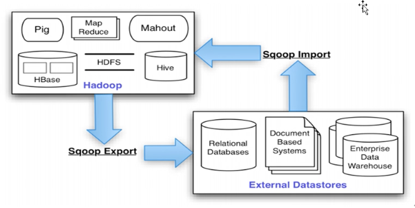
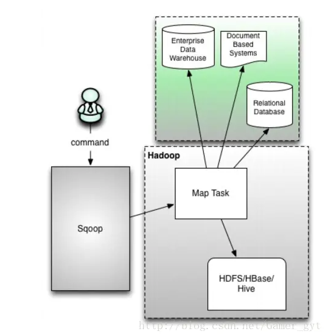
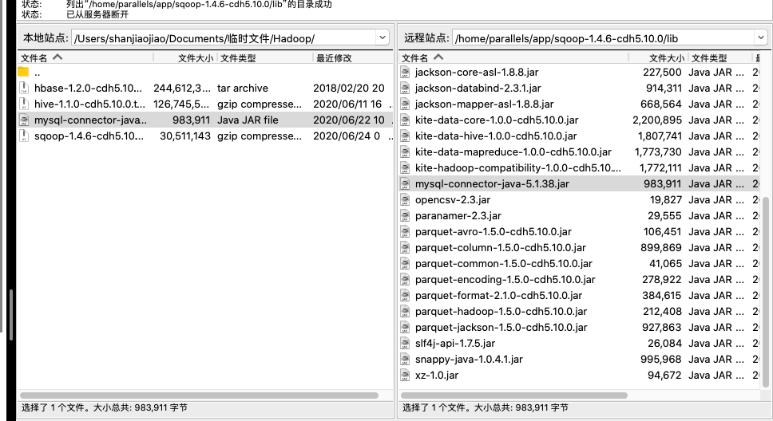

# sqoop 数据导入导出

- 核心思想：
	- 利用 MapReduce 加快数据传输速度
	- 
	- sqoop：SQL to Hadoop
	- sqoop 只是一个工具，通过调用 Hadoop 的 map task进行数据导入导出

- 架构
	- 

## 安装

- 下载地址：http://archive.cloudera.com/cdh5/cdh/5/sqoop-1.4.6-cdh5.10.0.tar.gz

- 配置：

	- sqoop-env.sh

		- ```shell
			# Licensed to the Apache Software Foundation (ASF) under one or more                                                                        
			# contributor license agreements.  See the NOTICE file distributed with                                                                     
			# this work for additional information regarding copyright ownership.                                                                       
			# The ASF licenses this file to You under the Apache License, Version 2.0                                                                   
			# (the "License"); you may not use this file except in compliance with                                                                      
			# the License.  You may obtain a copy of the License at                                                                                     
			#                                                                                                                                           
			#     http://www.apache.org/licenses/LICENSE-2.0                                                                                            
			#                                                                                                                                           
			# Unless required by applicable law or agreed to in writing, software                                                                       
			# distributed under the License is distributed on an "AS IS" BASIS,                                                                         
			# WITHOUT WARRANTIES OR CONDITIONS OF ANY KIND, either express or implied.                                                                  
			# See the License for the specific language governing permissions and                                                                       
			# limitations under the License.                                                                                                            
			                                                                                                                                            
			# included in all the hadoop scripts with source command                                                                                    
			# should not be executable directly                                                                                                         
			# also should not be passed any arguments, since we need original $*                                                                        
			                                                                                                                                            
			# Set Hadoop-specific environment variables here.                                                                                           
			                                                                                                                                            
			#Set path to where bin/hadoop is available                                                                                                  
			export HADOOP_COMMON_HOME=/home/parallels/app/hadoop                                                                                        
			                                                                                                                                            
			#Set path to where hadoop-*-core.jar is available                                                                                           
			#export HADOOP_MAPRED_HOME=                                                                                                                 
			                                                                                                                                            
			#set the path to where bin/hbase is available                                                                                               
			export HBASE_HOME=/home/parallels/app/hbase                                                                                                 
			                                                                                                                                            
			#Set the path to where bin/hive is available                                                                                                
			export HIVE_HOME=/home/parallels/app/hive                                                                                                   
			                                                                                                                                            
			#Set the path for where zookeper config dir is                                                                                              
			export ZOOCFGDIR=/home/parallels/app/zookeeper/conf  
			```

	- 将mysql 连接 jar 包放入 sqoop 的 lib 文件夹下

		- 

## 操作

- 帮助命令

	- ```shell
		[parallels@cdh01 bin]$ ./sqoop help                                                                        
		Warning: /home/parallels/app/sqoop-1.4.6-cdh5.10.0/bin/../../hcatalog does not exist! HCatalog jobs will fail.
		Please set $HCAT_HOME to the root of your HCatalog installation.
		Warning: /home/parallels/app/sqoop-1.4.6-cdh5.10.0/bin/../../accumulo does not exist! Accumulo imports will fail.
		Please set $ACCUMULO_HOME to the root of your Accumulo installation.
		20/06/24 10:22:29 INFO sqoop.Sqoop: Running Sqoop version: 1.4.6-cdh5.10.0
		usage: sqoop COMMAND [ARGS]
		
		Available commands:
		  codegen            Generate code to interact with database records
		  create-hive-table  Import a table definition into Hive
		  eval               Evaluate a SQL statement and display the results
		  export             Export an HDFS directory to a database table
		  help               List available commands
		  import             Import a table from a database to HDFS
		  import-all-tables  Import tables from a database to HDFS
		  import-mainframe   Import datasets from a mainframe server to HDFS
		  job                Work with saved jobs
		  list-databases     List available databases on a server
		  list-tables        List available tables in a database
		  merge              Merge results of incremental imports
		  metastore          Run a standalone Sqoop metastore
		  version            Display version information
		
		See 'sqoop help COMMAND' for information on a specific command.
		```

- 查看数据库：

	- ```
		sqoop list-databases \
		--connect jdbc:mysql://cdh01:3306/  \
		--username root \
		--password root
		```

	- ```
		[parallels@cdh01 bin]$ ./sqoop list-databases --connect jdbc:mysql://cdh01:3306/  --username root --password root
		Warning: /home/parallels/app/sqoop-1.4.6-cdh5.10.0/bin/../../hcatalog does not exist! HCatalog jobs will fail.
		Please set $HCAT_HOME to the root of your HCatalog installation.
		Warning: /home/parallels/app/sqoop-1.4.6-cdh5.10.0/bin/../../accumulo does not exist! Accumulo imports will fail.
		Please set $ACCUMULO_HOME to the root of your Accumulo installation.
		20/06/24 10:24:00 INFO sqoop.Sqoop: Running Sqoop version: 1.4.6-cdh5.10.0
		20/06/24 10:24:00 WARN tool.BaseSqoopTool: Setting your password on the command-line is insecure. Consider using -P instead.
		20/06/24 10:24:01 INFO manager.MySQLManager: Preparing to use a MySQL streaming resultset.
		information_schema
		hive
		mysql
		performance_schema
		test
		
		```

- 查看表：

	- ```
		sqoop list-tables \
		--connect jdbc:mysql://cdh01:3306/test  \
		--username root \
		--password root
		```

	- ```
		[parallels@cdh01 bin]$ ./sqoop list-tables \
		> --connect jdbc:mysql://cdh01:3306/test  \
		> --username root \
		> --password root
		Warning: /home/parallels/app/sqoop-1.4.6-cdh5.10.0/bin/../../hcatalog does not exist! HCatalog jobs will fail.
		Please set $HCAT_HOME to the root of your HCatalog installation.
		Warning: /home/parallels/app/sqoop-1.4.6-cdh5.10.0/bin/../../accumulo does not exist! Accumulo imports will fail.
		Please set $ACCUMULO_HOME to the root of your Accumulo installation.
		20/06/24 10:25:12 INFO sqoop.Sqoop: Running Sqoop version: 1.4.6-cdh5.10.0
		20/06/24 10:25:12 WARN tool.BaseSqoopTool: Setting your password on the command-line is insecure. Consider using -P instead.
		20/06/24 10:25:12 INFO manager.MySQLManager: Preparing to use a MySQL streaming resultset.
		patient_jiuzhen_jilu
		
		```

- 将 mysql 数据导入到 hdfs

	- ```
		   sqoop import \
		      --connect $1 \   //mysql jdbc 连接
		      --username $2 \  //用户名
		      --password $3 \	 	//免密
		      --query "$sql and "'$CONDITIONS' \ //查询的数据
		      --target-dir $5 \  //hdfs存储位置
		      --fields-terminated-by "," \  //字段间隔
		      --num-mappers 1 
		      --verbose   >> ${log_file}
		```

	- 说明：

		- `--query`为自定义查询

	- 例子：

		- ```
			sqoop import \
			 --connect jdbc:mysql://cdh01:3306/test \
			 --username root \
			 --password root \
			 --table patient_jiuzhen_jilu \
			 --fields-terminated-by "," \
			 --num-mappers 3 \
			 --target-dir /mysql
			```

- 将 mysql 数据导入到hive

	- ```
		sqoop import  \
		--connect jdbc:mysql://cdh01:3306/test  \
		--username root  \
		--password root  \
		--table user_info  \
		--fields-terminated-by "\t"  \
		--lines-terminated-by "\n"  \
		--hive-import  \
		--hive-overwrite  \
		--create-hive-table  \
		--delete-target-dir \
		--hive-database  default \
		--hive-table user_info
		```

	- 

